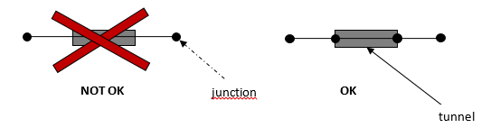
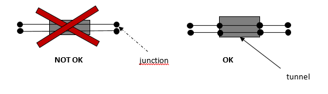

:::caution Not yet available
:::

[A typical tunnel file is shown below and can be downloaded here.](./tunnel.txt)

```
1   1234    1235
3   40  40  20
5.12572 50.09912    1   10  4   0   0.0 0
5.12165 50.10021    1   10  4   0   0.0 0
5.12345 50.09854    0   0   0   5   2.0 20

2   5678    5869    5879    8459
2   50  50
5.02573 50.08913    1   8   3   0   0.0 0
5.02166 50.19855    1   9   4   0   0.0 0
```

The files are plain text files using TABs as separators.

The tunnel file is optional. It describes the different tunnels in the scenario. It contains, for each tunnel, the IDs of the corresponding road segments in the network file and the description of the point sources (tunnel entrances and ventilation shafts) through which the traffic emissions can leave the tunnel.

The example above contains 2 tunnels. The first tunnel corresponds to 2 road segments, the second tunnel corresponds to 4 road segments. The first tunnel has 3 point sources (2 tunnel entrances and one ventilation shaft) and the second tunnel has 2 entrances.

## Format description

The tunnel file consists of multiple paragraphs separated by an empty line. Each paragraph represents one tunnel. Each paragraph has the following format:

```
tunnelID<tab>segmentID1<tab>segmentID2<tab>...
numberOfPointSources<tab>percentage1<tab>percentage2<tab>...
lon1<tab>lat1<tab>tunnelEntrance<tab>tunnelWidth<tab>tunnelHeight<tab>ventilationHeight<tab>ventilationDiameter<tab>flowRate
lon2<tab>lat2<tab>tunnelEntrance<tab>tunnelWidth<tab>tunnelHeight<tab>ventilationHeight<tab>ventilationDiameter<tab>flowRate
...
```

The third line is repeated for each point source of the tunnel.

Each field in the paragraph is explained below:

| Field                | Description                                                                                                                                                                     |
| :------------------- | :------------------------------------------------------------------------------------------------------------------------------------------------------------------------------ |
| tunnelID             | ID of the tunnel (unique)                                                                                                                                                       |
| segmentID            | A segment ID from the network file. One or more segment ID's can be provided for each tunnel, separated by `<tab>`                                                              |
| numberOfPointSources | The number of point sources (tunnel entrances and ventilation shafts) of the tunnel                                                                                             |
| percentagex          | The percentage of the total tunnel emission that leaves the tunnel through the x-th point source. The sum of the percentages should be equal to 100 for each tunnel.            |
| loni                 | The longitude of the i-th point source                                                                                                                                          |
| lati                 | the latitude of the i-th point source                                                                                                                                           |
| tunnelEntrance       | This field indicates whether the point sources is a tunnel entrance or not. A tunnel entrance is indicated with the value 1, a ventilation shaft is indicated with the value 0. |
| tunnelWidth          | The width of the tunnel entrance in m. For a ventilation shaft, this field is not applicable and should be given value 0.                                                       |
| tunnelHeight         | The height of the tunnel entrance in m. For a ventilation shaft, this field is not applicable and should be given value 0.                                                      |
| ventilationHeight    | The height of the ventilation shaft in m above ground level. For a tunnel entrance, this field is not applicable and should be given value 0.                                   |
| ventilationDiameter  | The diameter of the ventilation shaft in m. For a tunnel entrance, this field is not applicable and should be given value 0.                                                    |
| flowRate             | The flow rate of the ventilation shaft in normal cubic meter per second (Nm3/s). For a tunnel entrance, this field is not applicable and should be given value 0.               |

### Important boundary condition

The given road segments should correspond **exactly** with the tunnel. Segments that only partially overlap with the tunnel cannot be included. This is because the emissions of the given road segments are distributed over the tunnel entrances and ventilation shafts. The figures below illustrate how the tunnel and the road segments should correspond.

Road segment with 1 traffic direction:


Road segment with 2 traffic directions:


The first figure above shows a road segment and a tunnel in the middle of this segment. In this case, the road segment should be split into three parts so that one road segment (the middle part) corresponds exactly with the tunnel. The second figure shows a similar situation with 2 traffic directions. The 2 road segments are replaced by 6 smaller segments.

## Validation

The following validation rules are applied:

| Field                | Type                                                                                            | Validation                                                                     |
| :------------------- | :---------------------------------------------------------------------------------------------- | :----------------------------------------------------------------------------- |
| tunnelID             | int                                                                                             | Each tunnel should have a unique ID.\n                                         |
| segmentID            | int                                                                                             | Integer value, corresponding to one of segment ID's in the network file.       |
|                      |                                                                                                 | Each road segment can be used for only one tunnel.                             |
| numberOfPointSources | int                                                                                             | Strictly positive.                                                             |
| percentagex          | float                                                                                           | Integer value between 0 and 100 (0 not included).                              |
|                      | The number of percentage values should correspond to the number of point sources in the tunnel. |
|                      | The sum of the percentages should be equal to 100 for each tunnel.                              |
| loni                 | float                                                                                           |                                                                                |
| lati                 | float                                                                                           |                                                                                |
| tunnelEntrance       | int                                                                                             | Only the values 1 (tunnel entrance) and 0 (ventilation shaft) are allowed.     |
| tunnelWidth          | int                                                                                             | For a tunnel entrance this value should be between 0 and 100 (0 not included). |
|                      | For a ventilation shaft this value should be equal to 0.                                        |
| tunnelHeight         | int                                                                                             | For a tunnel entrance this value should be between 0 and 100 (0 not included). |
|                      | For a ventilation shaft this value should be equal to 0.                                        |
| ventilationHeight    | int                                                                                             | For a ventilation shaft this value should be between 0 and 100.                |
|                      | For a tunnel entrance this value should be equal to 0.                                          |
| ventilationDiameter  | float                                                                                           | Real number, with 1 decimal.                                                   |
|                      | For a ventilation shaft this value should be between 0 and 10.                                  |
|                      | For a tunnel entrance this value should be equal to 0.                                          |
| flowRate             | int                                                                                             | For a ventilation shaft this value should be between 0 and 100.                |
|                      | For a tunnel entrance this value should be equal to 0.                                          |

:::danger Attention:
A tunnel file cannot contain redundant `<tab>`s. None of the lines can end with a `<tab>`, including the empty lines between tunnel paragraphs.
:::
