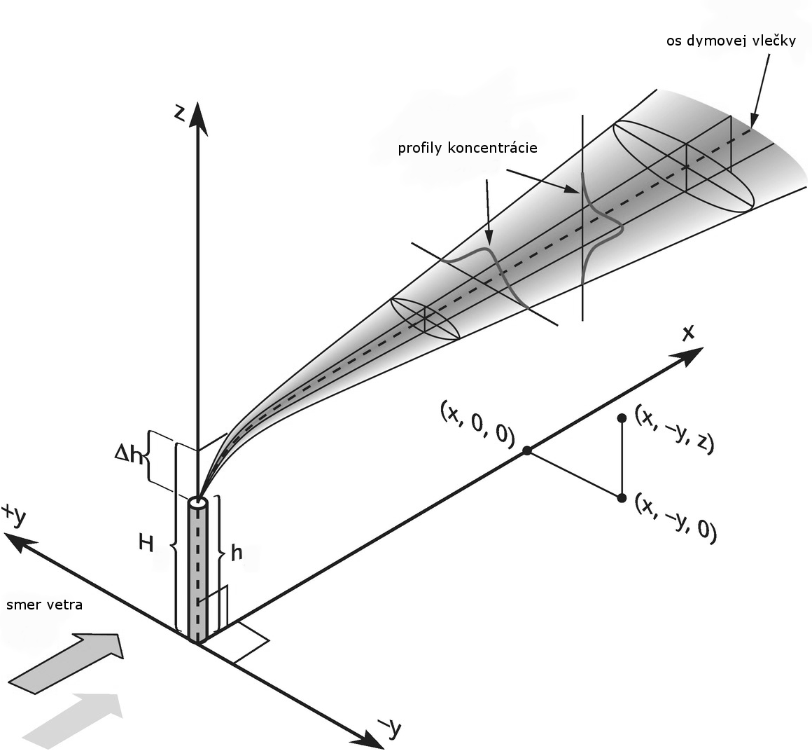

## Aplikácia ATMO-Plan

ATMO-Plan je užívateľsky priateľská webová  aplikácia na posudzovanie kvality ovzdušia, ktorá umožňuje spúšťať a porovnávať rôzne scenáre zmien konfigurácie emisných zdrojov. Pôvodne bola vyvinutá pre posudzovanie dopadu na kvalitu ovzdušia rôznych zmien v dopravnej infraštruktúre, napr. nové obchvaty, okruhy, dopravné tunely a nízko emisné zóny. V súčasnosti zahŕňa aj možnosť simulovať (priemyselné) bodové zdroje a opatrenia v oblasti malých zdrojov (vykurovanie domácností).   

Aplikáciu ATMO-Plan prevádzkuje SHMÚ a pre užívateľov je dostupná na stránke <a href="https://atmoplan.shmu.sk/"> Link</a>. Predtým, ako ju užívateľ môže začať používať, musí požiadať o vytvorenie konta na adrese atmoplan@shmu.sk (Mail musí obsahovať registračný email, meno, priezvisko a profesiu užívateľa)
Základný scenár každého projektu obsahuje aktuálnu situáciu, oproti ktorej sa vyhodnocujú užívateľom zadané scenáre. Tento základný scenár, obsahujúci za celú SR všetky väčšie emisné zdroje NEIS a dopravné zdroje, meteorológiu z modelu ALADIN v gridových bodoch s rozlíšením 4.5 km, a mapy priemerných ročných koncentrácií PM10, PM2,5 a NO2 je súčasťou aplikácie. Mapy koncentrácií s vysokým rozlíšením obsahujú aj príspevky z lokálnych kúrenísk. Súčasná verzia aplikácie obsahuje základný scenár pre rok 2019. Základný scenár pre vybrané územie je vždy súčasťou simulácie, nie je možné ho vynechať. Užívateľ si okrem neho môže vytvoriť ľubovoľné množstvo ďalších scenárov, v ktorých môže zmeniť aj konfiguráciu existujúcich zdrojov základného scenára, alebo pridávať vlastné zdroje s použitím vlastných emisných vstupov, pričom meteorologické parametre a pozaďové koncentrácie ostávajú rovnaké. Tieto scenáre sa potom porovnávajú so základným scenárom. 

## <a href="https://www.shmu.sk/sk/?page=2819"> Link na inštruktážne videá </a>

## Hlavné využitie

 Aplikácia je určená hlavne pre tieto účely:

- Hodnotenie vplyvu na kvalitu ovzdušia (napr. rozptylové štúdie - imisno-prenosové posudzovanie v zmysle zákona č.24/2006 Z.z a hodnotenie vplyvov na životné prostredie (EIA)) - pričom cieľom je na harmonizácia týchto procesov a vzájomná porovnateľnosť výstupov
- Podpora implementácie Programov na zlepšenie kvality ovzdušia v súlade so Zákonom č. 146/2023 Z. z.
o ochrane ovzdušia a o zmene a doplnení niektorých zákonov.
. Na tento účel aplikácia obsahuje aj možnosť návrhu a hodnotenia nízkoemisných zón  

## Modely v aplikácii ATMO-plan

### Dopravný emisný model FASTRACE 

[FASTRACE](https://vito.be/en/product/fastrace-traffic-emission-model) je dopravný emisný model vyvinutý vo VITO. Je založený na softvéri COPERT, ktorý sa celosvetovo používa na výpočet emisií z cestnej dopravy (vyvinutý spoločnosťou Emisia na objednávku Európskej environmentálnej agentúry (EEA)). COPERT neposkytuje geografické rozdelenie vypočítaných emisií, vyžadované modelmi kvality ovzdušia s vysokým rozlíšením. Preto bol vyvinutý FASTRACE, ktorý je založený na COPERT a zároveň poskytuje priestorové rozdelenie emisií na úrovni ulíc. Nižšie sú popísané základné koncepty modelu FASTRACE.   

#### Výpočtové jadro

FASTRACE počíta emisie z cestnej dopravy pre všetky typy vozidiel vo vozovom parku (emisie vozového parku), alebo pre všetky segmenty ciest v sieti (emisie cestnej siete) na základe údajov o mobilite a vozového parku použitím emisných faktorov COPERT. Emisie sa potom vypočítajú ako
emisie (E) = vozokilometre (vkm) \* emisný faktor (EF) 

#### Údaje o mobilite, vozovom parku a cestnej sieti

Na výpočet emisií potrebuje FASTRACE údaje o mobilite. Tieto môžu byť dodané v rôznych formátoch: vo formáte vozového parku a/alebo vo formáte cestnej siete:

- Údaje vo formáte vozového parku pozostávajú z počtu vozidiel určitého typu spolu s ročným počtom najazdených kilometrov pre daný typ vozidla;
- Údaje vo formáte cestnej siete predstavujú počet prechádzajúcich vozidiel na segmente cesty a súvisiacu rýchlosť.

FASTRACE spracováva tieto súbory na vozokilometre (vkm) podľa typu vozidla a segmentu cesty, čo je hlavný vstup pre výpočet emisií. 

#### Priradenie typov vozidiel a typov ciest zo súborov cestnej siete a vozového parku

Typy vozidiel a  typy ciest sa zvyčajne líšia v závislosti od zdroja údajov. Typy vozidiel uvažované v metodike COPERT sa zvyčajne nezhodujú s typmi vozidiel aké máme v reálnych dátach. To isté platí pre typy ciest. V COPERT existujú tri typy ciest: „Diaľnice“, „Mestské“ a „Regionálne“, zatiaľ čo údaje o cestnej sieti sú vo všeobecnosti známe oveľa podrobnejšie. Z tohto dôvodu FASTRACE poskytuje rôzne priradenia. V aplikácii je poskytnutá funkcionalita, ktorá umožňuje užívateľovi priradiť rôzne typy vozidiel a typy ciest. Ak sa klasifikácie (typy ciest, typy vozidiel, …) medzi súbormi nezhodujú, priradenia budú definované na základe expertných predpokladov. 

####  Emisné faktory

Emisné faktory (EF) sú určené na základe softvéru COPERT. Zatiaľ čo COPERT obsahuje funkcie EF, FASTRACE používa vyhľadávaciu tabuľku obsahujúcu EF podľa typu vozidla, typu cesty, znečisťujúcej látky a rýchlosti. Interpolácia EF z vyhľadávacej tabuľky prebieha v rámci modelu FASTRACE. Konfigurácia vyhľadávacej tabuľky je založená na množstve (úplných) behov COPERT špecifických pre daný región a odborných názoroch. Základné EF sú odvodené z výstupov COPERT. Tieto základné EF sú doplnené, keďže niektoré typy vozidiel, najmä typy, ktoré sa očakávajú v blízkej budúcnosti (a preto je potrebné ich zahrnúť do modelu vzhľadom na analýzu scenára), ešte nie sú zahrnuté v COPERT. Pre tieto typy vozidiel sa EF vkladajú do vyhľadávacej tabuľky na základe názoru odborníkov, literatúry a štúdií. 

### Disperzný model IFDM 

Model [IFDM](https://vito.be/en/product/ifdm-high-resolution-air-quality-modelling) počíta rozptyl znečisťujúcich látok v atmosfére v závislosti od rýchlosti vetra a jeho smeru a stability atmosféry. IFDM je bi-gaussovský disperzný model využívajúci Bultynck-Maletove disperzné parametre (Bultynck & Malet, 1972).

Gaussovský model predstavuje zjednodušené analytické riešenie rovníc plnej advekčnej difúzie, pričom využíva parametrizácie pre ustálený stav šírenia dymovej vlečky v atmosfére, ktoré sú závislé na meteorológii. Obrázok nižšie ilustruje princíp gaussovského modelu.

IFDM počíta pre každý definovaný bod receptora koncentračné príspevky zo všetkých zdrojov. Použitie modelu IFDM v mestskom prostredí bolo dobre zvalidované, čo dokumentuje viacero publikácií v odborných časopisoch (W. Lefebvre, Cosemans, & Kegels, 2013; W. Lefebvre, Van Poppel, Maiheu, Janssen, & Dons, 2013; Wouter Lefebvre et al., 2011; Wouter Lefebvre & Vranckx, 2013).
