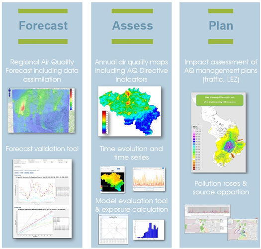
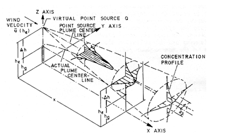

## ATMOSYS 

ATMOSYS je softvérový systém, ktorý obsahuje nástroje a aplikácie určené pre posudzovanie kvality ovzdušia, ktoré sú navrhnuté tak, aby poskytovali informácie vhodné pre uplatňovanie v praxi. Umožňujú detailné posudzovanie a predpovedanie kvality ovzdušia a je ich možné použiť pri príprave plánov na zlepšenie kvality ovzdušia a ich vyhodnotení. Jadro systému Atmosys tvoria súčasné vedecké modely, ktoré sú dobre zvalidované a poskytujú osvedčené výsledky. 

## Aplikácia ATMO-Plan

Jedna z kľúčových aplikácií v rámci systému ATMOSYS je ATMO-Plan, aplikácia na posudzovanie kvality ovzdušia na mestskej škále. Je to užívateľsky priateľná webová  

One of the key applications within the ATMOSYS platform is ATMO-Plan, the urban scale air quality planning application. It's a user friendly web based scenario assessment tool that allows users to run urban air quality planning scenarios. It was initially designed to assess the impact of urban mobility scenarios on the air quality, such as the creation of new bypasses, ring roads, traffic tunnels or low emission zones. But it also includes the option to add (industrial) point sources and thus simulate measures aimed at reducing those emissions. At the time of print, ATMO-Plan is being expanded to allow the assessment of measures aimed at tackling residential emissions.

The main ATMO-Plan application is hosted by VITO and available online through the URL . As explained further in Chapter 2, each registered user receives their own log-in details. This version includes access to the pan-European data that can be used as input to the underlying models to screen traffic related scenarios for any city across the EU. This dataset is typically used to get users started until they source their own local data. This dataset is region specific as background air quality, emission factors etc. are specific to each region in the EU. Users can also upload their own input data.

ATMO-Plan can also be further customized for a specific region and installed at a user's location. The latter deployment usually includes the addition of specific local data in discussion with the receiving party for the system. During the initial project inception phase certain aspects in the core models can also be fine-tuned, such as the available fleet categories, nature of the traffic intensities and preconfigured datasets for background concentrations and meteo.

## The Pan-EU Traffic Emissions Screening Functionality (The generic EU-wide data)

ATMO-Plan contains a pan-European database of model input data to allow for screening of traffic related scenarios for any city across the EU. The Copernicus Atmospheric Monitoring Service (CAMS) regional re-analysis dataset for Europe and the European Centre for Medium-range Weather Forecasts (ECMWF) ERA-5 data for 2015 provide the background air quality data. A precompiled database of traffic intensity estimates for motorways and major roads across the EU allows the generation of traffic emissions data for the EU-28.

## Key Uses

The application is typically used to support the implementation of air quality actions plans in line with the European air quality ambient directive, designing LEZ's and to evaluate the impact of local clean air action plans. It can also be used as a standard tool to harmonize all air quality assessment impact processes across a region (e.g. environmental permit processes and Environmental Impact Assessments (EIA)).

## The underlying models

### The FASTRACE traffic emissions model

[FASTRACE](https://vito.be/en/product/fastrace-traffic-emission-model) is a traffic emission model developed by VITO. It is based on COPERT, the software used worldwide to calculate emissions from road transport (developed by emisia commissioned by the European Environment Agency (EEA)). COPERT does not provide a geographical breakdown of the calculated emissions. However high resolution air quality models require spatially disaggregated emissions. Consequently, FASTRACE was built as a COPERT based model, providing spatial allocation of emissions at street level. Below, the basic concepts of FASTRACE are described.

#### Computational kernel

FASTRACE calculates emissions from road transport for all types of vehicles in a fleet (fleet emissions) or for all road segments in a network (network emissions), starting from mobility data and a fleet and based on COPERT emission factors. Emissions are then calculated as
emissions (E) = vehicle kilometers (vkm) \* emission factor (EF)

#### Mobility data, fleet, and network

To calculate emissions, FASTRACE requires mobility data. These can be delivered in different formats: in fleet format and/or network format:

- A fleet consists of the number of vehicles per vehicle type, along with the annual mileage per vehicle type;
- A network describes the number of passing vehicles per road segment and the associated speed.

FASTRACE processes these files to vehicle kilometers (vkm) per vehicle type and road segment, which is the main input for the calculation of emissions.

#### Mapping the vehicle types in the network & fleet files

Vehicle types, road types, pollutants, ... usually differ depending on the data-source. The vehicle types from COPERT are usually not identical to the types of vehicles within the fleet file, or to the aggregation level available within the network. The same applies to types of roads. In COPERT there are three types of roads: 'Highway', 'Urban' and 'Rural' whereas in a network file, the road types are in general known in much greater detail. In order to correctly implement the above computation, FASTRACE provides various mappings. In the application the functionality is provided to allow the user to map the vehicle types in both files. This is shown in section 3.8.2.1. If classifications (road types, vehicle types, …) do not mutually match with each other and/or the COPERT types, mappings will be defined based on (expert) assumptions.

#### Emission Factors

Emission factors (EF) are determined based on the COPERT software. However, whereas COPERT implements complex EF functions, FASTRACE uses a look-up table containing EFs per vehicle type, road type, pollutant and speed. Interpolation of EFs from the look-up table occurs within the FASTRACE model. Configuration of the look-up table is based on a number of (full-blown) region specific COPERT runs and expert opinions. The basic EF are derived from the COPERT output. These basic EFs are supplemented as some vehicle types, in particular types that are to be expected in the near future (and thus are necessary to include in the model with respect to scenario analysis) are not yet included in COPERT. For these vehicle types, EFs are inserted into the look-up table based on expert opinion, literature and specific studies.

### The IFDM dispersion model

The [IFDM](https://vito.be/en/product/ifdm-high-resolution-air-quality-modelling) model calculates the dispersion of pollutants in the atmosphere depending on windspeed/direction & atmospheric stability. IFDM is a bi-Gaussian dispersion model using the Bultynck-Malet dispersion parameters (Bultynck & Malet, 1972) . The figure below illustrates the elements in a Gaussian dispersion model.

A Gaussian model is a simplified analytic solution to the full advection diffusion equations using meteo dependent parameterisations for the steady state plume spreading in the atmosphere. IFDM works with a source-receptor grid in which the concentration contributions from all sources are computed for each receptor grid point.

The IFDM model has been well validated for use in urban environments with several atmospheric environment papers published (W. Lefebvre, Cosemans, & Kegels, 2013; W. Lefebvre, Van Poppel, Maiheu, Janssen, & Dons, 2013; Wouter Lefebvre et al., 2011; Wouter Lefebvre & Vranckx, 2013).
