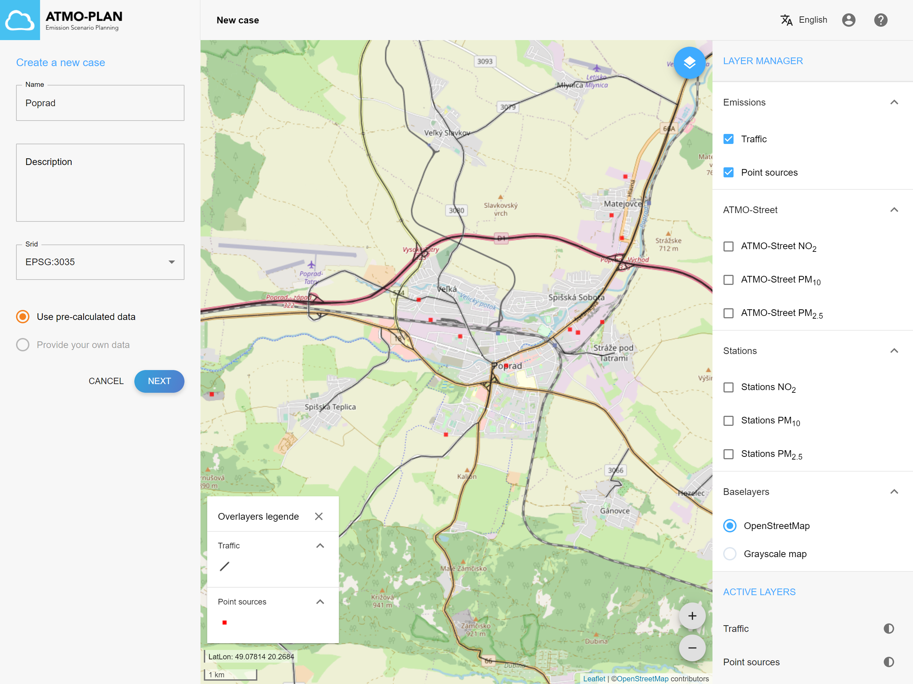
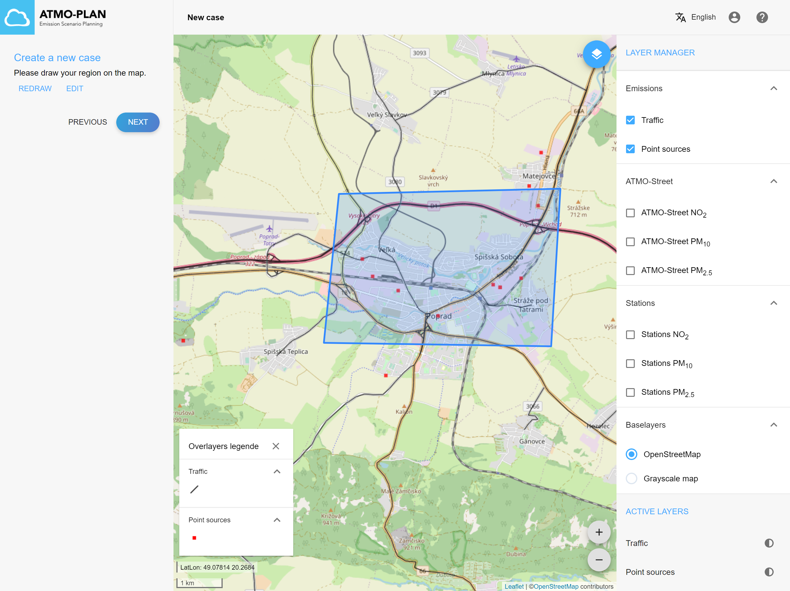
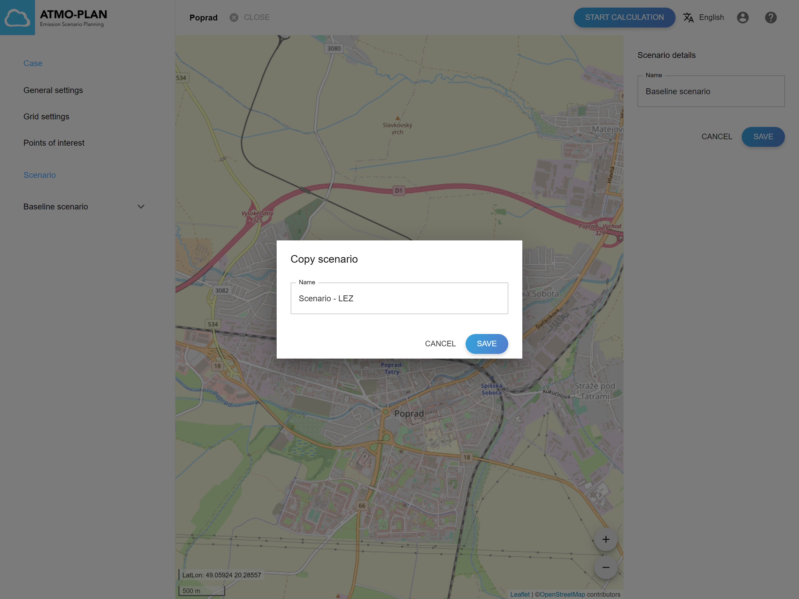
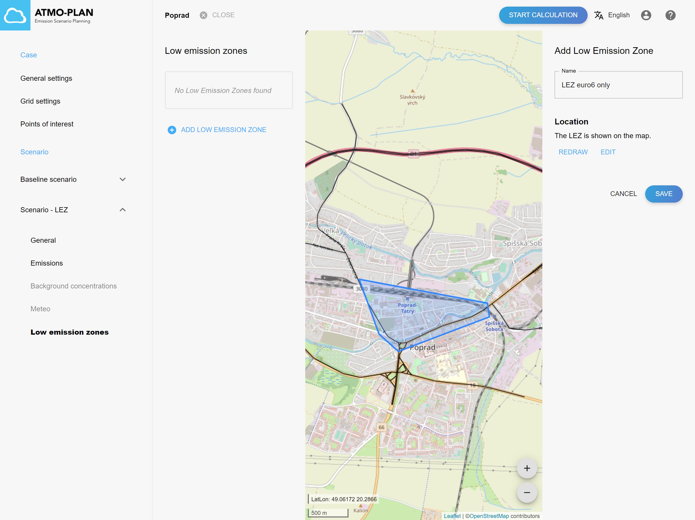
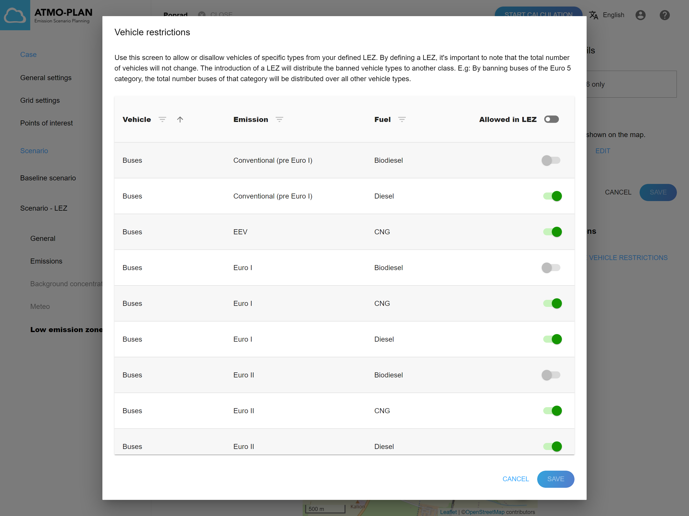
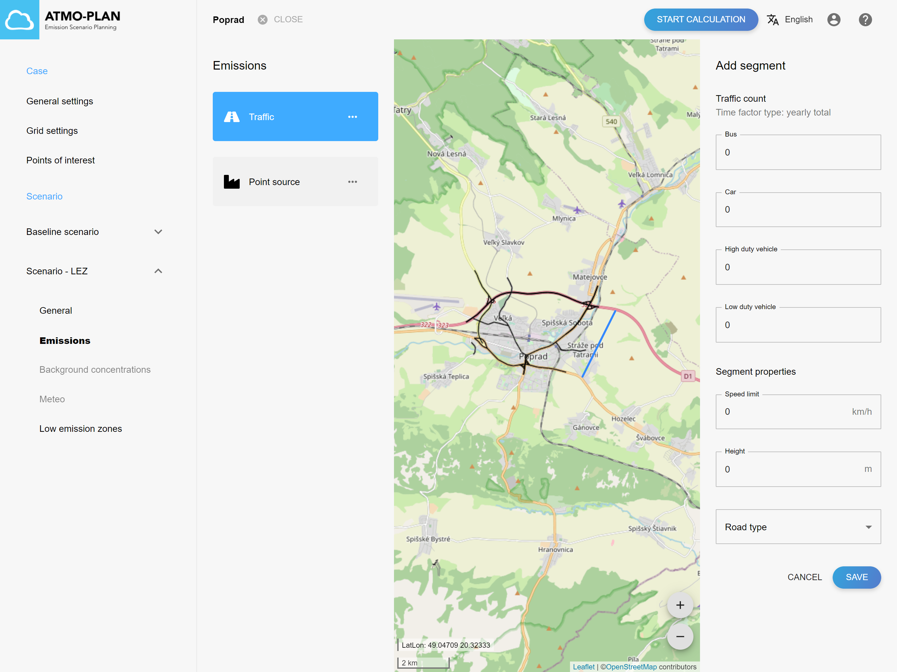
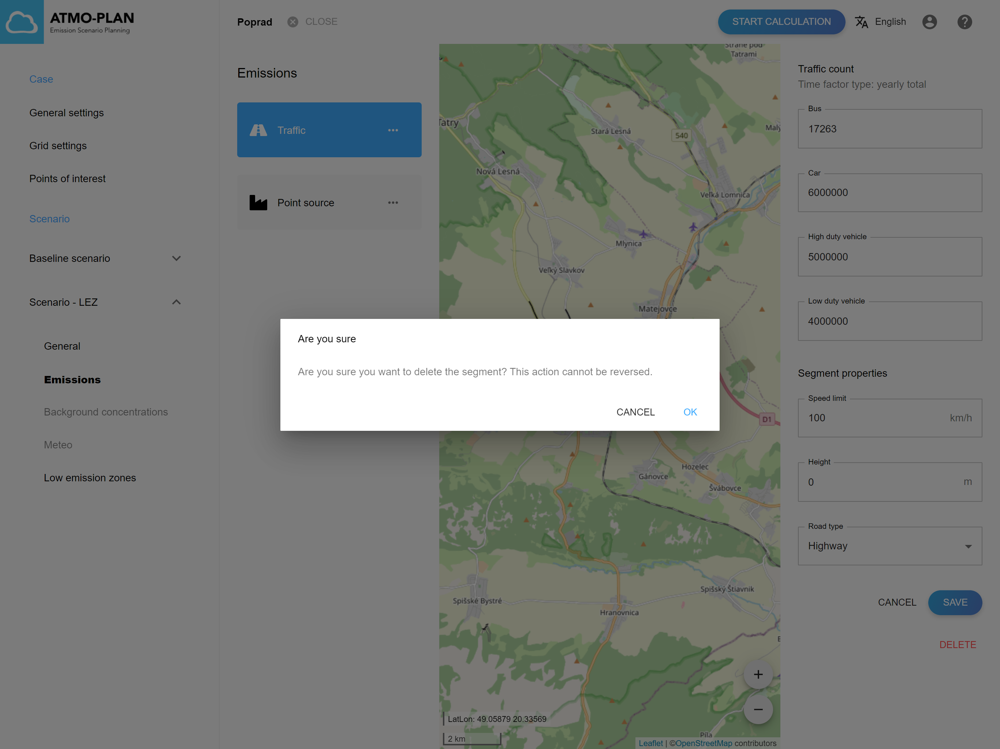
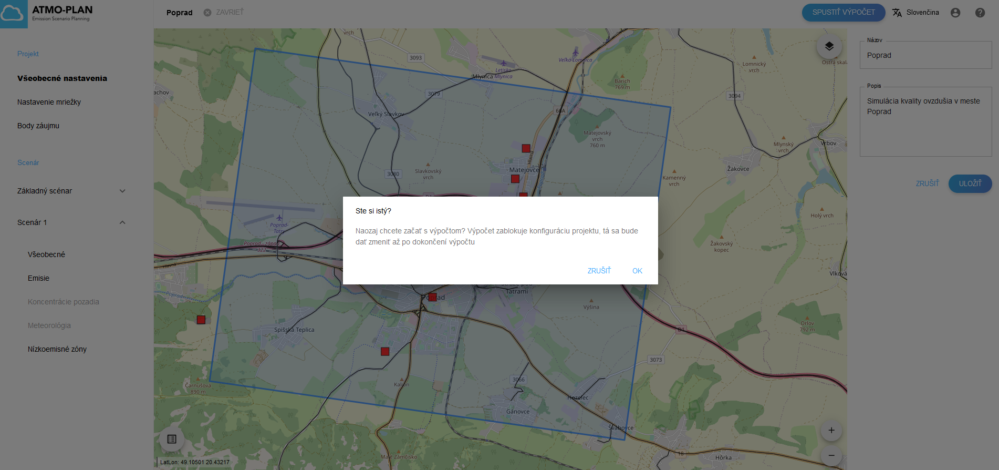
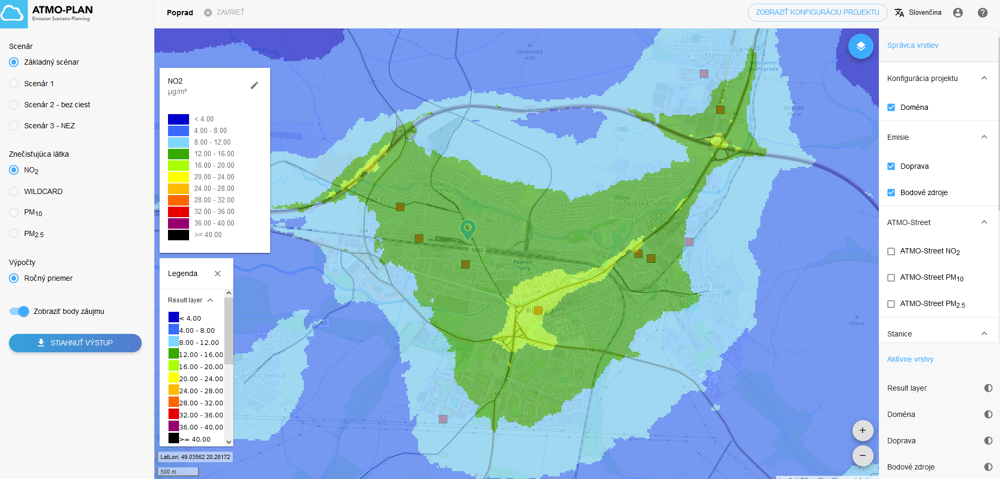

# Rýchle vytvorenie nového projektu

Ak chcete získať prvotné informácie o kvalite ovzdušia vo vašej študijnej oblasti, môžete postupovať podľa týchto krokov rýchleho spustenia a definovať základný scenár a niektoré ďalšie scenáre. 

## Krok 1: Vytvorenie nového projektu a základného scenára 

Na úvodnej stránke kliknite vpravo hore na symbol *Pridanie nového projektu* 

Create a new case by choosing the pre-calculated data option. Then simply draw your domain and enter a name for the case.

The case and baseline scenario are then automatically computed. The computation takes some time and the progress can be monitored in the status column of the case overview. When the computation is finished, the generated case and baseline scenario contain all necessary information to start a run (including a grid configuration, traffic emission, point source emission, background and meteo data). Click on the case name to open the case detail page.

## Step 2: Add a scenario by duplicating the baseline scenario

An extra scenario can be added to the case by simply duplicating the baseline scenario from step 1. The copied scenario will contain the same information as your baseline scenario, which is a good starting point to define your scenario.

## Step 3: Modify the copied scenario

The extra scenario can then be edited to define a realistic scenario. The following sections contain some examples:

### Example 1: Add a low emission zone

A low emission zone can be defined in a few steps. First, you should draw your LEZ and provide a name for it. Then you should define your LEZ fleet, by including/banning vehicle types in/from your LEZ.

### Example 2: Add a new road

A new road can be added by drawing it on the map and then specifying the traffic intensities and the other road properties.

### Example 3: Delete a road

A road can be deleted by selecting the road on the map, and the clicking the delete button.

## Step 4: Start the calculation

The calculation can be started by clicking on the 'Start calculation' button in the top right corner. The calculation will take some time and an e-mail will be sent when the calculation has finished.

## Step 5: Inspect the results

When a calculation is finished an email is sent to the user and the results of the calculation are made available in the tool. The results consist of interpolated maps and timeseries that can be visualized in the application and a zip file that can be downloaded.

