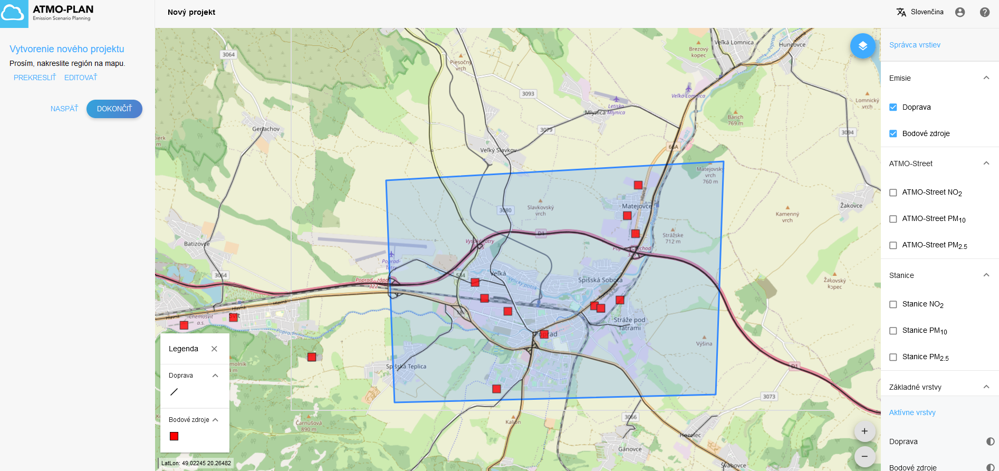
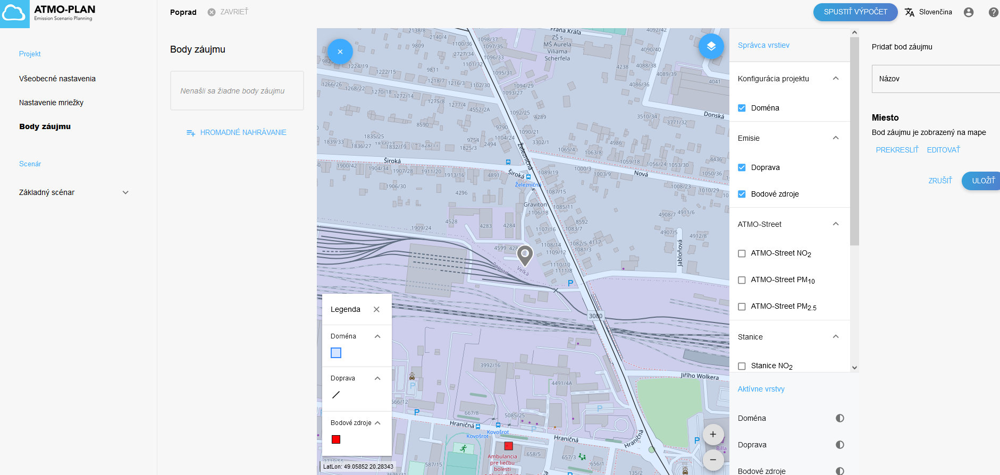
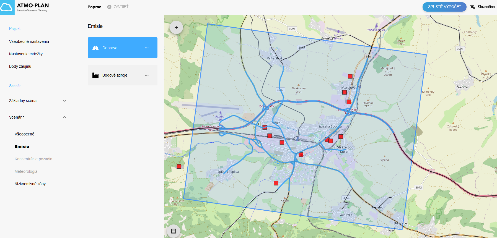
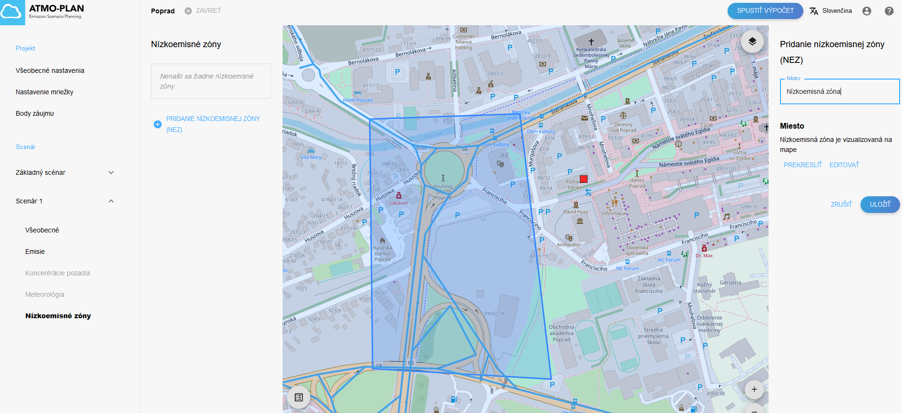
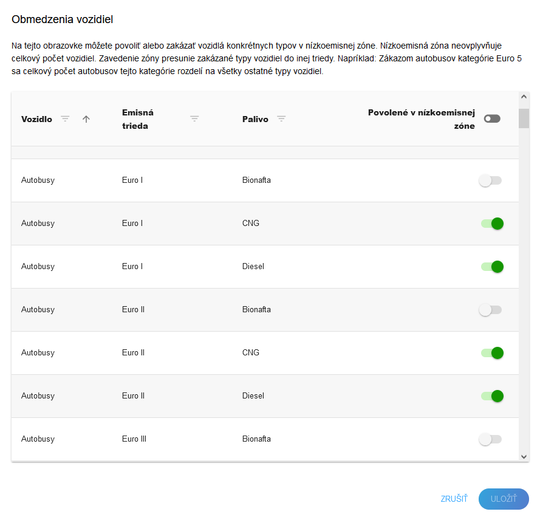

# Rýchle vytvorenie nového projektu

Nasledujúce kroky rýchleho spustenia Vás prevedú cez vytvorenie nového projektu, definíciu základného scenára a vytvorenia ďalších scenárov, v ktorých si môžete pridať vlastné bodové a cestné emisie alebo zmeniť tie v základnom scenári, a taktiež si v nich môžete definovať nízkoemisnú zónu. 

Projekt pozostáva z viacerých scenárov, pričom referenčný scenár, s ktorým sa budú porovnávať všetky ostatné scenáre, sa nazýva základný scenár. V základnom scenári sú všetky dáta - meteorológia, pozadie a emisie definované v aplikácii. V ostatných scenároch môže užívateľ meniť emsiné vstupy, no nemôže meniť meteorológiu ani pozadie.

## Krok 1: Vytvorenie nového projektu a základného scenára 

Na úvodnej stránke kliknite v záložke *Projekty* vpravo hore na symbol *Pridanie nového projektu*  

Otvorí sa Vám okno, kde môžete vyplniť názov projektu a jeho popis. Pričom na začiatku môžete použiť len vopred vypočítané údaje (zodpovedá základnému scenáru). Môžete si tiež pozrieť emisie základného scenáru v interaktívnej mape. 

Kliknite na tlačítko *Ďalej* a nakreslite región pre výpočtovú doménu projektu.

Kliknite na tlačítko *Dokončiť*. Vytvorí sa Vám projekt so základným scenárom (môže to trvať istý čas, sledujte informácie v stĺpci *Status*). Na úvodnej stránke kliknite na názov projektu, otvorí sa okno s projektom, v ktorom si môžete pozrieť základné informácie o projekte (konfiguráciu výpočtovej mriežky, emisie bodových a dopravných zdrojov, pozadie, meteorologické údaje). 

Pred spustením simulácií môžete pridať *Bod záujmu*. V týchto bodoch budú po dokončení simulácie dostupné časové rady koncentrácií znečisťujúcich látok. *Body záujmu* sú miesta, v ktorých nás koncetrácie znečisťujúcich látok zaujímajú prioritnejšie, môžu to byť napr. miesta monitorovacích staníc alebo miesta zvlášť citlivé na kvalitu ovzdušia. Body záujmu možeme pridať nasledovne:

1. na ľavom paneli kliknite na *Body záujmu* a na mape vľavo hore kliknite na symbol + a nakreslite *Bod záujmu* do mapy a pridajte k nemu názov. 

2. načítaním zo súboru, ktorý je pripravený pomocou manuálu (kliknite na *HROMADNÉ NAHRÁVANIE*)

Ďalej si ukážeme ako vytvoriť scenáre s vlastne definovanými emisiami a nízkoemisnými zónami.  

## Krok 2: Pridanie scenáru kopírovaním základného scenára

K základnému scenáru je možné pridať ďalší scenár jednoduchým kopírovaním základného scenáru. Prostredníctvom tlačidla na obrázku skopírujte základný scenár

Následne zadajte názov 

Skopírovaný scenár bude obsahovať rovnaké informácie ako základný scenár, čo je dobrý východiskový bod na definovanie nového scenára, ktorý môžete modifikovať nasledovným spôsobom.  

## Step 3: Modifikácia vytvoreného scenáru

Vo všetkých scenároch okrem základného môžete meniť veľkosť emisií už existujúcich zdrojov v doméne, môžete pridávať nové bodové a cestné zdroje a vytvoriť nízkoemisnú zónu.

### Príklad 1: Pridanie bodového zdroja

Nový zdroj môže byť pridaný 

1. manuálne 

V scenári kliknite na *Emisie* -> *Bodové zdroje* -> a na mape vľavo hore kliknite na symbol + a zakreslite nový bodový zdroj do mapy.

V paneli vľavo môžete potom jednoducho pridať názov zdroja a jeho vlastnosti

2. načítaním zo súboru, ktorý je pripravený pomocou manuálu (kliknite na tri bodky pre načítanie súboru s bodovými zdrojmi)

### Príklad 2: Zmena vlastností bodového zdroja alebo vymazanie bodového zdroja 

V scenári kliknite na *Emisie* -> *Bodové zdroje* a na mape kliknite na cestný úsek (editovateľné sú bodové zdroje vyznačené modrými štvorčekmi). V paneli vľavo môžete potom zmeniť jeho vlastnosti, alebo ho úplne vymazať tlačidlom *ODSTRÁNIŤ*, ktoré sa nachádza vpravo dole.

### Príklad 3: Pridanie novej cesty

Nová cesta môže byť pridaná 

1. manuálne 
V scenári kliknite na *Emisie* -> *Doprava* -> a na mape vľavo hore kliknite na symbol + a nakreslite cestu do mapy.

Následne zadajte dopravné intenzity a ostatné vlastnosti cestného segmentu. 

2. načítaním zo súboru, ktorý je pripravený pomocou manuálu (kliknite na tri bodky pre načítanie súboru s cestnými segmentmi)

### Príklad 4: Zmena vlastností cestného segmentu alebo vymazanie cesty  

V scenári kliknite na *Emisie* -> *Doprava* a na mape kliknite na cestný úsek (editovateľné sú cestné úseky vyznačené modrou farbou). Môžete zmeniť jeho vlastnosti, alebo ho úplne vymazať tlačidlom *ODSTRÁNIŤ* v paneli vľavo dole. 

### Príklad 5: Pridanie nízkoemisnej zóny

V scenári kliknite na *Nízkoemisné zóny* -> *Pridanie nízkoemisnej zóny* a pomenujte a nakreslite nízkoemisnú zónu a kliknite na tlačidlo *Uložiť*.

Po nakreslení nízkoemisnej zóny kliknite vľavo dole na *Vozidlá v nízkoemisnej zóne* a definujte aké typy vozidiel povolíte v nízkoemisnej zóne

## Krok 4: Spustenie výpočtu

Výpočet je možné spustiť kliknutím na tlačidlo „Spustiť výpočet“ v pravom hornom rohu. Trvanie výpočetu je závislé od veľkosti domény, počtu zdrojov a dostupných výpočtových prostriedkov. Po dokončení výpočtu Vám bude odoslaný e-mail.  

## Krok 5: Prezeranie výstupov 

Po dokončení výpočtu sa výsledky výpočtu sprístupnia v aplikácii. Kliknutím na „Zobrazenie výsledkov“ na stránke prehľadu projektov zobrazíte výsledné interpolované mapy a časové rady. V predvolenom nastavení sa zobrazujú výsledky pre základný scenár. Po kliknutí na ostatné scenáre sa pod nápisom *Výpočty* zobrazí možnosť zobrazenia máp pre *Rozdiel* a *Relatívny rozdiel* medzi základným a vybraným scenárom. Mapy (ako súbory .tif) a časové rady v bodoch záujmu  (ako súbory .csv) pre koncetrácií znečisťujúcich látok si môžete stiahnuť kliknutím na tlačidlo *Stiahnuť výstup*. Časové rady je možné zobraziť v nástroji kliknutím na bod záujmu. 

