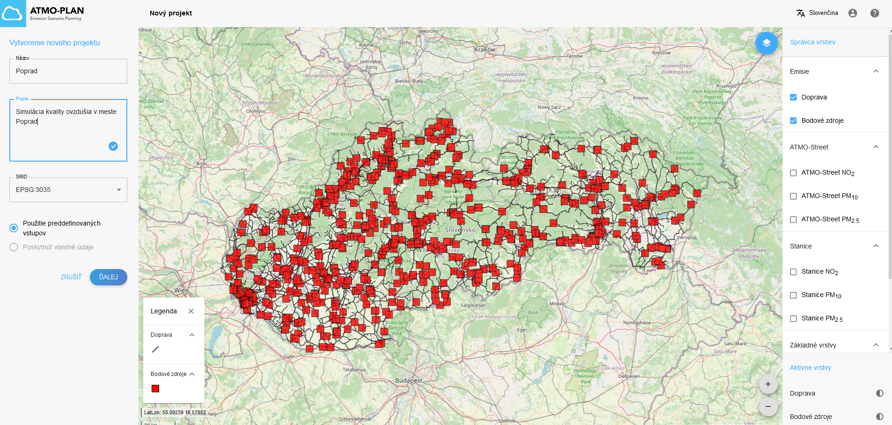

# Rýchle vytvorenie nového projektu

Nasledujúce kroky rýchleho spustenia Vás prevedú cez vytvorenie nového projektu, definíciu základného scenára a vytvorenia ďalších scenárov, v ktorých si môžete pridať vlastné bodové a cestné emisie alebo zmeniť tie v základnom scenári, a taktiež si v nich môžete definovať nízkoemisnú zónu. 

## Krok 1: Vytvorenie nového projektu a základného scenára 

Na úvodnej stránke kliknite v záložke *Projekty* vpravo hore na symbol *Pridanie nového projektu*  

Otvorí sa Vám okno, kde môžete vyplniť názov projektu a jeho popis. Pričom na začiatku môžete použiť len vopred vypočítané údaje (zodpovedá základnému scenáru). 

Kliknite na tlačítko *Ďalší*. A nakreslite región pre výpočtovú doménu projektu.

Kliknite na tlačítko Dokončiť. Vytvorí sa Vám projekt so základným scenárom (môže to trvať istý čas). Na úvodnej stránke kliknite na názov projektu, otvorí sa vám okno s projektom, v ktorom si môžete pozrieť základné informácie o projekte (konfiguráciu výpočtovej mriežky, emisie bodových a dopravných zdrojov, pozadie, meteorologické údaje). Ďalej si ukážeme ako vytvoriť scenáre s vlastne definovanými emisiami a nízkoemisnými zónami.  

## Krok 2: Pridanie scenáru kopírovaním základného scenára

K základnému scenáru je možné pridať ďalší scenár jednoduchým kopírovaním základného scenáru. Prostredníctvom tlačidla na obrázku skopírujte základný scenár

Následne zadajte názov 

Skopírovaný scenár bude obsahovať rovnaké informácie ako základný scenár, čo je dobrý východiskový bod na definovanie nového scenára, ktorý môžete modifikovať nasledovným spôsobom.  

## Step 3: Modifikácia vytvoreného scenáru

Vo všetkých scenároch okrem základného môžete meniť veľkosť emisií už existujúcich zdrojov v doméne, môžete pridávať nové bodové a cestné zdroje a vytvoriť nízkoemisnú zónu.

### Príklad 1: Pridanie novej cesty

Nová cesta môže byť pridaná 

A new road can be added by drawing it on the map and then specifying the traffic intensities and the other road properties.

### Example 3: Delete a road

A road can be deleted by selecting the road on the map, and the clicking the delete button.

### Example 1: Add a low emission zone

A low emission zone can be defined in a few steps. First, you should draw your LEZ and provide a name for it. Then you should define your LEZ fleet, by including/banning vehicle types in/from your LEZ.

## Step 4: Start the calculation

The calculation can be started by clicking on the 'Start calculation' button in the top right corner. The calculation will take some time and an e-mail will be sent when the calculation has finished.

## Step 5: Inspect the results

When a calculation is finished an email is sent to the user and the results of the calculation are made available in the tool. The results consist of interpolated maps and timeseries that can be visualized in the application and a zip file that can be downloaded.

