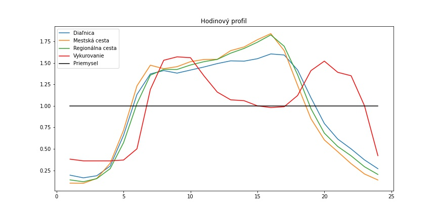
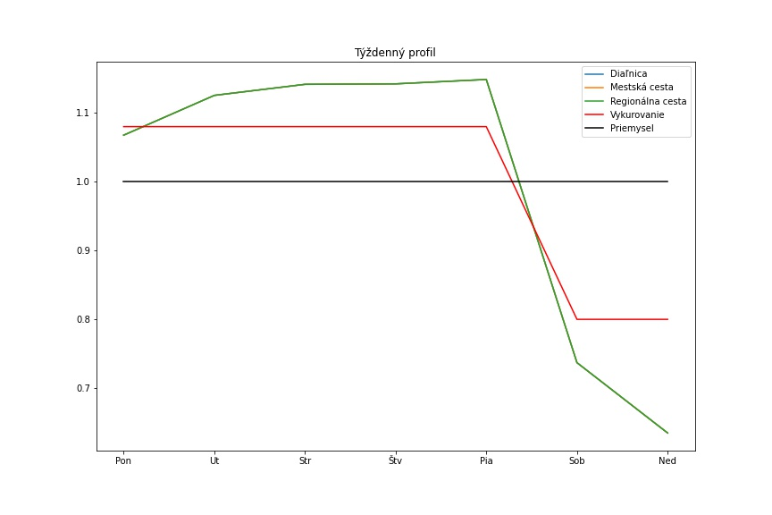
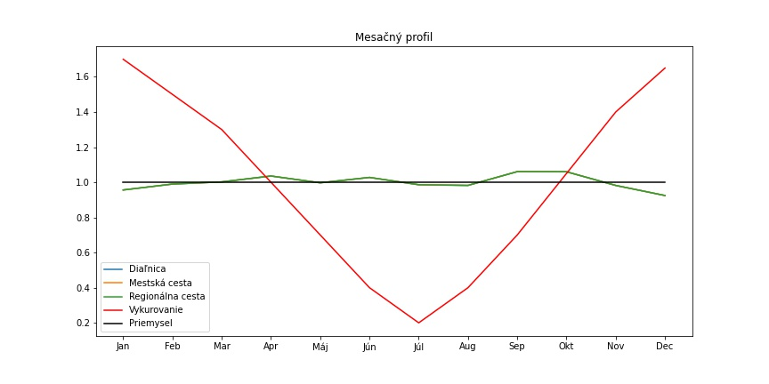

Časové profily reprezentujú priebeh emisie znečisťujúcich látok zo zdroja do prostredia. 
Aplikácia ATMOPLAN má v sebe zabudované tri tipy časových profilov (hodinový, týždenný a mesačný) pre každý typ zdroja.
Výsledný časový profil vznikne ako kombinácia hodinového, týždňového a mesačné časového profilu pre danú hodinu v roku.
Výsledný faktor z kombinácie časových profilov sa aplikuje na priemernú emisiu zdroja a tým vytvorí časovú variáciu emisií zdrojov.

## Vykurovanie domácností
Profil pre vykurovanie domácností zohľadňuje priebeh vykurovacej sezóny, aktivitu obyvateľstva v rámci dňa a zmeny počas pracovného týždňa a víkendu.

## Doprava
Dopravný časový profil zachytáva kolísanie dopravných intenzít v rámci rannej a večernej špičky a zmeny počas pracovného týždňa a víkendu. 
Profil sa delí na 3 podkategórie, tieto kategórie zohľadňujú intenzity dopravy na cestách typu: Diaľnica, mestská a regionálna cesta.
Výsledné podkategórie sa líšia len veľmi mierne v rámci hodinového časového profilu.

## Priemysel
Špecifikom časového profilu pre bodové zdroje (priemysel) je, že je konštantný počas celého roka a výpočet používa priamo užívateľom zadanú hodinovú emisiu.

