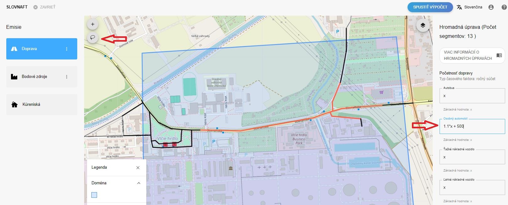

ATMOPLAN umožňuje jednoduchým spôsobom hormadne škálovať importované dopravné intenzity.

Vo vytvorenom scenári projektu si klikneme na emisie z dopravy.

V ľavej hornej časti obrazovky sa nachádza utilita s ikonou "lasa".
Tento nástroj slúži na výber úsekov pomocou kreslenia uzavretého polygónu.
Po nakreslení polygónu, ktorý farebne vyznačí vybrané úseky, sa v pravej časti obrazovky zobrazia príslušné parametre pre vybrané úseky.
V prípade, že úseky nemajú zhodné parametre, sa čísla nahradia symbolom "x".

Do príslušného pola s intenzitami, či už s číslom alebo symbolom x, je možné vložiť jednoduchú matematickú rovnicu.
Y(výsledná intenzita) =  a * X(vstupná intenzita) + b

V príklade uvedenom na obrázku budeme vybrané úseky škálovať faktorom a = 1.1 (10 % nárast) a ešte pripočítame hodnotu b = 500.
Takto môžeme modifikovať všetky polia s dopravnými intenzitami ( autobusy, osobné autá,  ľahké a ťažké nákladné autá)
Po úspešnom vložení vzorcov klikneme na tlačidlo uložiť a systém automatikcy prepočíta hodnoty.

Pre prehľadnejšie porovnávanie a overenie hodnôt môžeme kliknúť na vybraný cestný úsek a pozrieť si jeho aktuálnu hodnotu.
Pod každým poľom s intenzitou sa zobrazuje jeho základná hodnota(baseline value) a v poli samotnom je zobrazená nová buď priamo zadaná alebo prepočítaná hodnota.

Týmto spôsobom je možné škálovať aj väčšie oblasti, keď sa zavádzajú napr. projekcie intenzít do budúcnosti, kde sa často aplikuje percentuálny nárast pre jednotlivé kategórie automobilov.
 

