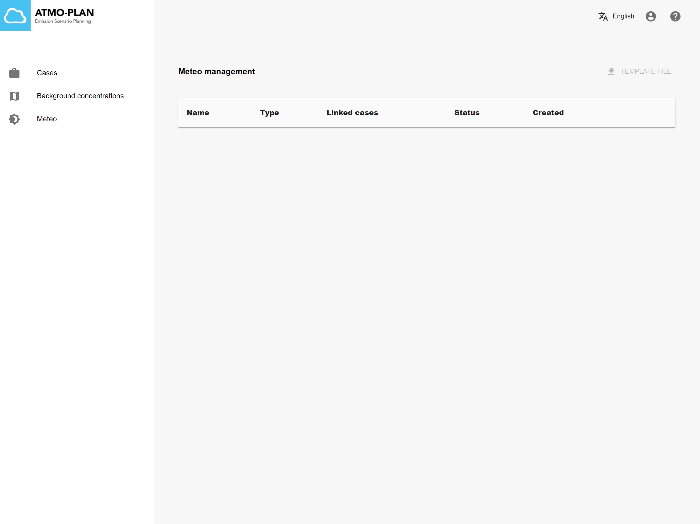

:::tip Available in each deployment
:::

When clicking on the menu item 'Meteo' in the main page, an overview of all available meteo is shown.

Each meteo item has the following properties:

- Name: the name of the meteo
- Type:
  - Predefined CAMS data: when the meteo is provided by the system (TODO)
  - Custom data yes: when the meteo is defined by the user.
- LinkedCases: the number of cases that are using the meteo. A meteo that is used in at least one case cannot be deleted.
- Status: This property can have three different values:
  - No file: No file has been uploaded yet.
  - Finished: The file has been uploaded and imported successfully.
  - Failed: The file has been uploaded, but contains validation errors. When clicking on the status, an error message is shown.
- Created: The creation date

:::caution
In Slovakia and Hungary, the list of meteo is empty. In these deployments, the only background concentration is a RIO background, which has a fixed meteo associated that is not shown in the tool.
:::
