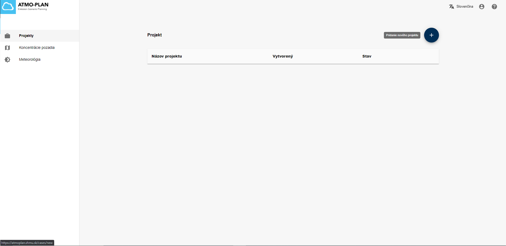
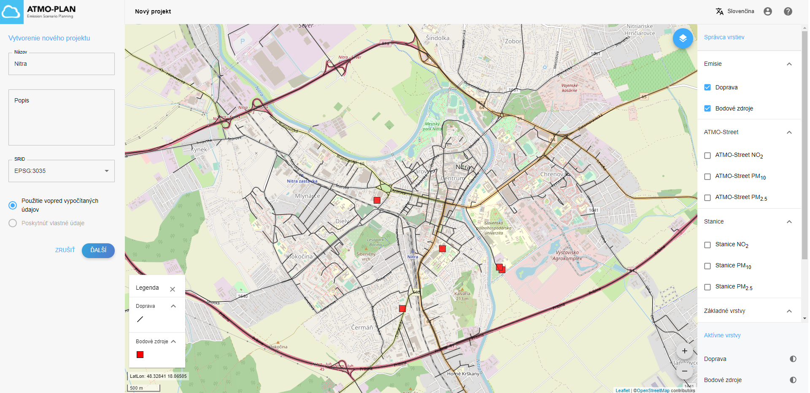
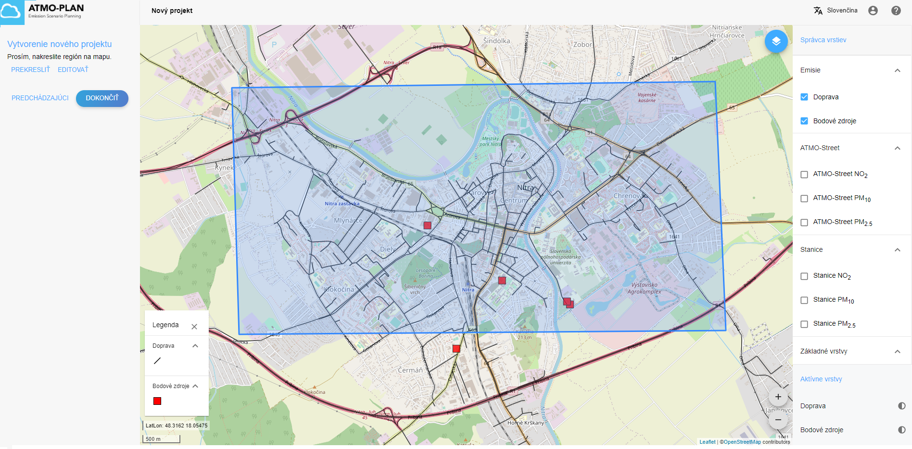
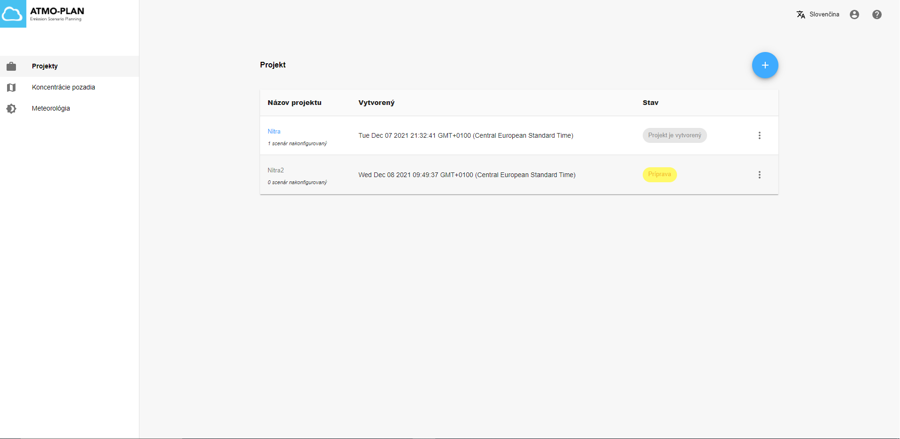
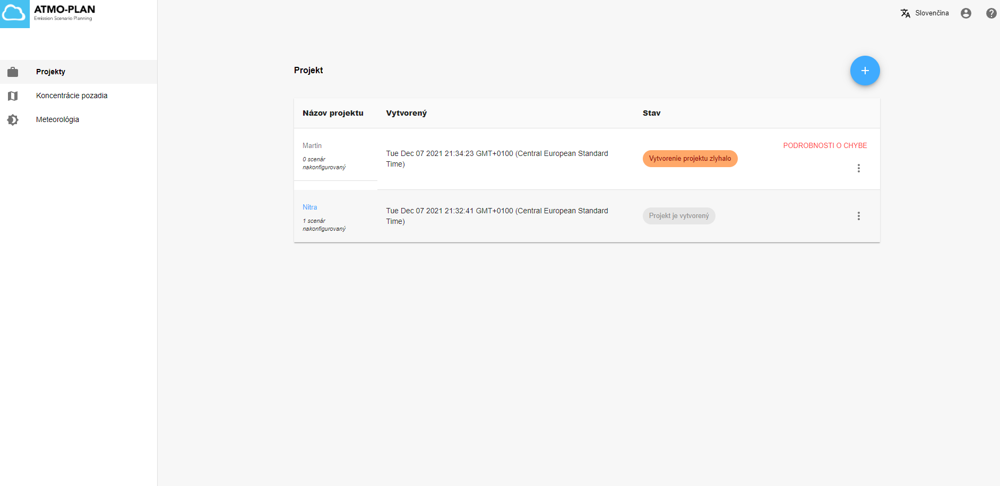
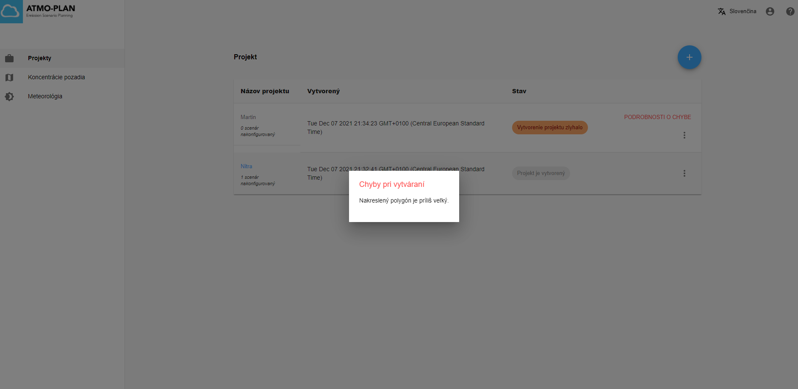
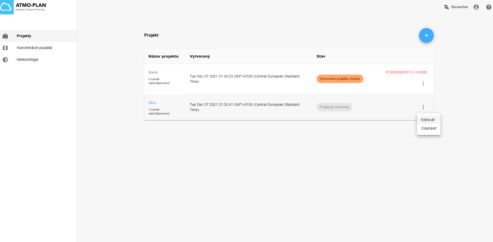
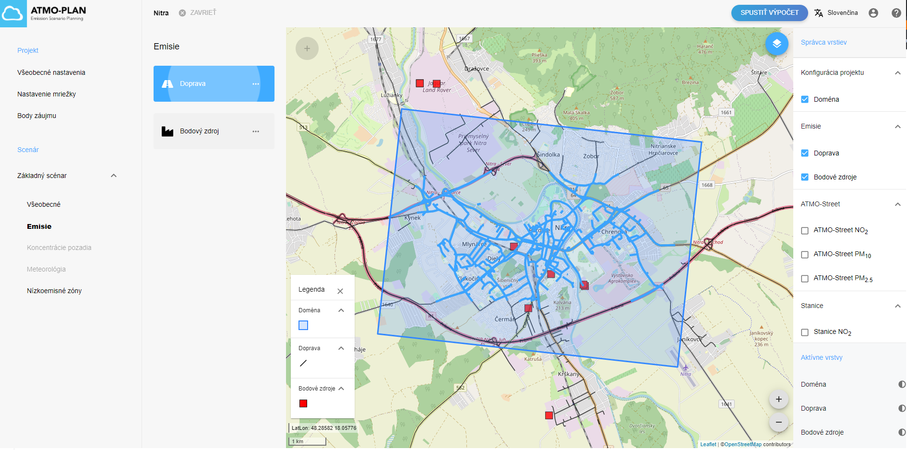
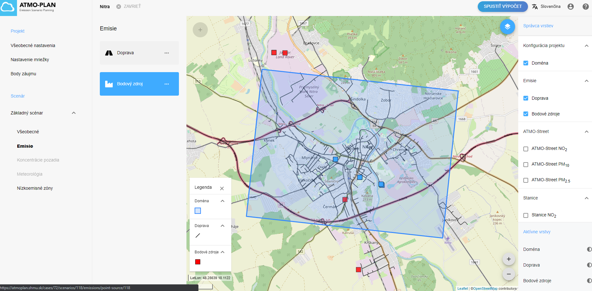

# Vytvorenie projektu a základného scenára na základe vopred vypočítaných údajov 

Do aplikácie ATMO-Plan boli vložené údaje reprezentatívne pre Slovenskú republiku. Medzi ne patria informácie o bodových zdrojoch, emisiách z cestnej premávky, pozaďové koncentrácie a meteorológia. Tieto údaje sú automaticky aplikované pri vytváraní nových projektov. Výpočet slúži ako prvý referenčný základ na získanie údajov o situácii v kvalite ovzdušia a umožňuje používateľom otestovať vplyv nízkoemisných zón alebo iných opatrení na zníženie emisií z dopravy.

## Krok 1: Výber projektu 

Po kliknutí na menu Projekty na hlavnej stránke sa projekty používateľa zobrazia v tabuľke. Ak chcete vytvoriť nový projekt, kliknite na znamienko + vpravo hore.

Po kliknutí sa spustí sprievodca. V prvom kroku sprievodcu môžete zadať názov a voliteľný popis. ATMO-Plan používa predefinovanú projekciu EPSG:3035, v ktorej sa generované aj výsledky výpočtu. Následne vyberte možnosť „Použiť vopred vypočítané údaje“, ako je znázornené na obrázku nižšie. Kliknutím na 'Ďalší' otvoríte ďalší krok sprievodcu. Kliknutím na „Zrušiť“ zatvoríte sprievodcu a prerušíte vytváranie projektu.

## Krok 2: Nakreslite svoju doménu

V druhom kroku sprievodcu môžete na mapu nakresliť doménu vášho projektu. To sa robí kliknutím na mapu a nakreslením rohov polygónu. Priblížiť/oddialiť môžete pomocou ikon v pravom dolnom rohu mapy alebo pomocou kolieska myši. Kreslenie polygónu ukončíte kliknutím na prvý bod polygónu.

Domény môžu byť ľubovoľné polygóny, ktoré by mali by mať veľkosť približne jedného mesta. Ak je doména príliš veľká, zobrazí sa chybové hlásenie, ktoré vám povie, aby ste nakreslili menšiu doménu. K dispozícii sú iba údaje pre Slovenkú republiku. Ak nakreslíte polygón mimo tejto oblasti, zobrazí sa chybové hlásenie.

Vpravo je zobrazený správca vrstiev. Ten vám umožňuje vizualizovať mapy, ktoré vám môžu pomôcť pri kreslení vášho projektu. Mapy zahŕňajú cesty a bodové zdroje celého regiónu, podkladové mapy pre rôzne znečisťujúce látky a umiestnenie monitorovacích staníc pre rôzne znečisťujúce látky.

Po nakreslení polygónu kliknutím na Ďalej zatvoríte sprievodcu. 

## Krok 3: Sledovanie priebehu vytvárania projektu

Po kliknutí na „Ďalej“ sa nový projekt zobrazí v tabuľke prehľadu projektov, kde je možné skontrolovať stav vytvárania projektu. Stav výpočtu je zobrazený v stĺpci „Stav“. Obnovuje sa automaticky a môže mať nasledujúce hodnoty:

- Príprava: tvorba projektu stále prebieha
- Projekt je vytvorený: vytváranie bolo úspešne dokončené. Projekt je teraz pripravený na úpravu.
- Vytvorenie projektu zlyhalo: vytvorenie zlyhalo. Po kliknutí na „Podrobnosti o chybe“ sa zobrazí chybové hlásenie.

Po zatvorení sprievodcu sa na pozadí automaticky spustí vytváranie projektu. Vypočítajú sa nasledujúce údaje:

- Vytvorí sa nový projekt so zadaným názvom, popisom a projekciou.
- Na základe nakreslenej domény sa určí vhodná konfigurácia mriežky.
- Pre projekt je vytvorený základný scenár.
- Nasledujúce údaje sa vypočítajú a uložia v základnom scenári:
   - Pre nakreslenú doménu je vypočítaná sieť.
   - Pre nakreslenú doménu sa určí skladba vozového parku.
   - Vypočíta sa mapovanie siete.
   - Pre doménu sú určené bodové zdroje.
   - Koncentrácie pozadia a meteorologické podmienky sú vypočítané pre nakreslenú doénu.

Získavanie údajov môže trvať niekoľko minút. 

:::Upozornenie: Existujú určité obmedzenia týkajúce sa veľkosti domény.
Doména by mala byť maximálne 1000 km2 a (pre výpočtové obmedzenia) maximálny počet ciest je 10 000. Ak je doména príliš veľká alebo ak je vo vybranej doméne príliš veľa ciest, vytvorenie projektu zlyhá a stav sa zmení na „Vytvorenie projektu zlyhalo“. Kliknutím na „Podrobnosti o chybe“ sa zobrazí chybové hlásenie. V oboch prípadoch by mala byť poskytnutá menšia doména.

 

## Krok 4: Úprava projektu

Po dokončení vytvárania projektu sa v prehľade projektov zobrazí stav „Projekt je vytvorený“. Od tohto momentu je projekt k dispozícii na úpravu. Kliknite na názov projektu alebo otvorte ponuku projektu a kliknite na „Upraviť“. Otvorí sa stránka s podrobnosťami o projekte, ktorá zobrazuje projekt a jeho základný scenár.

Vypočítané úseky ciest je možné zobraziť tak, že prejdete na základný scenár, kliknete na „Emisie“ a potom na „Doprava“.

Vypočítané bodové zdroje je možné zobraziť podobným spôsobom kliknutím na „Bodový zdroj“.

