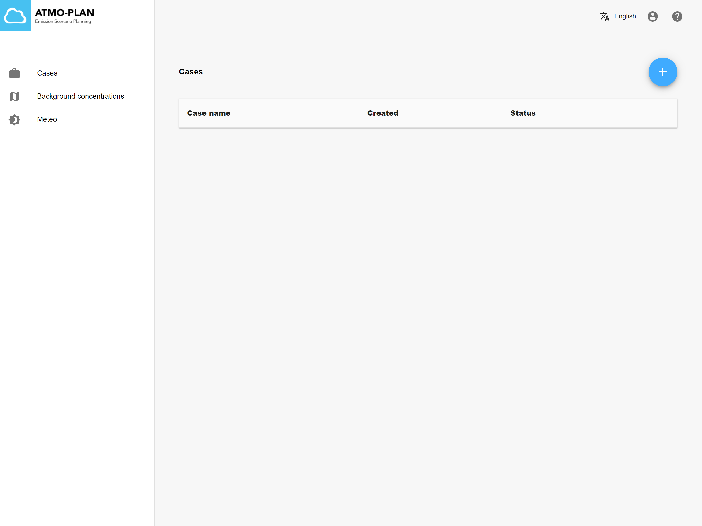
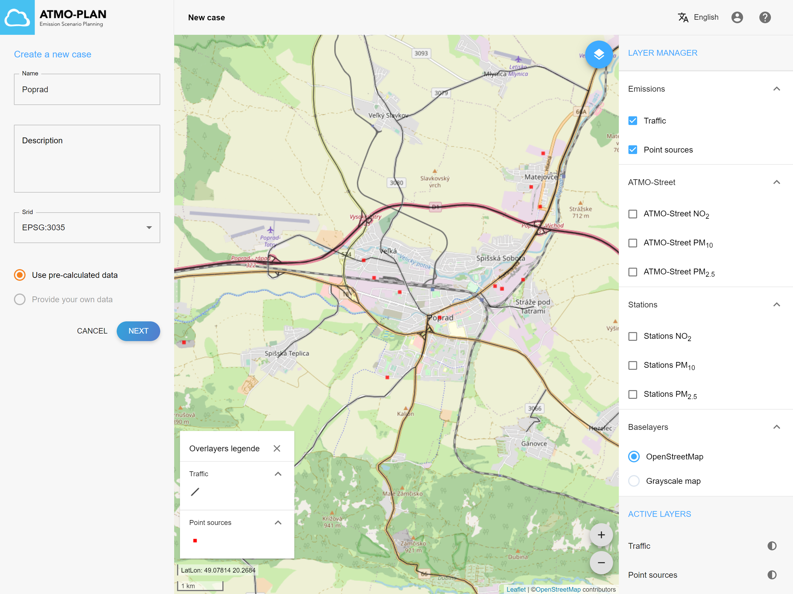
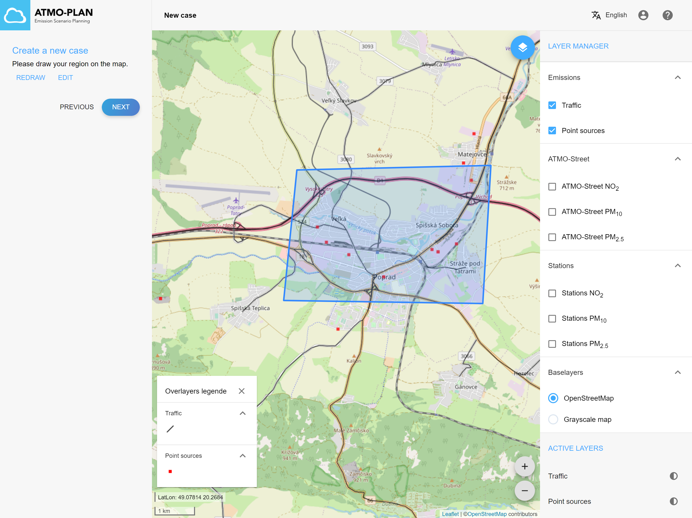
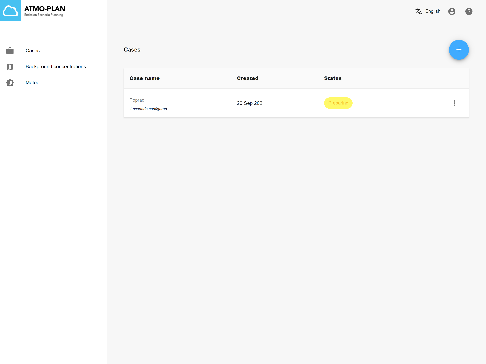
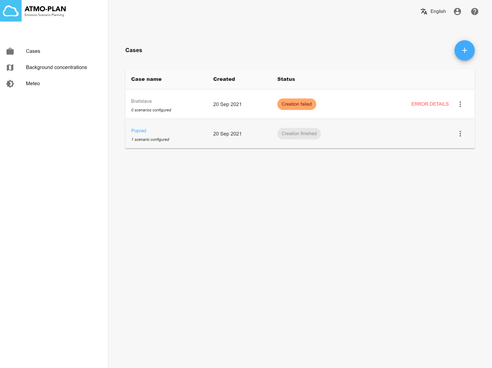
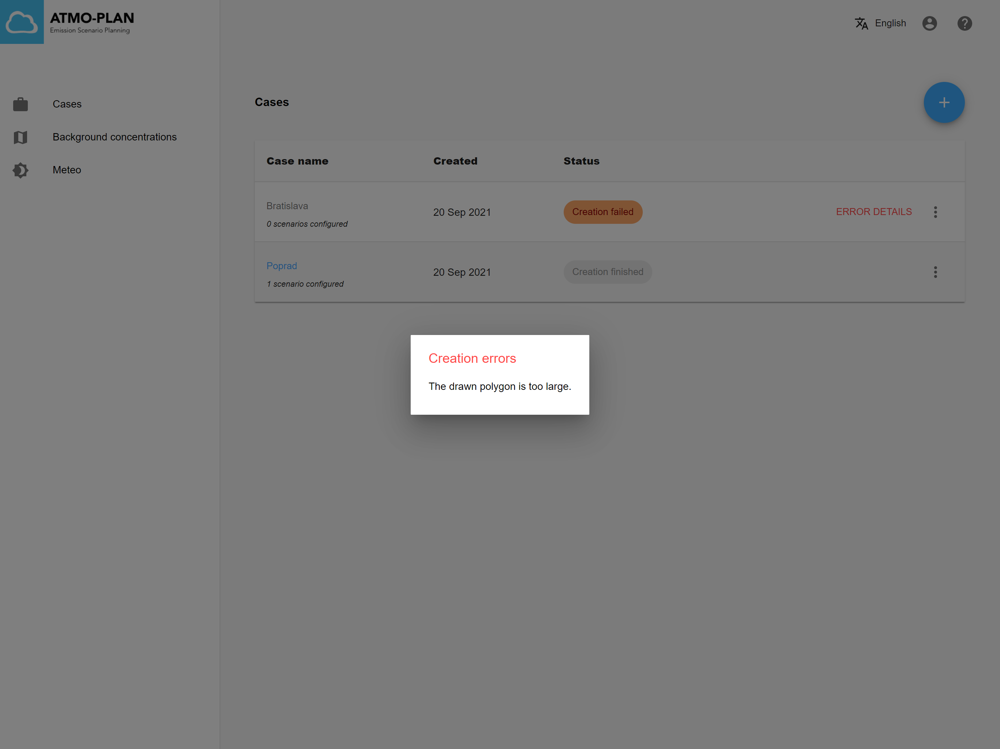
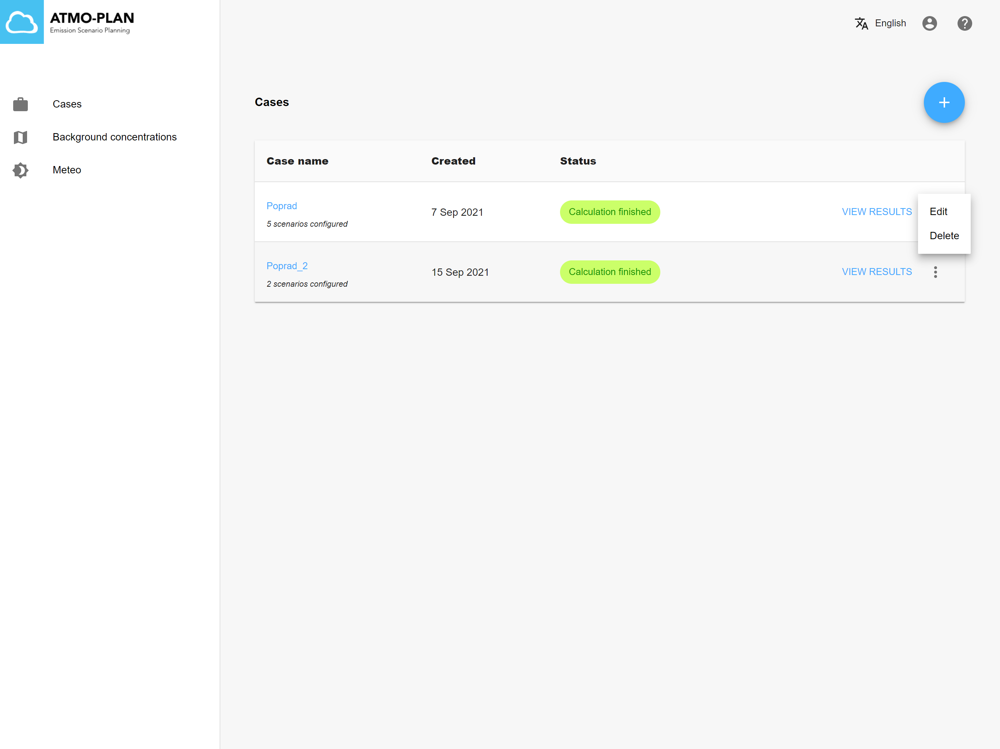
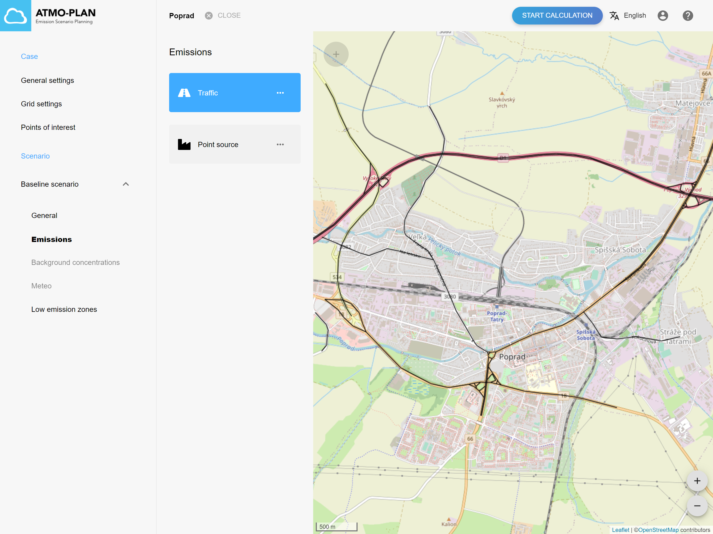
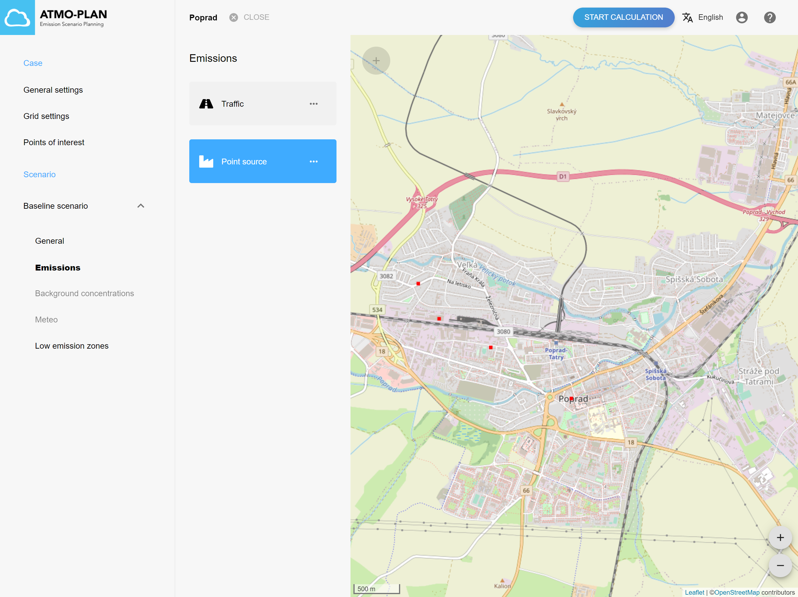

# Creating a case and baseline scenario based on pre-calculated data

:::tip Available in Slovakia, Hungary
:::

(TODO: herschrijven) For quick screening and testing purposes, generic EU-wide data for all 28 members of the European Union has been inserted in the ATMO-Plan application. More details concerning this dataset is provided in Appendix H : Generic EU-wide data. We recommend that this data is only used as a first screening to provide a first estimate of the air quality concentrations. This serves as a first basic reference baseline to get an indication of the air quality situation and allow users to already test the impact of LEZ or other actions to reduce traffic emissions. The data is based on (a downscaling of) open source datasets, and errors in the underlying datasets may be reflected in the final dataset. In those cases, the custom data should be complemented with local bottom-up data.
Performing a quick scan of the air quality based on the generic EU-wide data comprises of two key processes. Firstly, all the input data is acquired from the VITO-servers, secondly, using this data the air quality simulation is started.

## Step 1: Select the correct case type

When clicking on the Cases menu in the main page, the cases for the user are shown in a table. To create a new case, click the + sign at the top right.

 A wizard is started. In the first step of the wizard, you can provide a name and optional description for your case and you can select the SRID in which the calculation results should be returned. Then select the 'Use pre-calculated data' option as shown in the figure below. Click on 'Next' to open the next step of the wizard. Click on 'Cancel' to close the wizard and abort the case creation.

## Step 2: Draw your domain

In the second step of the wizard, you can draw the domain of your case on the map. This is done by clicking on the map and drawing the corners of a polygon. You can zoom in/out using the icons at the bottom right of the map, or by using the mouse wheel. Close the polygon by clicking on the first corner.

Domains can be any polygon and should approximately be the size of a single city. If the domain is too large, an error message will appear, telling you to draw a smaller domain. Furthermore, only data is available for your region of interest. If you draw a polygon outside of that region, an error message will appear.

After drawing the polygon, click on Next to close the wizard.

## Step 3: Watch the progress of the case creation

After clicking on 'Next', the new case will appear in the case overview table where the status of the case creation can be inspected. The status of the calculation is shown in the 'Status' column. It is refreshed automatically and can have the following values:

- Preparing: the creation is busy
- Creation finished: the creation has completed successfully. The case is now ready to be edited.
- Creation failed: the creation has failed. When clicking on 'Error details', an error message is shown.

After closing the wizard, the case creation automatically starts in the background. The following data is calculated:

- A new case is created, with the provided name, description and SRID.
- Based on the drawn domain, an appropriate grid configuration is determined.
- A baseline scenario is created for the case.
- The following data is calculated and stored in the baseline scenario:
  - A network is calculated for the drawn domain.
  - A fleet is calculated for the drawn domain.
  - A network mapping is calculated.
  - Point sources are calculated for the drawn domain.
  - Background concentrations and meteorological conditions are calculated for the drawn domain.

Acquiring the data can take several minutes.

:::caution
TODO: uitleg over buffer, verschilt per deployment, waarom doen we dit?
:::

:::caution There are some limitations on the size of the domain.
The domain should maximally be 1000 km2 and (for computational constraints) the maximum number of roads is 10.000. If the domain is too big or if there are too many roads in the selected domain, the creation of the case will fail and the status will change to 'Creation failed'. By clicking on 'Error details', an error message is shown. In both cases, a smaller domain should be provided.
:::

 

## Step 4: Inspect your case

When the creation of the case is complete, the status 'Creation finished' will appear in the case overview. From that moment, the case is available for editing. Click on the case name or open the case menu and click on 'Edit'. The detail page for the case is opened, showing the case and its baseline scenario.

The computed road segments can be visualized by going to the base scenario, clicking on 'Emissions' and then on 'Traffic'.

The computed point sources can be visualized in a similar way by clicking on 'Point source'.

