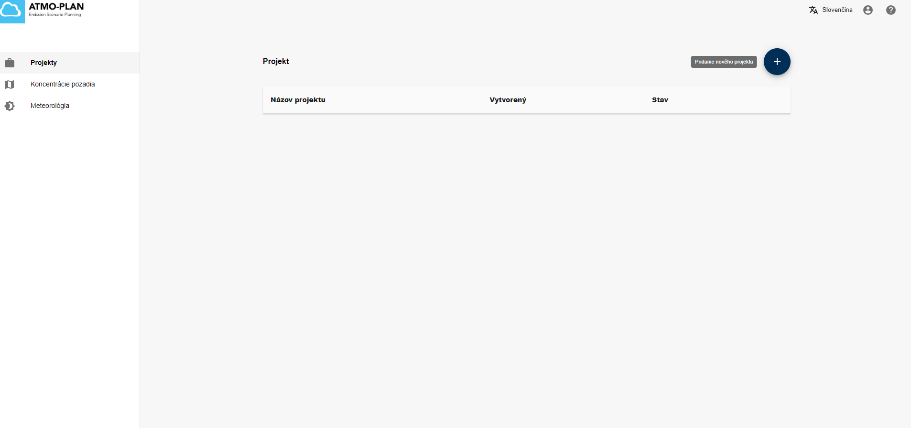

# Vytvorenie nového projektu

Na vytvorenie nového projektu kliknite na + znamienko v pravom hornom rohu. Vytvorené projekty sa zobrazia v tabuľke. 
When clicking on the Cases menu in the main page, the cases for the user are shown in a table. To create a new case, click the + sign at the top right.

Je možné vytvoriť dva druhy projektov:

- [Projekty s automatickým použitím vopred vypočítaných dát](./creating-a-predefined-case.md)
- [Projekty vytvorené od základu s použitím vlastných dát](./creating-a-normal-case.md)

Oba druhy projektov sú vysvetlené v sekcií nižšie.

