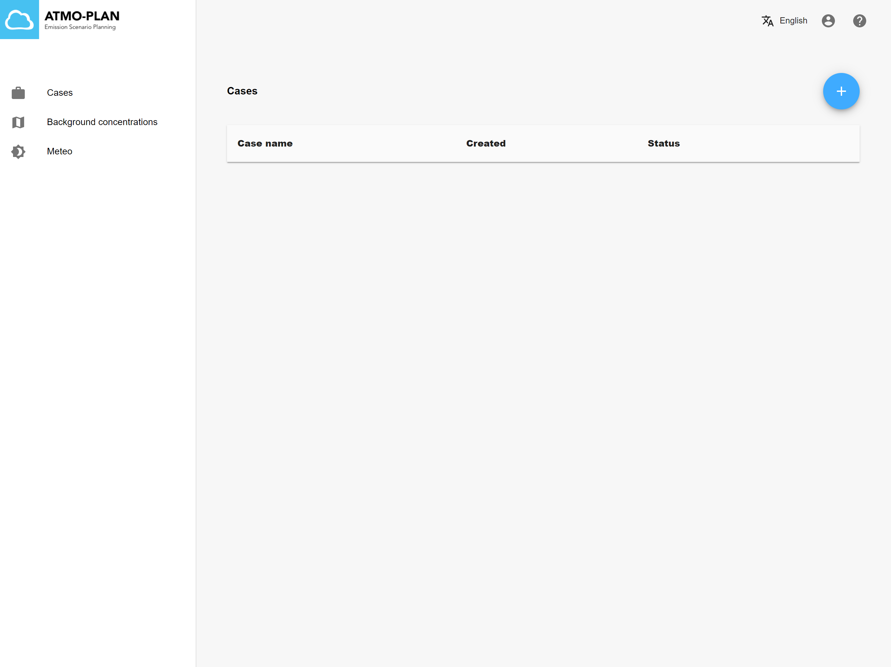

# Creating a new case

:::tip Available in each deployment
:::

When clicking on the Cases menu in the main page, the cases for the user are shown in a table. To create a new case, click the + sign at the top right.

There are two types of cases that can be created:

- [Cases that are automatically created using pre-calculated data](./creating-a-predefined-case.md)
- [Cases that are created from scratch, providing your own data](./creating-a-normal-case.md)

Both case types are explained in the sections below.
