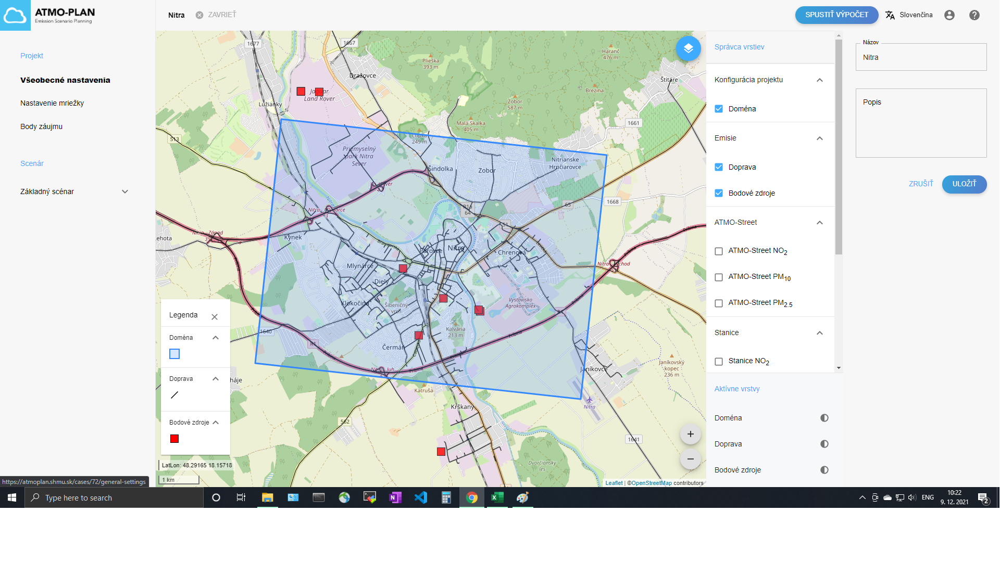

## Kontrola všeobecných nastavení projektu

Prejdite na stránku s podrobnosťami o projekte a kliknite na „Všeobecné nastavenia“. Názov a popis projektu si môžete pozrieť tu.

## Aktualizácia všeobecných nastavení projektu

Prejdite na stránku s podrobnosťami o projektu a kliknite na „Všeobecné nastavenia“. Tu je možné upraviť názov a popis.
::: Upozornenie
Všeobecné nastavenia nie je možné aktualizovať počas prebiehajúceho výpočtu alebo po jeho (úspešnom) dokončení. Všeobecné nastavenia sú potom prístupné len na čítanie.
:::

