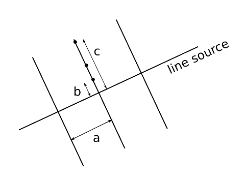
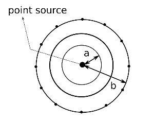

## Inspecting the grid settings of a case

:::tip Available in each deployment
:::

Before the case results are calculated, the user will have to set up the calculation grid. As the underlying IFDM dispersion model is a Gaussian model and thus source receptor based, it requires a receptor grid on which to calculate the concentrations. From this receptor grid, an interpolated map with the final concentration values can be derived. However, for this interpolation to succeed, the receptor grid should be adjusted to capture the spatial gradients in the concentration field. To this end there are different receptor grids added to the calculation:

- A **regular grid**, which consists of a rectangular mesh of evenly spaced grid points.
- A **line based grid**, with added grid refinements around the roads, thus allowing better representation of the concentration gradients around the roads.
- A **point based grid**, which serves a similar purpose, but is centered around the location of the point sources.

As [mentioned earlier](../introduction-to-case-and-scenario-management.md), the grid is common for all the scenarios in each case. So, in other words, the grid is defined at case level, not scenario level. Therefore, it can only be calculated after all the scenarios in a case are defined.

Default values for the grid settings are automatically computed when the user draws the case.

When the user clicks on the 'Grid settings' menu, three submenus are presented for the three grid types. When clicking on each submenu, the corresponding configuration values are shown:

For each of the grids a number of parameters should be given. These are described in the application itself with a brief explanation of what these parameters mean as well as their minimum and maximum value and a default value. (TODO) A help function is provided (click the '?' icon at the top right of the grid parameters section) which will show the figures below for the user to understand better the meaning of the different parameters in the grids. Note that the parameter names (a,b,c…) correspond to the letters in the figures.

:::caution
Please note that there is currently a limit of 60000 grid points on the total grid to reduce the computation time.
:::

### Inspecting the regular grid

Default values for the regular grid settings are automatically computed when the user draws the case. The center point of the regular grid is the center point of the drawn polygon.

In case of the regular grid, there are three settings:

- the number of points in horizontal direction (x - axis)
- the number of points in vertical direction (y - axis)
- the distance between the points in meter, between 50 and 1000m

Note that the minimum distance may seem rather coarse, however, local refinements around the emission sources will be dealt with by the high resolution line and point based grids. A good default would be 1000 m for the size of a larger city.

The extent of the regular grid is shown on the map with a blue rectangle.

### Inspecting the line based grid

Default values for the line based grid settings are automatically computed when the user draws the case.

In a line based grid, receptor points are defined perpendicular to the emission line sources (typically roads). These points are spaced according to a number of parameters. In the diagram below, a drawing of the parameters for the line based grid is shown. The black dots correspond to the receptor points.

The parameters for a line based grid are:
_ (a): the distance in m between the locations of the perpendicular lines along the line source
_ (b): the distance to the first receptor point on the perpendicular line (in m)
_ (c): the distance to the last point on the perpendicular line (in m)
_ The number of points on each perpendicular line
\_ The tolerance (in m) determining when points are too close together

The receptor points closer to the line source will be spaced closer to each other than the points further away from the line source.

The user is requested to add a tolerance in m. As the grids are based upon the emission sources selected or uploaded for a particular location, the system does not know in advance (i.e. before the submission of the run) where all the grid points will be situated. Hence, after computation of the whole grid, based upon all the different emission inputs and the definition of the regular grid, a check is performed for grid points which end up very close together. This is based on the tolerance value provided by the user. Redundant receptor points will be removed from the final grid to increase calculation efficiency.

### Inspecting the point based grid

Default values for the point based grid settings are automatically computed when the user draws the case.

The point based grid is defined in a similar way as the line based grid. Here, the receptor points are placed on concentric circles around each point source. Below a drawing is shown of the parameters for the point based grid. The black dots correspond to the receptor points. The central larger point represents the point source.

The parameters for the point based grid are:

- The number of concentric circles
- The number of receptor points on each circle
- (a): the distance from the point source to the first concentric circle
- (b) : the distance to the last concentric circle
- The tolerance (in m) determining when points are too close together

The tolerance is explained in [the previous section](#inspecting-the-line-based-grid).

### Updating the grid settings of a case

:::caution Not yet available
:::
