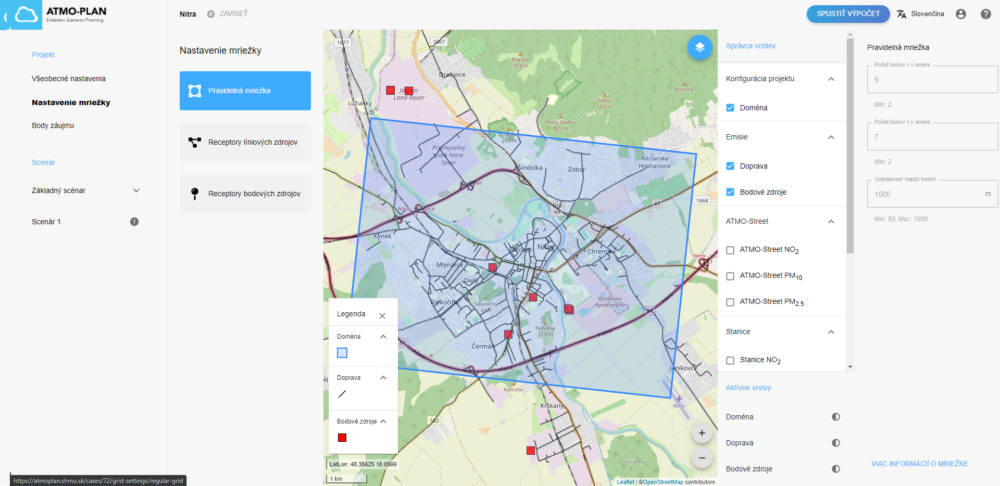
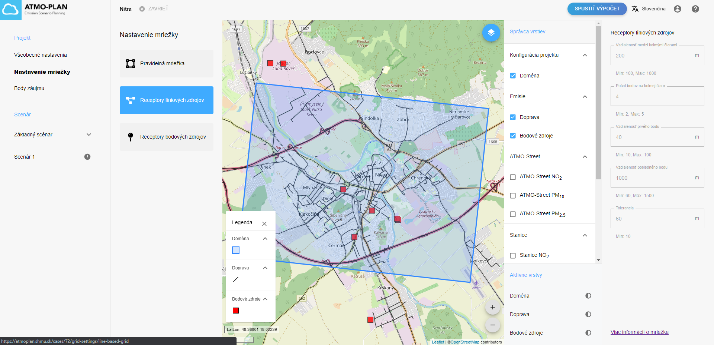
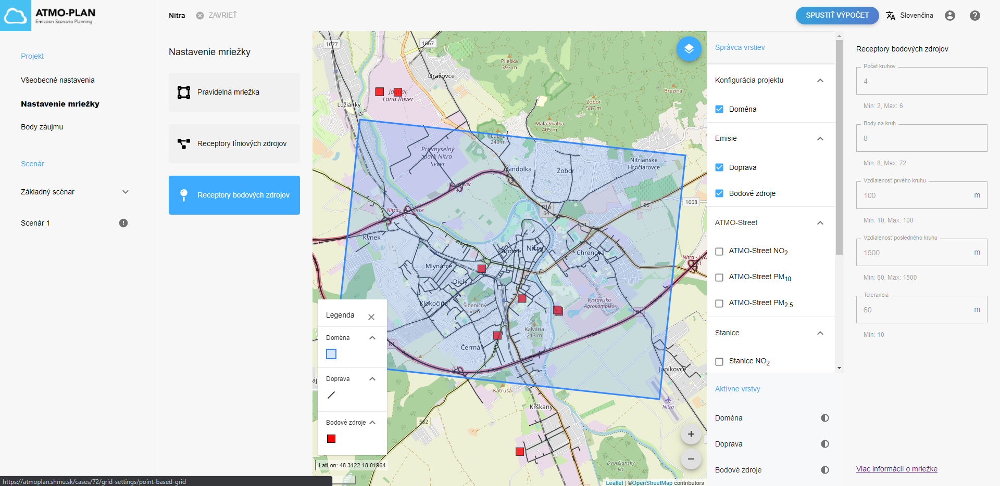

## Prehľad nastavení mriežky projektu

Pred spustením výpočtu projektu musí používateľ nastaviť výpočtovú mriežku a receptory. Základný disperzný model IFDM je Gaussovský model založený na receptoroch v okolí zdrojov, vyžaduje si teda receptorovú sieť, na ktorej sa vypočítajú koncentrácie znečisťujúcich látok. Z tejto receptorovej siete možno odvodiť interpolovanú mapu s hodnotami výsledných koncentrácií. Aby však táto interpolácia bola úspešná, výsledná mriežka by mala byť upravená tak, aby zachytávala priestorové gradienty v koncentračnom poli. Na tento účel sú do výpočtu pridané rôzne nastavenia receptorov a pravidelnej mriežky. (Parametre líniových a bodových zdrojov v aktuálnej verzií ATMO-Plan majú definované prednastavené hodnoty, ktoré užívateľ nemôže zmeniť. V prípade pravidelnej mriežky je možné nastaviť iba jej veľkosť).

- **Pravidelná mriežka**, ktorá pozostáva z pravouhlej siete rovnomerne rozmiestnených bodov mriežky.
- **Receptory líniových zdrojov** s nastaveniami v okolí ciest, čo umožňuje lepšie znázornenie gradientov koncentrácie.
- **Receptory bodových zdrojov**. Nastavenie slúži na podobný účel ako pri líniových zdrojoch, ale je zamerané na okolie bodových zdrojov.

Mriežka je spoločná pre všetky scenáre v projekte. Inými slovami, mriežka je definovaná na úrovni projektu, nie na úrovni scenára. Z tohto dôvodu je počítaná až po zadefinovaní všetkých scenárov projektu.

Predvolené hodnoty pre nastavenia mriežky sa automaticky vypočítajú, keď používateľ nakreslí projekt.

Keď používateľ klikne na ponuku „Nastavenia mriežky“, zobrazia sa tri možnosti pre tri typy nastavení. Po kliknutí na každú možnosť sa zobrazia príslušné konfiguračné hodnoty:

Pre každé z nastavení je potrebné uviesť niekoľko parametrov. Tieto parametre sú podrobnejšie opísané nižšie. 

:::Upozornenie:
V súčasnosti existuje limit 60 000 bodov mriežky na celkovej mriežke, aby sa skrátil výpočtový čas.
:::

### Pravidelná mriežka

Predvolené hodnoty pre bežné nastavenia mriežky sa automaticky vypočítajú, keď používateľ nakreslí projekt. Stredový bod pravidelnej mriežky je stredovým bodom nakresleného polygónu.

V prípade pravidelnej mriežky existujú tri nastavenia:

- počet bodov v horizontálnom smere (os x)
- počet bodov vo vertikálnom smere  (os z)
- vzdialenosť medzi bodmi v metroch rozmedzí 50 a 1000 m

Všimnite si, že minimálna vzdialenosť sa môže zdať dosť hrubá, avšak do nastavnia vstupujú aj parametre bodových a líniových zdrojov s vysokým rozlíšením. Vhodná predvolená hodnota by bola 1000 m pre veľkosť väčšieho mesta.

Rozsah pravidelnej mriežky je na mape znázornený modrým obdĺžnikom.

### Receptory líniových zdrojov

Predvolené hodnoty pre nastavenia receptorov líniových zdrojov sa automaticky vypočítajú, keď používateľ nakreslí projekt.

Receptorové body sú definované kolmo na zdroje emisných čiar ( ciest). Tieto body sú rozmiestnené s rozostupom daným podľa množstva parametrov. V nižšie uvedenom diagrame sú znázornené receptory líniových zdrojov. Čierne bodky zodpovedajú receptorovým bodom.

Parametre receptorov:

- vzdialenosť (v m) medzi polohami kolmých čiar pozdĺž líniového zdroja
- vzdialenosť k prvému receptorovému bodu na kolmici (v m)
- vzdialenosť k poslednému receptorovému bodu na kolmici (v m)
- Počet bodov na každej kolmej čiare
- Tolerancia (v m) na minimálnu vzdialenosť bodov.

Receptorové body bližšie k linkovému zdroju budú rozmiestnené bližšie k sebe ako body ďalej od linkového zdroja.

Keďže mriežky sú založené na zdrojoch emisií vybraných alebo nahraných pre konkrétne miesto, systém vopred (t. j. pred odoslaním testu) nevie, kde budú umiestnené všetky body mriežky. Preto sa po výpočte celej mriežky na základe všetkých dostupných emisných vstupov a definície pravidelnej mriežky vykoná kontrola bodov siete, ktoré sú umiestnené blízko seba. Kontrola je založená na hodnote tolerancie poskytnutej používateľom. Nadbytočné receptorové body budú z konečnej mriežky odstránené, aby sa zvýšila efektívnosť výpočtu. 

### Receptory bodových zdrojov

Predvolené hodnoty pre nastavenia receptorov bodových zdrojov sa automaticky vypočítajú, keď používateľ nakreslí projekt.

Nastavenie je definovaná podobným spôsobom ako pri líniových zdrojoch. V tomto prípade sú receptorové body umiestnené na sústredných kruhoch okolo každého bodového zdroja. Pod nákresom sú zobrazené parametre receptorov. Čierne bodky zodpovedajú receptorovým bodom. Bod umiestnený v strede predstavuje bodový zdroj.

Parametre receptorov:

- Počet sústredných kruhov
- Počet receptorových bodov na každom kruhu
- (a) : vzdialenosť od bodového zdroja k prvej sústrednej kružnici
- (b) : vzdialenosť k poslednému sústrednému kruhu
- Tolerancia (v m) určujúca, kedy sú body príliš blízko seba
