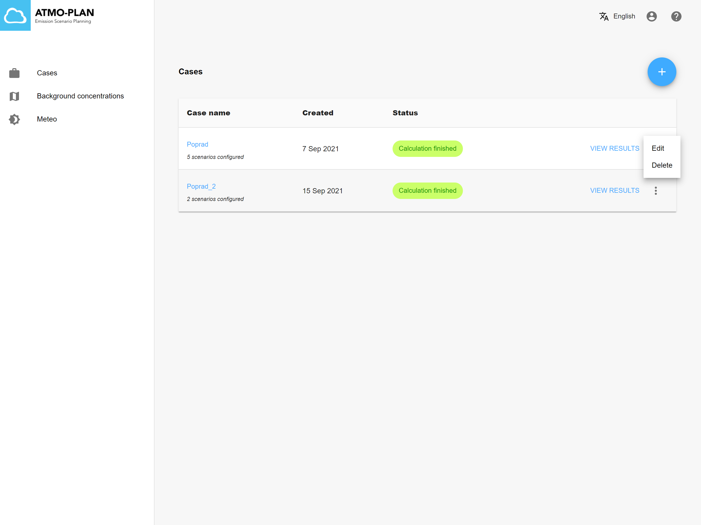

:::tip Available in each deployment
:::

After logging in, when clicking on the menu item 'Cases' in the main page, an overview of all your cases is shown. For each case, the name, number of scenarios, creation date and status is shown. The menu at the right of each case allows you to edit and delete the case.

