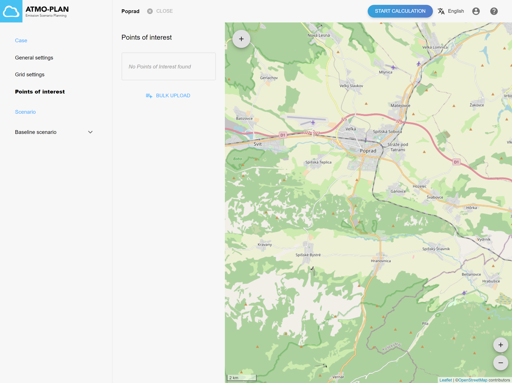
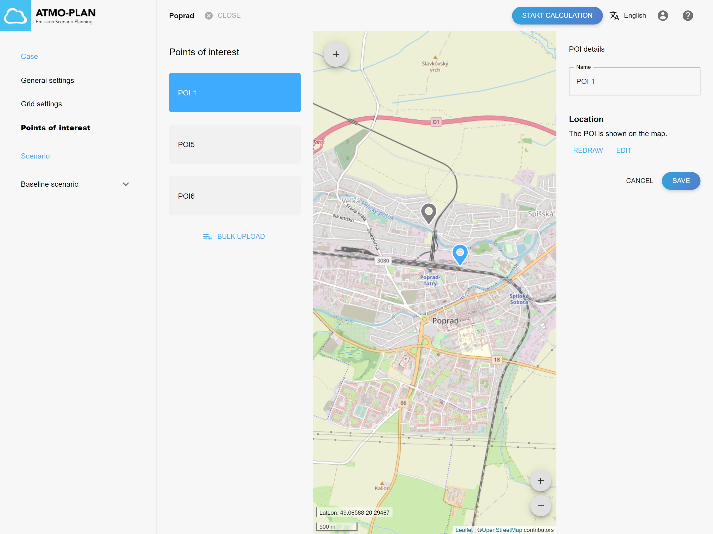
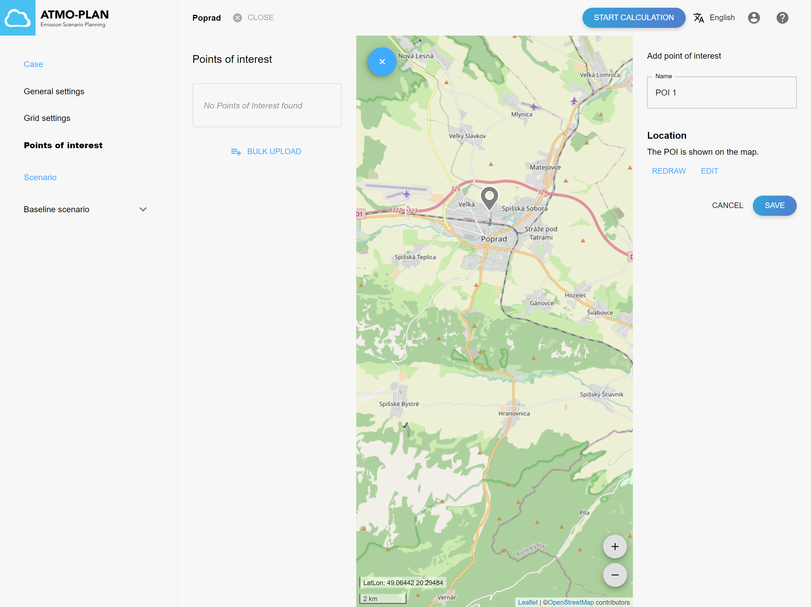
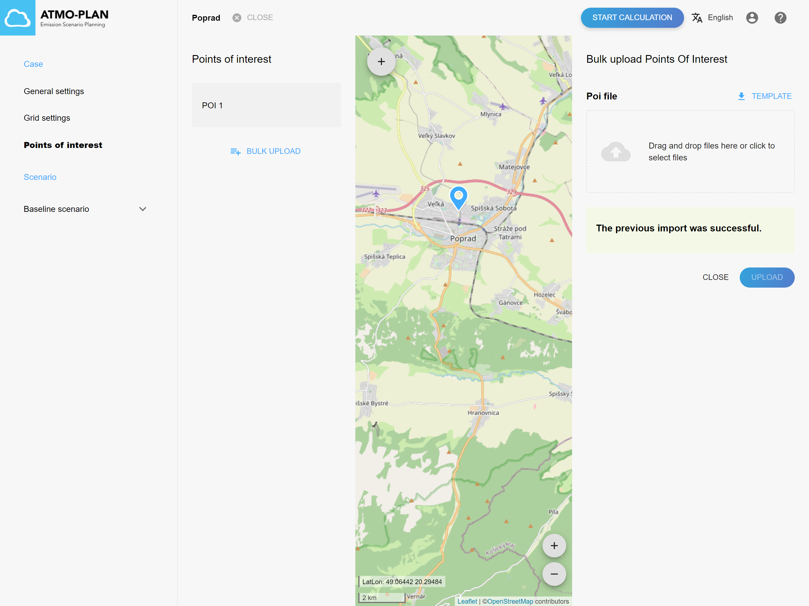
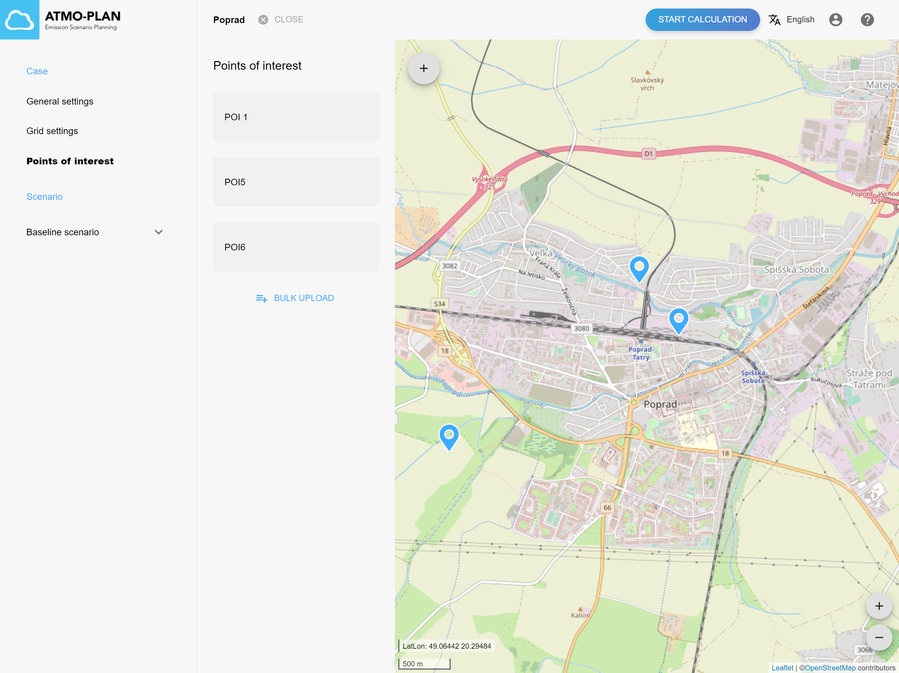
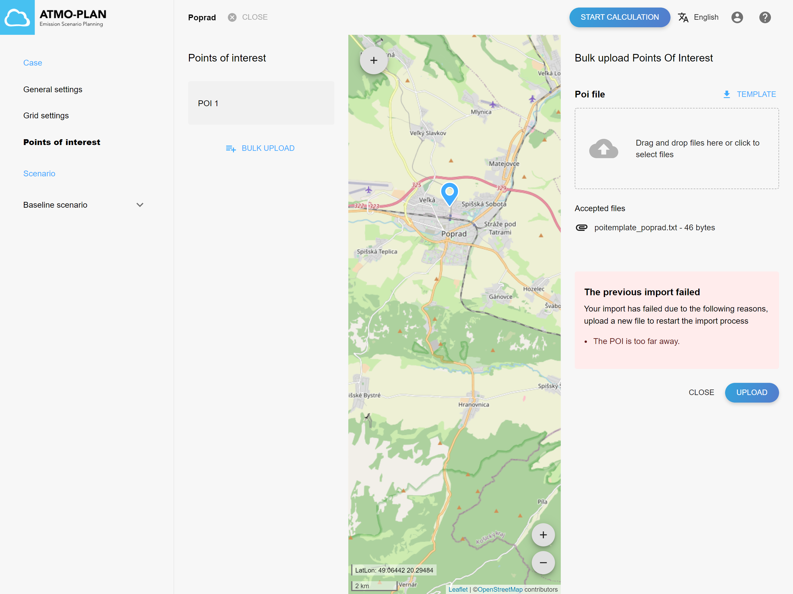
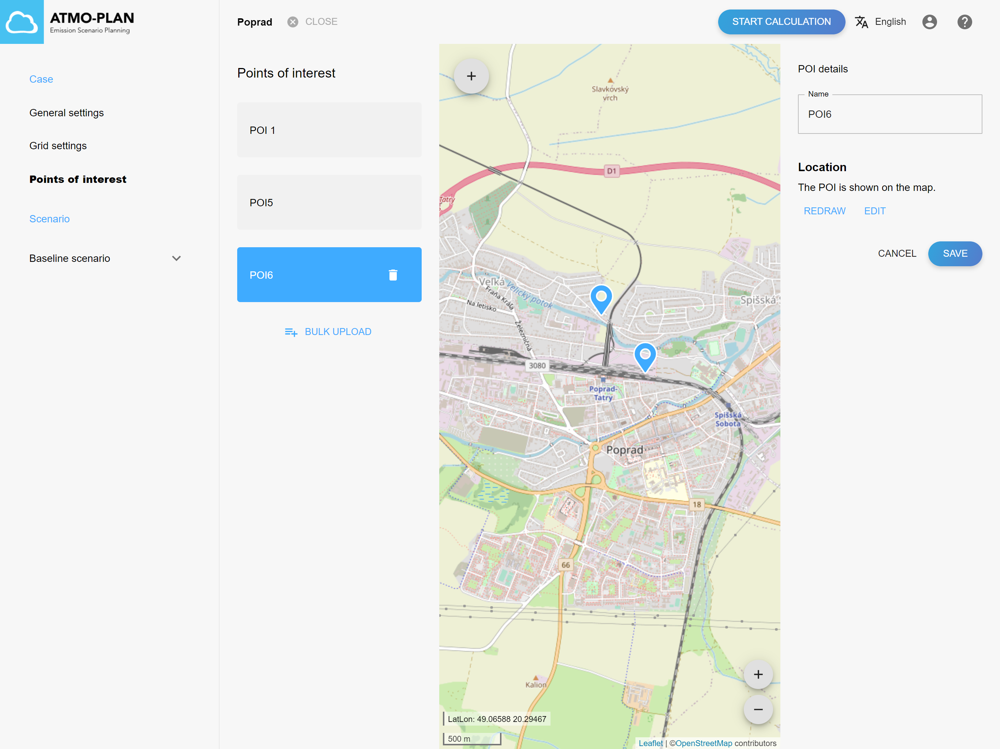

## Inspecting the points of interest

:::tip Available in each deployment
:::

The ATMO-Plan application offers the possibility to add specific points of interest (POI) to the calculation. These may e.g. correspond to the location of monitoring stations and/or sensitive receptors.

In the calculation, the points of interest are treated as normal receptor points and are added to the receptor grid. The key benefit of setting these POI receptor points is that the full hourly and daily time series of the calculation will be stored in the results for all POIs. For the ordinary receptor points, only the post processed aggregated (mean) concentrations will be stored. The full time series of the POI's allow the comparison of model values against station observations using a number of temporal validation statistics. These statistics can be found in the output text files that can be downloaded. (TODO: we hebben die statistieken toch niet voor POIs?)

Points of interest are associated with a case, not with individual scenarios. Simply select the 'Points of interest' menu in the case detail page to inspect the POIs of your case.

All POIs are listed at the left and are shown on the map. An individual POI can be selected by clicking on a POI in the list or on a POI on the map. The properties of the selected POI are then shown on the right.

## Creating points of interest

:::tip Available in each deployment
:::

:::caution
POIs cannot be created while the results are being calculated or when the calculation is (successfully) finished. The appropriate buttons are hidden or disabled.
:::

Points of interest can be defined in two ways:

- By clicking on the map and then providing a name
- By uploading a file containing multiple POIs

## Creating a POI via the map

Select the 'Points of interest' menu in the case detail page to inspect the POIs of your case. A list with all POIs is shown and the POIs are shown on the map.

Click on the '+'-sign in the top left corner of the map to create an extra POI. Click on the map to draw your POI in the correct location and then enter the name of the POI. Click on Save to create the POI.

The new POI is then added to the list at the left.

## Upload multiple POIs via a file

Select the 'Points of interest' menu in the case detail page to inspect the POIs of your case. A list with all POIs is shown and the POIs are shown on the map.

Click on the 'Bulk upload' button at the left. At the right, a panel is shown where the file can be uploaded. At the top a template can be downloaded that can be used to define your own POI file. The format of the POI file is described in more detail in an appendix.

Upload your POI file by dragging and dropping the file in the upload component. Alternatively, you can click on the upload component; this opens a file explorer, which allows you to choose a file on your file system. The name of the chosen file is shown below the upload component. Click on 'upload' to start importing the file.

When importing files, their content is parsed, validated and put into a back-end database. For larger files, this may take some time. While the import is busy, a message is shown on the page.

When the file was valid, the POIs are added to the list at the left and shown on the map.

When the file is invalid, the user is notified with a brief message of where the import went wrong. You can then correct your file and upload it again, as described above.

## Updating a point of interest

:::tip Available in each deployment
:::

:::caution
The POIs cannot be updated while the results are being calculated or when the calculation is (successfully) finished. The POI settings are read-only then.
:::

Select the 'Points of interest' menu in the case detail page to inspect the POIs of your case. A list with all POIs is shown and the POIs are shown on the map.

The name and location of a POI can be changed by clicking on a POI in the list or on the map.

The name is shown on the right. You can edit the name and click on Save.

The location of the POI can be changed by clicking on redraw and then clicking on the map to select a new location. Click on Save to save the new location.

Alternatively, you can click on edit and then drag the marker to a new location. Click on Save to save the new location.

## Deleting a point of interest

:::tip Available in each deployment
:::

:::caution
POIs cannot be deleted while the results are being calculated or when the calculation is (successfully) finished. The delete button is hidden then.
:::

POIs can be removed by hovering over a POI in the list at the left, and then clicking on the delete icon. A confirmation dialog is shown containing an ok and cancel button.

