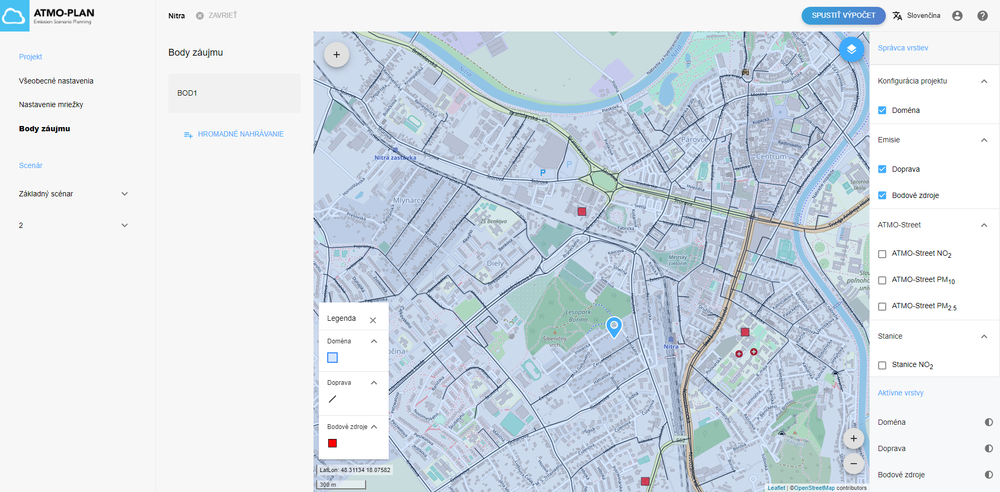
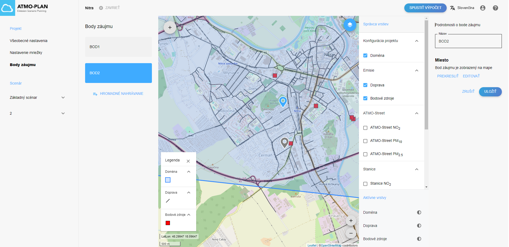
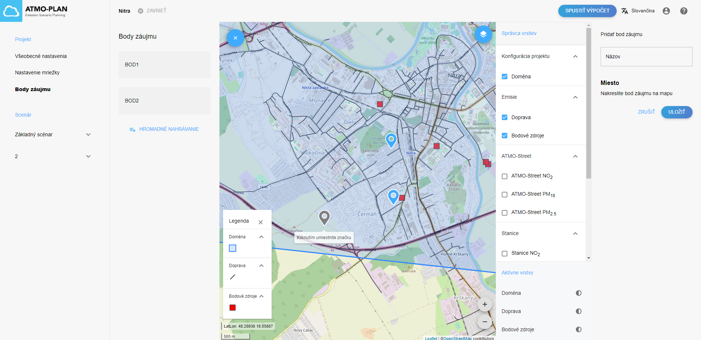
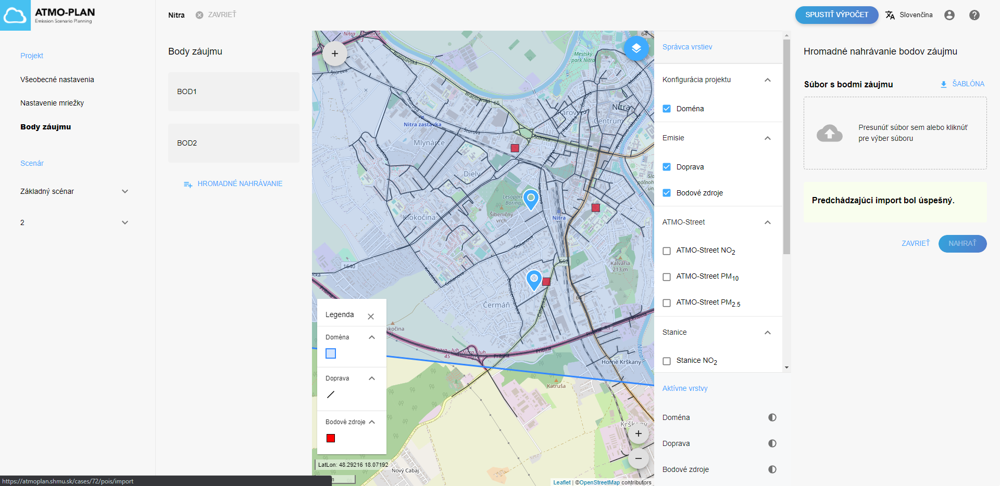
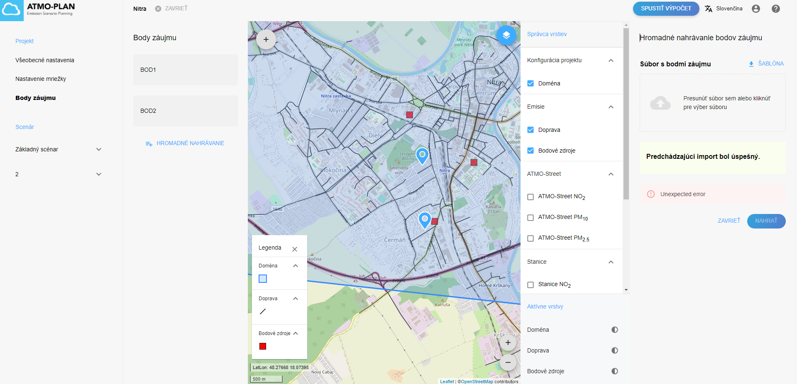
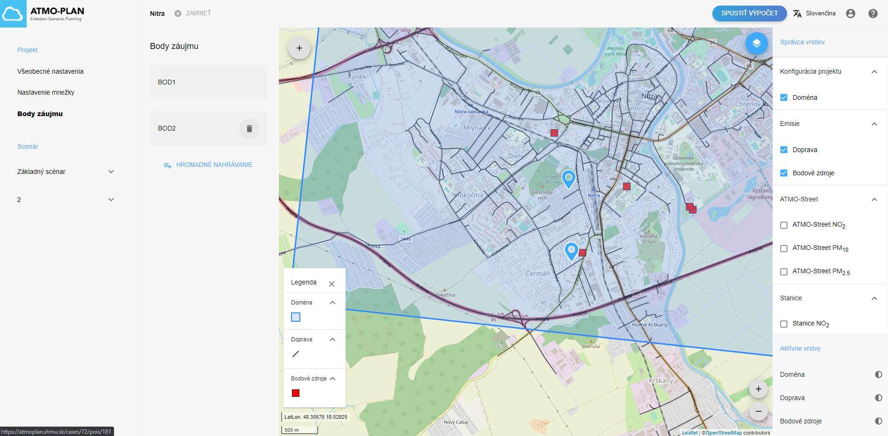
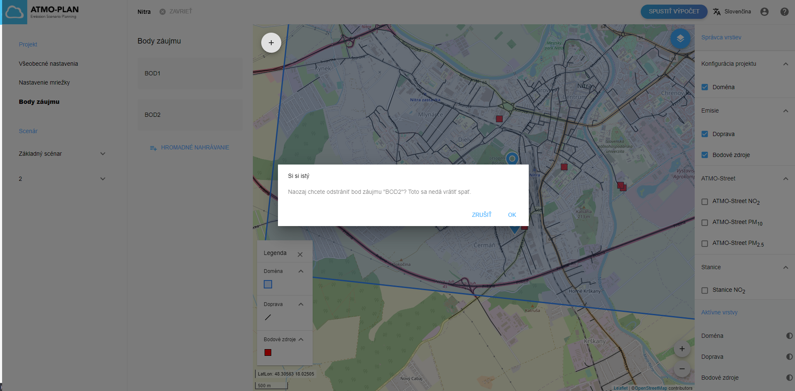

## Prehľad nastavení bodov záujmu

Aplikácia ATMO-Plan ponúka možnosť pridať do výpočtu konkrétne body záujmu. Tieto môžu napríklad zodpovedať umiestneniu monitorovacích staníc alebo iných vhodných lokalít.

Vo výpočte sa body záujmu považujú za normálne receptorové body a pridajú sa do siete receptorov. Kľúčovou výhodou nastavenia týchto bodov je, že celý hodinový a denný časový rad výpočtu bude uložený vo výsledkoch pre všetky vybrané body záujmu. Pre bežné receptorové body sa uložia iba agregované (priemerné) koncentrácie po ich spracovaní. dostupnosť úplného časového radu bodov umožňuje porovnanie hodnôt modelu s pozorovaniami staníc pomocou množstva štatistík zamernaých na analýzu časových radov. 

Body záujmu sú spojené s projektom, nie s jednotlivými scenármi. Jedoduchým vyberom ponuky „Body záujmu“ na stránke s podrobnosťami o projekte si môžete prezrieť body záujmu vášho projektu. 

Všetky body záujmu sú uvedené vľavo a sú zobrazené na mape. Jednotlivý body je možné vybrať kliknutím  v zozname alebo na  mape. Vlastnosti vybraného bodov sa potom zobrazia vpravo.

## Vytváranie bodov záujmu

:::caution Upozornenie:
Body záujmu nemožno vytvárať počas prebiehajúceho výpočtu alebo po dokončení výpočtu. Príslušné tlačidlá sú skryté alebo deaktivované.
:::

Body záujmu možno definovať dvoma spôsobmi:

- Kliknutím na mapu a následným zadaním názvu
- Nahraním súboru obsahujúceho viacero bodov záujmu

## Vytvorenie bodov záujmu prostredníctvom mapy

Na stránke s podrobnosťami o projekte vyberte ponuku 'Body záujmu', kde si môžete prezreieť body záujmu vášho projektu. Body záujmu sa zobrazia v zozname ako aj na mape.

Kliknutím na znamienko „+“ v ľavom hornom rohu mapy vytvoríte ďalší bod záujmu. Kliknutím na mapu nakreslite svoj bod na vybrané miesto a potom zadáte jeho názov. Kliknutím na Uložiť vytvoríte bod.

Nový bod záujmu sa potom pridá do zoznamu vľavo.

## Nahranie viacerých bodov záujmu prostredníctvom súboru

Na stránke s podrobnosťami o projekte vyberte ponuku 'Body záujmu', aby ste si prezreli body záujmu vášho projektu.

Kliknite na tlačidlo „Hromadné odovzdanie“ vľavo. Vpravo sa zobrazí panel, do ktorého je možné súbor nahrať. V hornej časti si možno stiahnuť šablónu, ktorú možno použiť na definovanie vlastného súboru.

Nahrajte súbor s bodmi presunutím súboru do časti okna určenej na nahrávanie. Prípadne môžete kliknúť na šípku. Tým sa otvorí prieskumník súborov, ktorý vám umožní vybrať súbor vo vašom počítači. Kliknutím na „NAHRAŤ“ spustíte import súboru.

Pri importovaní súborov sa ich obsah analyzuje, overí a vloží do databázy. V prípade väčších súborov to môže chvíľu trvať. Pokiaľ import stále prebieha, na stránke sa zobrazuje správa.

Ak bol súbor platný, body záujmu sa pridajú do zoznamu vľavo a zobrazia sa na mape.

Ak je súbor neplatný, používateľ je upozornený krátkou správou o chybe importu. Potom môžete svoj súbor opraviť a znova nahrať, ako je popísané vyššie.

## Aktualizovanie informácií o bodoch záujmu

:::caution Upozornenie:
Body záujmu nemožno aktualizovať počas prebiehajúceho výpočtu alebo po jeho (úspešnom) dokončení. Nastavenia sú v tomto prípade prístupné iba na čítanie.
:::

Názov bodu sa zobrazuje vpravo. Môžete ho upraviť a kliknúť na Uložiť.

Umiestnenie bodov záujmu možno zmeniť kliknutím na prekresliť a následným kliknutím na mapu vyberte nové miesto. Kliknutím na Uložiť uložíte nové umiestnenie.

Prípadne môžete kliknúť na upraviť a potom presunúť značku na nové miesto. Kliknutím na Uložiť uložíte nové umiestnenie.

## Odstránenie bodu záujmu

:::caution Upozornenie
Body záujmu nemožno vymazať počas prebiehajúceho výpočtu alebo po jeho (úspešnom) dokončeníu. Tlačidlo Odstrániť je vtedy skryté.
:::

Body záujmu možno odstrániť umiestnením kurzora myši nad vybraný bod v zozname vľavo a kliknutím na ikonu odstránenia. Zobrazí sa dialógové okno s potvrdením, ktoré obsahuje tlačidlo OK a Zrušiť.

