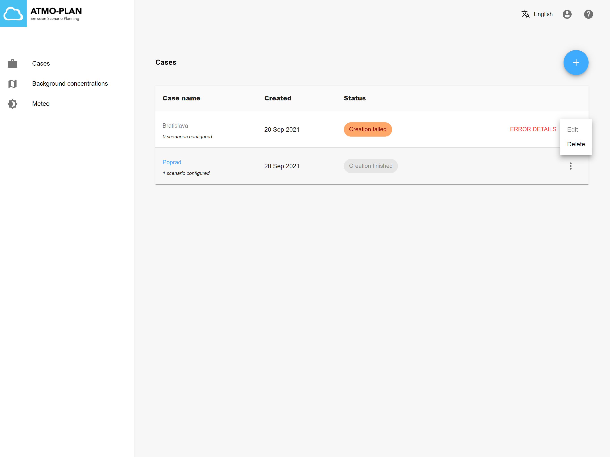

:::tip Available in each deployment
:::

To delete a case, go to the case overview and open the menu to the right of your case. Click on 'Delete'. A confirmation dialog is shown in which you can confirm the deletion, or cancel it. When clicking on OK, the case and all associated scenarios will be deleted.

:::caution
A case cannot be deleted when the creation is still busy, or while the results are being calculated. The menu item is disabled then.
:::

