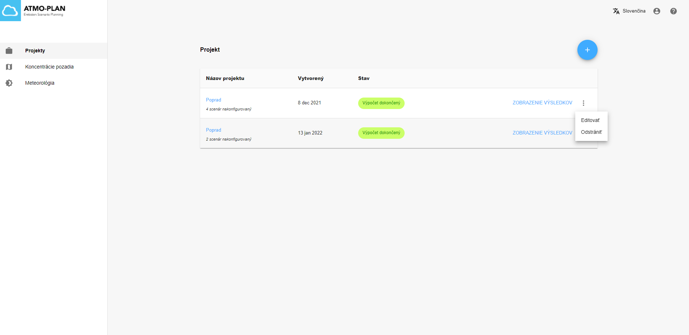
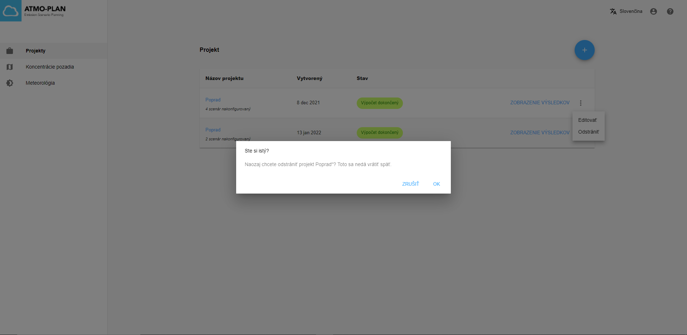

Ak chcete projekt odstrániť, prejdite do prehľadu projektov a otvorte ponuku napravo od vybraného projektu. Kliknite na 'Odstrániť'. Zobrazí sa potvrdzovacie dialógové okno, v ktorom môžete potvrdiť vymazanie alebo ho zrušiť. Po kliknutí na OK sa projekt a všetky súvisiace scenáre vymažú.

:::Upozornenie
Projekt nemožno odstrániť, keď je vytváranie stále prebiehaé alebo keď sa počítajú výsledky.
:::

