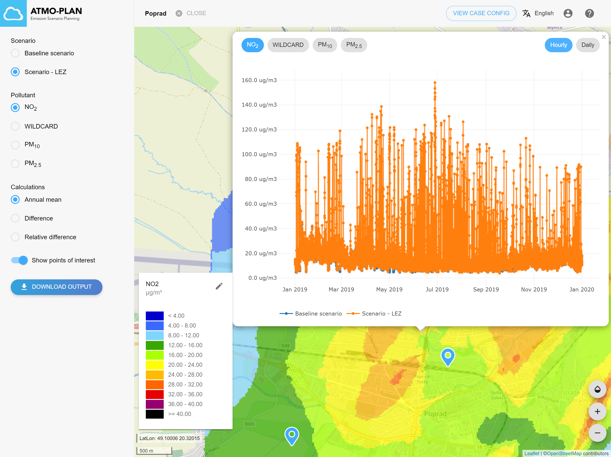

:::tip Available in Slovakia, Hungary
:::

When a calculation is finished, an email is sent to the user. The results of the calculation can be inspected by clicking on 'View results' in the case overview, or in the case detail page (top right).

The results consist of:

- Interpolated maps containing the yearly mean concentrations for each pollutant
- Interpolated maps showing the absolute and relative difference for the yearly mean concentrations between the scenario and baseline scenario
- Time series for the POIs
- A zip file containing CSV result files

### Interpolated maps

Go to the results page of a case. The menu on the left shows all the scenarios of the case, all substances, the different map types, the POIs and a button to download the results.

For the baseline scenario, the annual mean concentrations for the four pollutants (NO2, PM10, PM2.5, WILDCARD) can be selected.

For a non-baseline scenario, also the relative and absolute difference maps of the yearly mean concentration with respect to the base scenario are provided. In these maps, positive values refer to an increase in concentrations (worsening of the air quality), while negative values refer to a decrease in concentrations (improvement of the air quality).

When selecting a map in the drop down list, the map is visualized on the right, using a default legend which is shown in the bottom left corner. For each pollutant a default legend is provided (option 'default'), but it is also possible to select a legend ranging from the minimum to the maximum value on the map (option 'dynamic'), or to provide a custom minimum and maximum value (option 'custom').

### Timeseries for POIs

By default, the POIs of the case are shown on the map using blue markers. When the user clicks on a marker, a graph is displayed with the modelled concentration time series for each scenario.

The user can select the pollutant to be displayed in the graph and the temporal resolution (hourly or daily mean concentrations). By moving the mouse over the graph, the date and corresponding concentration values are displayed for each scenario.

Additional functionalities are available through the menu above the graph. These functionalities include:

- Downloading the graph as a PNG
- Zooming:

  - Select the zoom icon and draw a rectangle to zoom in on a specific part of the graph
  - Use + and - to zoom in and out
  - Use 'autoscale' to reset the graph after zooming

### Downloading the results

The results can be downloaded via the 'Download output' button. When the user clicks this button, a zip-archive will be downloaded containing the results for all scenarios in the case.

#### Case

At the highest level, the zip file contains one folder for each scenario. The folder name corresponds to the scenario name. The folder also contains the following files for the case:

##### Input:

| File/folder      | Content                                                      |
| :--------------- | :----------------------------------------------------------- |
| case_summary.txt | Describes the general settings and grid settings of the case |
| poi.txt          | Name and location of all POIs of the case                    |

##### Output:

There are no output files for the case.

#### Scenario

Each scenario folder contains files that describe the scenario and result files:

##### Input:

<table>
  <tr>
    <th>File</th>
    <th>Content</th>
  </tr>
  <tr>
    <td>scenario_summary.txt</td>
    <td>Describes the general settings of the scenario</td>
  </tr>
  <tr>
    <td >pointsource-X.txt</td>
    <td>
      X = name of the point source emission of the scenario
       
      Contains a list of all point sources and their properties for the given emission
     </td>
  </tr>
  <tr>
    <td>pointsource-X.txt</td>
    <td>X = name of the point source emission of the scenario</td>
  </tr>
  <tr>
    <td>LEZ.txt</td>
    <td>Contains a list of all low emissions zones of the scenario.</td>
  </tr>
</table>

##### Output:

<table>
  <tr>
    <th>File</th>
    <th>Content</th>
  </tr>
  <tr>
    <td>fastrace.txt fastraceMetadata.txt</td>
    <td>
      
These files are the output of the traffic emission calculation.

      
The meta data file (fastraceMetadata.txt) contains information on the version of the traffic emission model and other metadata.

      
The data file (fastrace.txt) contains the actual calculated emission values on the line segments provided by the network. The format of this file is described in appendix G.

    </td>
  </tr>
  <tr>
    <td>outputIndicatorsX_Y_Z.tif</td>
    <td>
      

        X = pollutant (NO2, PM10, PM25, WILDCARD)
         
        Y = indicator corresponding to the pollutant (MeanConcentration, P50, P99.8, max1day, ...)
         
        Z = SRID
      

      
These GeoTIFF raster files contain the indicator values for the different pollutants. These rasters were gridded from the receptor grid. These files are ordinary GeoTIFFs including projection information which can easily be opened in any GIS client for creating off-line visualisations and analyses (e.g. QGIS, ArcGIS…).

    </td>
  </tr>
  <tr>
    <td>outputIndicatorsX_MeanConcentration_3035_diff.tif</td>
    <td>
      
X = pollutant (NO2, PM10, PM25, WILDCARD)

      
These GeoTIFF raster files contain the differences of the annual mean values between the scenario and the baseline scenario.

    </td>
  </tr>
  <tr>
    <td>outputIndicatorsX_MeanConcentration_3035_rel_diff.tif</td>
    <td>
      
X = pollutant (NO2, PM10, PM25, WILDCARD)

      
These GeoTIFF raster files contain the relative differences of the annual mean values between the scenario and the baseline scenario.

    </td>
  </tr>
  <tr>
    <td>outputIndicatorsX_Z.csv</td>
    <td>
      

        X = pollutant (NO2, PM10, PM25, WILDCARD)
	 
        Z = SRID
      

      
These files contain annual indicator values for all receptor grid points. The indicators include the annual mean concentrations and a list of indicators that are different per pollutant. These files are provided as plain text comma separated value files (.csv) and can easily be imported into any spreadsheet tool.

    </td>
  </tr>
  <tr>
    <td>outputIndicatorsX_Z_diff.csv</td>
    <td>
      

        X = pollutant (NO2, PM10, PM25, WILDCARD)
	 
        Z = SRID
      

      
These files contain the absolute differences of the indicators between the scenario and the baseline scenario.

    </td>
  </tr>
  <tr>
    <td>outputIndicatorsX_Z_rel_diff.csv</td>
    <td>
      

        X = pollutant (NO2, PM10, PM25, WILDCARD)
	 
        Z = SRID
      

      
These files contain the relative differences of the indicators between the scenario and the baseline scenario.

    </td>
  </tr>
  <tr>
    <td>outputTimeseriesX_Z.csv</td>
    <td>
      

        X = pollutant (NO2, PM10, PM25, WILDCARD)
	 
        Z = SRID
      

      
These files contain the hourly time series for the points of interest for the different pollutants.

      
The files first lists the different points of interest by their name and coordinates, followed by the time series data as a comma separated list providing the timestamp and the different POIs as columns. There are separate output files for the hourly and daily concentrations.

    </td>
  </tr>
  <tr>
    <td>outputTimeseriesDailyX_Z.csv</td>
    <td>
      

        X = pollutant (NO2, PM10, PM25, WILDCARD)
	 
        Z = SRID
      

      
These files contain the daily time series for the points of interest for the different pollutants. The format corresponds to the hourly time series files.

    </td>
  </tr>
</table>
