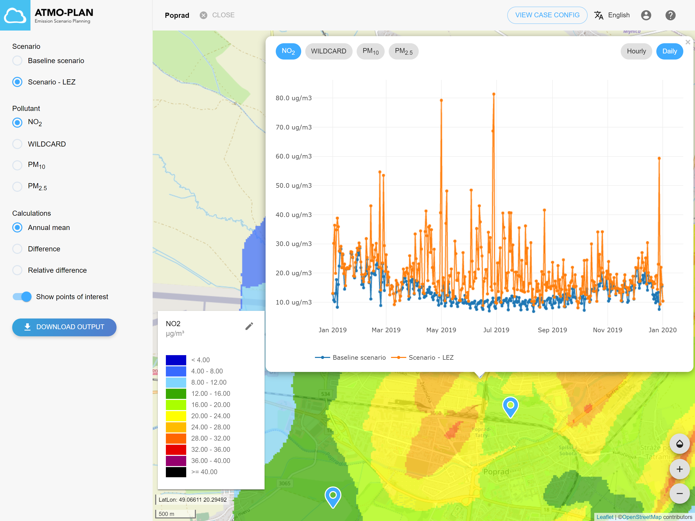
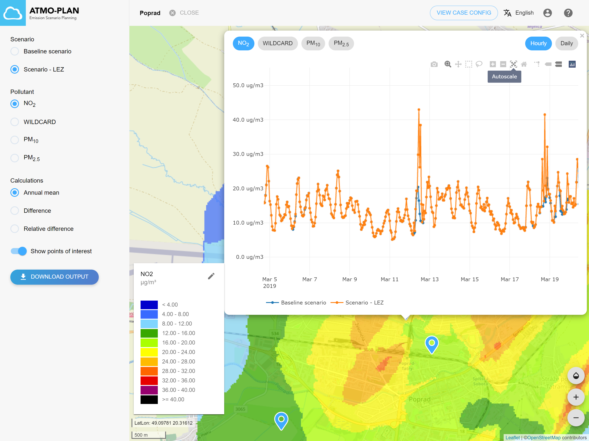

Po dokončení výpočtu sa používateľovi odošle e-mail. Výsledky výpočtu je možné skontrolovať kliknutím na „Zobraziť výsledky“ v prehľade projektov alebo na stránke s podrobnosťami o projekte (vpravo hore).

Výsledky obsahujú:

- Interpolované mapy priemerných ročných  koncentrácií pre každú znečisťujúcu látku
- Interpolované mapy zobrazujúce absolútnych a relatívny rozdiel ročných priemerných koncentrácií medzi scenárom a základným scenárom
- Časové rady priemerných hodinových koncentrácií pre body záujmu
- Súbor zip obsahujúci súbory s výsledkami v formáte .csv.

### Interpolované mapy

Prejdite na stránku s výsledkami projektu. Ponuka na ľavej strane zobrazuje všetky scenáre projektu, všetky znečisťujúce látky, rôzne typy máp, body záujmu a tlačidlo na stiahnutie výsledkov.

Pre základný scenár je možné zvoliť priemerné ročné koncentrácie pre štyri znečisťujúce látky (NO2, PM10, PM2,5, WILDCARD).

Pre  ostatné scenáre sú dostupné aj mapy relatívnych a absolútnych rozdielov ročnej priemernej koncentrácie vzhľadom na základný scenár. V týchto mapách kladné hodnoty znamenajú zvýšenie koncentrácií (zhoršenie kvality ovzdušia), záporné hodnoty pokles koncentrácií (zlepšenie kvality ovzdušia).

Pri výbere mapy v rozbaľovacom zozname sa mapa zobrazí na pravej strane pomocou predvolenej legendy, ktorá sa zobrazuje v ľavom dolnom rohu. Pre každú znečisťujúcu látku je poskytnutá predvolená legenda (možnosť „predvolené“), ale je tiež možné vybrať legendu v rozsahu od minimálnej po maximálnu hodnotu na mape (možnosť „dynamická“) alebo poskytnúť vlastné minimum a maximum hodnotu (možnosť „vlastné“).

### Časové rady pre body záujmu

V predvolenom nastavení sa body záujmu prípadu zobrazujú na mape pomocou modrých značiek. Keď používateľ klikne na značku, zobrazí sa graf s časovým radom koncentrácií pre každý scenár.

Používateľ si môže vybrať znečisťujúcu látku, ktorá sa má zobraziť v graf, a časové rozlíšenie (hodinové alebo priemerné priemerné koncentrácie). Presunutím myši nad graf sa pre každý scenár zobrazí dátum a zodpovedajúce hodnoty koncentrácií.

Ďalšie funkcie sú dostupné prostredníctvom ponuky nad grafom. Tieto funkcie zahŕňajú:

- Stiahnutie grafu vo formáte .png
- Priblíženie:

  - Vyberte ikonu priblíženia a nakreslením obdĺžnika priblížite konkrétnu časť grafu
  - Na priblíženie a oddialenie použite + a -
  - Použite „automatickú mierku“ na resetovanie grafu po priblížení

### Sťahovanie výsledkov

Výsledky je možné stiahnuť pomocou tlačidla „Stiahnuť výstup“. Keď používateľ klikne na toto tlačidlo, stiahne sa archív zip obsahujúci výsledky pre všetky scenáre v prípade.

#### Projekt

Na najvyššej úrovni obsahuje súbor zip jeden priečinok pre každý scenár. Názov priečinka zodpovedá názvu scenára. Priečinok obsahuje aj nasledujúce súbory pre prípad:

##### Vstup:

| File/folder      | Content                                                      |
| :--------------- | :----------------------------------------------------------- |
| case_summary.txt | Popisuje všeobecné nastavenia a nastavenia mriežky           |
| poi.txt          | Názov a umiestnenie všetkých bodov záujmu prípadu            |

##### Výstup:

Pre prípad neexistujú žiadne výstupné súbory.

#### Scenár

Každý priečinok scenára obsahuje súbory, ktoré popisujú scenár a výsledné súbory:

##### Vstup:
<table>
  <tr>
    <th>File</th>
    <th>Content</th>
  </tr>
  <tr>
    <td>scenario_summary.txt</td>
    <td>Popisuje všeobecné nastavenia scenára</td>
  </tr>
  <tr>
    <td >pointsource-X.txt</td>
    <td>
      X = názov bodového zdroja scenára
       
      Obsahuje zoznam všetkých bodových zdrojov a ich vlastnosti.
     </td>
  </tr>
  <tr>
    <td>LEZ.txt</td>
    <td>Obsahuje zoznam všetkých nízkoemisných zón scenára.</td>
  </tr>
</table>

##### Výstup:

<table>
  <tr>
    <th>Súbor</th>
    <th>Obsah</th>
  </tr>
  <tr>
    <td>fastrace.txt fastraceMetadata.txt</td>
    <td>
      
Tieto súbory sú výstupom výpočtu emisií z dopravy.

      
Súbor s metadátami (fastraceMetadata.txt) obsahuje informácie o verzii dopravného emisného modelu a ďalšie metadáta.

      
Dátový súbor (fastrace.txt) obsahuje aktuálne vypočítané hodnoty emisií na líniových segmentoch. Formát tohto súboru je popísaný v časti Formát súborov ->FASTRACE - výstupný formát 

    </td>
  </tr>
	
  <tr>
    <td>outputIndicatorsX_Y_Z.tif</td>
    <td>
      

        X = znečisťujúca látka (NO2, PM10, PM25, inertný plyn)
         
        Y = indikátor pre danú znečisťujúcu látku (priemerná koncentrácia, precentily (P50, P99,8), maximálna koncentrácia, ...)
         
        Z = SRID
      

      
Tieto rastrové súbory obsahujú hodnoty indikátorov pre rôzne znečisťujúce látky. Tieto rastre boli vytvorené z výpočtovej mriežky,  sú to bežné súbory formátu GeoTIFF vrátane informácií o projekcii, ktoré možno ľahko otvoriť v ľubovoľnej GIS aplikácii.
 (napr. QGIS, ArcGIS…).

    </td>
  </tr>
  <tr>
    <td>outputIndicatorsX_MeanConcentration_3035_diff.tif</td>
    <td>
      
X = znečisťujúca látka (NO2, PM10, PM25, intertný plyn)

      
Tieto rastrové GeoTIFF súbory obsahujú rozdiely priemerných ročných koncentrácií medzi scenárom a základným scenárom.

    </td>
  </tr>
  <tr>
    <td>outputIndicatorsX_MeanConcentration_3035_rel_diff.tif</td>
    <td>
      
X = znečisťújúca látka (NO2, PM10, PM25, intertný plyn)

      
Tieto rastrové GeoTIFF súbory obsahujú relatívne rozdiely priemerných ročných koncentrácií medzi scenárom a základným scenárom.

    </td>
  </tr>
  <tr>
    <td>outputIndicatorsX_Z.csv</td>
    <td>
      

        X = pollutant (NO2, PM10, PM25, WILDCARD)
	 
        Z = SRID
      

      
Tieto súbory obsahujú ročné hodnoty indikátorov pre všetky body mriežky. Indikátory zahŕňajú priemerné ročné koncentrácie a iné indikátory, ktoré sa líšia podľa znečisťujúcej látky. Tieto súbory sú obyčajné textové súbory s hodnotami oddelenými čiarkami (.csv) a možno ich jednoducho importovať do akéhokoľvek tabuľkového procesora. 

    </td>
  </tr>
  <tr>
    <td>outputIndicatorsX_Z_diff.csv</td>
    <td>
      

        X = znečisťujúca látka (NO2, PM10, PM25, inertný plyn)
	 
        Z = SRID
      

      
Tieto súbory obsahujú absolútne rozdiely indikátorov medzi scenárom a základným scenárom.

    </td>
  </tr>
  <tr>
    <td>outputIndicatorsX_Z_rel_diff.csv</td>
    <td>
      

        X = znečisťujúca látka (NO2, PM10, PM25, inertný plyn)
	 
        Z = SRID
      

      
Tieto súbory obsahujú relatívne rozdiely indikátorov medzi scenárom a základným scenárom.

    </td>
  </tr>
  <tr>
    <td>outputTimeseriesX_Z.csv</td>
    <td>
      

        X = znečisťujúca látka (NO2, PM10, PM25, WILDCART (inertný plyn))
	 (NO2, PM10, PM25, inertný plyn)
	 
        Z = SRID
      

      
Tieto súbory obsahujú časové rady priemerných hodinových koncentrácií jednotlivých znečistujúcich látok pre body záujmu. 

      
Hlavička súboru obsahuje zoznam bodov záujmu  (ich názvy a súradnice), jednotky, rok, ESPG súradnicového systému (3035). 
	      Dátová časť súboru obsahuje v .csv formáte rok, mesiac, deň, hodinu a priemerné hodinové koncentrácie pre všetky body záumu  (ako stĺpce). Samostatné výstupné súbory sú vytvorené  pre hodinové a denné koncentrácie pre každú znečiťujúcu látku.
	       

    </td>
  </tr>
  <tr>
    <td>outputTimeseriesDailyX_Z.csv</td>
    <td>
      

        X = znečisťujúca látka (NO2, PM10, PM25, inertný plyn)
	 
        Z = SRID
      

      
 Tieto súbory obsahujú časové rady priemerných denných koncentrácií v mieste bodov záujmu pre rôzne znečisťujúce látky. Formát zodpovedá súborom časových radov priemerných hodinových koncentrácií.

    </td>
  </tr>
</table>
