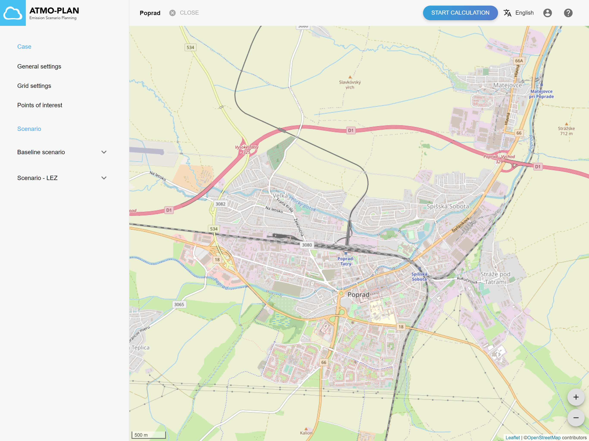
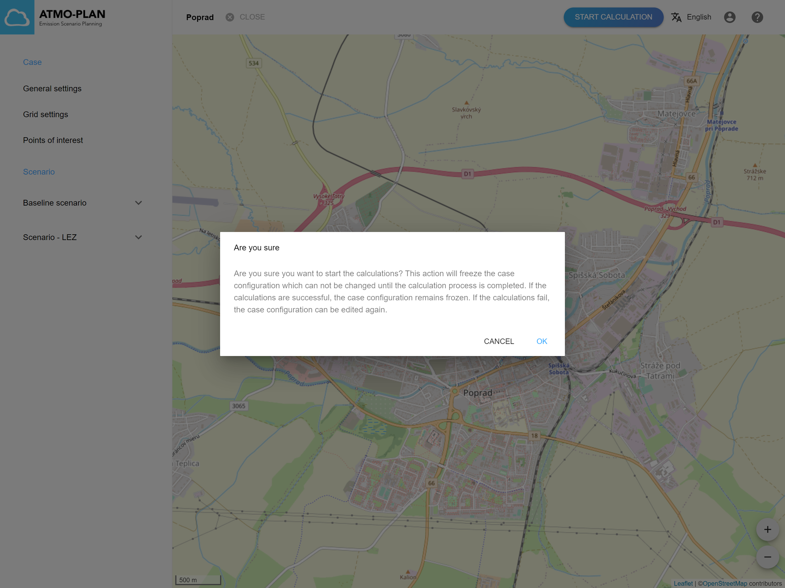

Keď sú definované všetky scenáre v projekte, je nastavená konfigurácia siete a definované body záujmu, používateľ môže pristúpiť k spusteniu výpočtu  kliknutím na tlačidlo „Spustiť výpočet“ v pravej hornej časti stránky s podrobnosťami o projekte.

:::POZOR!

Ak je projekt odoslaný na spracovanie (výpočet), nie je možné k nemu pridávať ďalšie scenáre. Používateľ je na to upozornený, ako je možné vidieť na obrázku nižšie.
:::

When a calculation is started, the following chain of events occurs in the background:

- The case and all its scenarios are validated to check whether they contain all necessary information to start the run.
- A message is placed on a message queue signaling the back-end that a new calculation is requested. This message will trigger the generation of a calculation job which will be scheduled for execution. Depending on the current load of the back-end, the job may be delayed or start running immediately. The size and load of the back-end determines the speed at which jobs start running.
- Once the calculation job starts running on the back-end, a number of steps are performed:
  - The receptor grid is defined by calculating all the grids for the different scenarios, adding them together and removing redundant points with the given tolerance specifications as given in the grid configuration for the case.
  - The scenarios in the case are calculated:
    - The [FASTRACE](/#the-fastrace-traffic-emissions-model) traffic emissions model is run for the traffic emission sources. The traffic emission model translates the traffic intensities and fleet composition into line source emissions in kg/km for the different pollutants, ready to be fed to the IFDM dispersion model.
    - Next, the IFDM model is run for the time steps given in the background and meteo files. For the defined POIs, the full time series is retained.
    - Finally, a postprocessing run is started which will grid the concentration results as calculated on the receptor grid to raster files and make them available via a web map service (WMS) so they can be visualized in the application. For non-baseline scenarios, (absolute and relative) difference maps are created.

V prehľade projektov je počas výpočtu projektu označenie „Výpočet beží“.

Since **calculations can take several hours to finish**, the planning application sends an email to the user when the calculation has ended, both successfully or if failed. The status of the case in the case overview is then changed to 'Calculation finished' or 'Calculation failed'.

When a calculation is failed, an error message is available under 'Error details' in the case overview.
