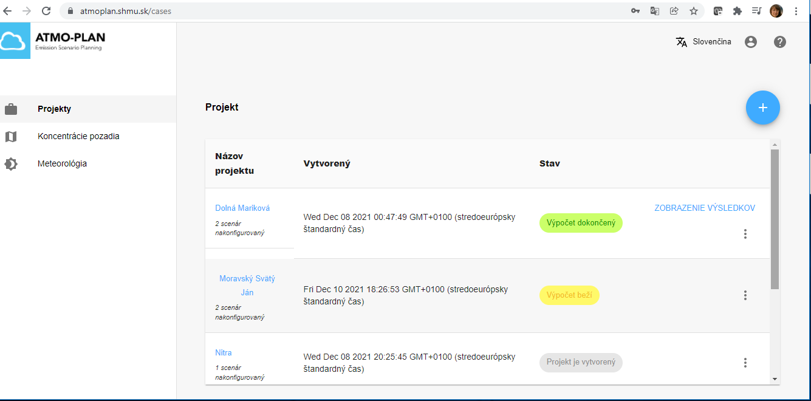

Keď sú definované všetky scenáre v projekte, je nastavená výpočtová mriežka a definované body záujmu, používateľ môže pristúpiť k spusteniu výpočtu  kliknutím na tlačidlo „Spustiť výpočet“ v pravej hornej časti stránky s podrobnosťami o projekte.

:::caution POZOR!

Ak je projekt odoslaný na spracovanie (výpočet), nie je možné k nemu pridávať ďalšie scenáre. Používateľ je na to upozornený, ako je možné vidieť na obrázku nižšie.
:::

Po spustení výpočtu sa na pozadí spustia nasledujúca procesy:

- Projekt a všetky jeho scenáre sa skontrolujú a overí sa, či obsahujú všetky potrebné informácie na spustenie výpočtu.
- 
<!--- - A message is placed on a message queue signaling the back-end that a new calculation is requested. This message will trigger the generation of a calculation job which will be scheduled for execution. Depending on the current load of the back-end, the job may be delayed or start running immediately. The size and load of the back-end determines the speed at which jobs start running. --->

-  Výpočtová úloha sa zaradí do zoznamu plánovaných úloh. V závislosti od aktuálneho zaťaženia servara sa môže úloha spustiť okamžite alebo s oneskorením. 
- Po spustení výpočtovej úlohy sa na serveri vykoná niekoľko krokov:
-- Mriežka receptorov je zadefinovaná po spracovaní všetkých mriežok zadaných pre rôzne scenáre (ich sčítaním a odstránením nadbytočných bodov pri zadanej tolerancii, ako je uvedené v konfigurácii mriežky pre daný projekt).

-- Výpočet scenárov:
    --- Pre zdroje emisií z dopravy sa používa model dopravných emisií [FASTRACE](/#the-fastrace-traffic-emissions-model). Model emisií z dopravy prevádza intenzity dopravy a zloženie vozového parku do emisií z líniových zdrojov v kg/km pre rôzne znečisťujúce látky, ktoré sú pripravené pre gausovský rozptylový model. IFDM.
    --- Ďalej sa spustí model IFDM v takom časovom kroku, aký majú pozaďové koncentrácie  a meteorologické parametre. Pre definované body záujmu bude v výstupe dostupný celý časový rad koncentrácií.
    --- Nakoniec sa spustí postprocessing, ktorý skonvertuje koncentrácie vypočítané na mriežke do rastrových súborov a sprístupní ich prostredníctvom webovej mapovej služby (WMS), aby ich bolo možné vizualizovať v aplikácii. Pre scenáre sa vytvárajú (absolútne a relatívne) rozdielové mapy.

V prehľade projektov je počas výpočtu projektu označenie „Výpočet beží“.

Keďže **dokončenie výpočtov môže trvať niekoľko hodín**, aplikácia odošle používateľovi e-mail, keď sa výpočet skončí, či už úspešne alebo naopak. Stav projektu v prehľade projektov sa potom zmení na „Výpočet ukončený“ alebo „Výpočet zlyhal“.

<!---  --->

Ak výpočet zlyhá, v zozname projektov sa zobrazí chybové hlásenie v časti „Podrobnosti o chybe“.
