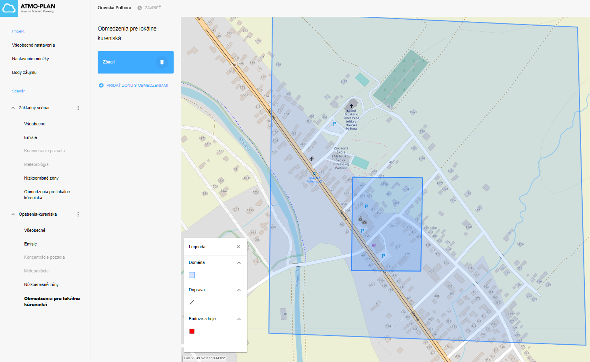

## Opatrenia pre lokálne kúreniská

Nástroj ATMO-Plan umožňuje definovanie opatrení pre zóny s lokálnymi kúreniskami. 

Prejdite na stránku s podrobnosťami projektu, otvorte scenár a kliknite na „Opatrenia pre lokálne kúreniská“. Zoznam všetkých vytvorených zón pre scenár je zobrazený vľavo.

Kliknutím na názov zóny sa na mape vykreslí modrý polygón znázorňujúci ohraničenie.

Na lište vpravo sa zobrazený názov zóny.

## Vytvorenie zóny s opatreniami pre lokálne kúreniská

:::caution Upozornenie
V základnom scenári nie je povolené vytvárať zóny s opatreniami pre lokálne kúreniská.
:::

:::caution Upozornenie
Zónu nemožno vytvoriť počas výpočtu alebo po (úspešnom) dokončení výpočtu. 
:::

Prejdite na stránku s podrobnosťami projektu, otvorte scenár a kliknite na „Opatrenia pre lokálne kúreniská“. Zoznam všetkých zón sa zobrazí vľavo. Kliknutím na „Pridať zónu s opatreniami“ vytvoríte novú zónu.

Po kliknutí na „Pridať zónu s opatreniami“ môže užívateľ nakresliť polygón zóny na mapu. Kliknite na mapu a nakreslite rohy polygónu. Priblíženie/oddialenie dosiahnete pomocou ikon v pravom dolnom rohu mapy alebo pomocou kolieska myši. Polygón uzatvoríte kliknutím na prvý roh. Umiestnenie polygónu je možné zmeniť kliknutím na „Prekresliť“ alebo „Editovať“ na pravo. Po kliknutí na „Prekresliť“ nakreslený polygón zmizne a môžete začať kresliť. Keď kliknete na „Editovať“, môžete zmeniť tvar polygónu presúvaním rohov pomocou myši.

Vpravo je možné zadať názov zóny. Po kliknutí na „Uložiť“ sa zóna pridá do zoznamu zón vľavo.

Na dokončenie definície zóny je potrebné definovať opatrenia pre zónu. Toto sa vykonáva v konfiguračnom nástroji, ktorý sa otvorí po kliknutí na „Správa opatrení pre zóny“. 

Nástroj v hornej časti umožňuje nastavení globálnych opatrení pre celú zónu - Opatrenia (celá zóna), pričom 100 % predstavuje zónu bez opatrení. 
Toto nastavanie redukuje všetky emisie vzťahuje sa napríklad na zateplenie domov v celej oblasti, kde dôjde k celkovej redukcií potrebného vykurovania a teda aj produkovaných emisií.
Nástroj obsahuje aj nastavenie špecifických opatrení pre vybrané kategórie. Užívateľ si môže nastaviť napr. zníženie emisií z vykurovania drevom pre vybrané zariadenie.
K lepšej orientácií ako nastavovať špecifické opatrenia je priložený excel súbor - (<a href="//docs/tutorial/scenario/images/Kureniska_opatrenia.xlsx">download</a>).
Nástroj umožňuje aj filtrovanie podľa kategórií kliknutím na obrátenú pyramídu vedľa kategórie.

Po dokončení konfigurácie zóny kliknúť na „Uložiť“.

## Aktualizácia zóny s opatreniami

:::caution Upozornenie
V základnom scenári nie je povolené vytvárať/aktualizovať zóny s opatreniami.
:::

:::caution Upozornenie
Zónu nie je možné aktualizovať počas výpočtu alebo po (úspešnom) dokončení výpočtu. Vlastnosti zóny sa vtedy môžu len zobraziť.
:::

Prejdite na stránku s podrobnosťami projektu, otvorte scenár a kliknite na „Opatrenia pre lokálne kúreniská“. Zoznam všetkých zón pre scenár je zobrazený vľavo. 
Názov zóny je možné aktualizovať vpravo a opatrenia pre zónu možno aktualizovať podľa postupu vysvetlenom v predchádzajúcej časti.

## Odstránenie zóny s opatreniami

:::caution Upozornenie
Zónu s opatreniami nie je možné odstrániť počas výpočtu alebo po (úspešnom) dokončení výpočtu. Tlačidlo „Odstrániť“ je vtedy skryté.
:::

Prejdite na stránku s podrobnosťami projektu, otvorte scenár a kliknite na „Opatrenia pre lokálne kúreniská“. Zoznam všetkých zón pre scenár je zobrazený vľavo. 
Zónu je možné odstrániť umiestnením kurzora myši na zónu v zozname vľavo a kliknutím na ikonu výmazania. Pon kliknutí sa zobrazí sa dialógové okno s potvrdením, ktoré obsahuje tlačidlá „OK“ a „Zrušiť“.

Video test
<video width="630" height="300" src=".images/short_test.mp4" type="video/mp4"></video>

