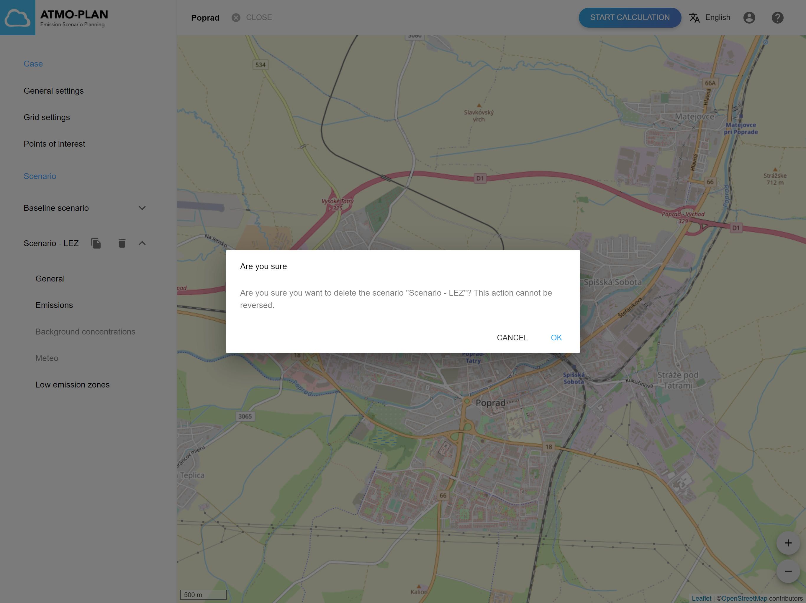

## Deleting a scenario

:::tip Available in Slovakia, Hungary
:::

:::caution
Deleting a baseline scenario is not allowed. The delete button is hidden for baseline scenarios.
:::

:::caution
A scenario cannot be deleted while the results are being calculated, when file imports are busy or when the calculation is (successfully) finished. The delete button is disabled then.
:::

Go to the case detail page. A scenario can be removed by hovering over a scenario in the list at the left, and then clicking on the delete icon. A confirmation dialog is shown containing an ok and cancel button.

