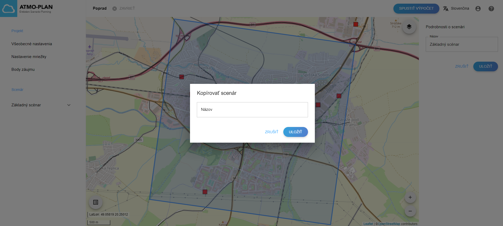
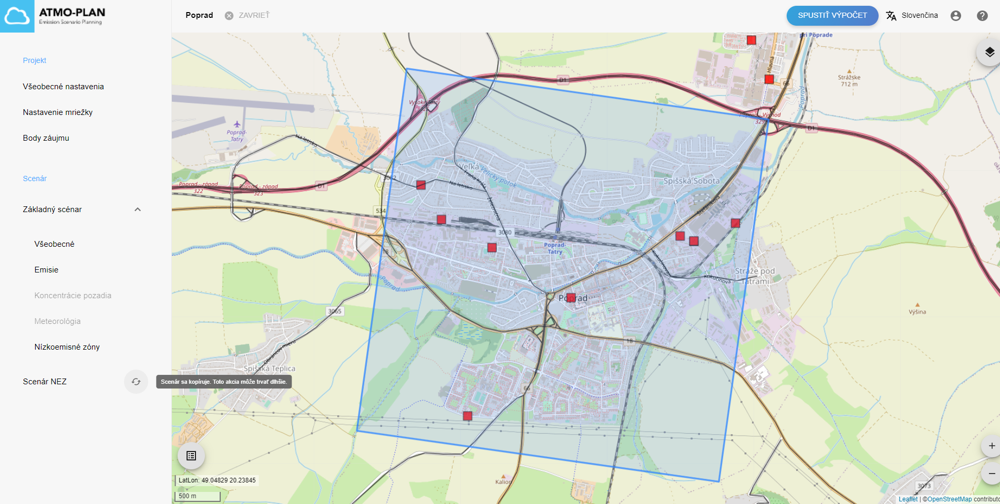

## Kopírovanie scenára

:::caution Upozornenie
Scenár nie je možné kopírovať počas výpočtu výsledkov alebo po (úspešnom) dokončení výpočtu. Vtedy je tlačidlo „Kopírovať scenár“ zablokované.
:::

Kopírovanie scenára sa môže použiť na rýchle zadefinovanie nového scenára z existujúceho scenára.

Prejdite na stránku s podrobnosťami projektu. Scenár možno kopírovať umiestnením kurzora myši nad názov scenára v zozname vľavo a kliknutím na tlačidlo „Kopírovať scenár“. Zobrazí sa kontextové okno s výzvou na zadanie názvu nového scenára. Názvy scenárov v projekte by mali byť jedinečné, pri zadaní názvu, ktorý už existuje, sa zobrazí chybové hlásenie.

Po kliknutí na „Uložiť“ sa nový scenár pridá do zoznamu scenárov vľavo.

Kopírovanie scenára trvá pár minút. Počas kopírovania sa napravo od kopírovaného scenára zobrazí ikona a po umiestnení kurzora myši na ikonu sa zobrazí správa.

Pri kopírovaní scenára sa vytvoria nasledujúce dáta:

- Názov nového scenára zadá používateľ.
- Nový scenár nie je základným scenárom.
- Cesty sa skopírujú (ak sú k dispozícii).
- Súbor flotily sa skopíruje (ak je k dispozícii).
- Mapovanie vozidiel sa skopíruje (ak je k dispozícii).
- Vyberie sa rovnaké pozadie (ak je k dispozícii).
- Vyberie sa rovnaké meteo (ak je k dispozícii).
- Súbor s tunelmi sa skopíruje (ak je k dispozícii).
- Bodové zdroje sa skopírujú (ak sú k dispozícii).
- NEZ sa skopírujú (ak sú k dispozícii).
