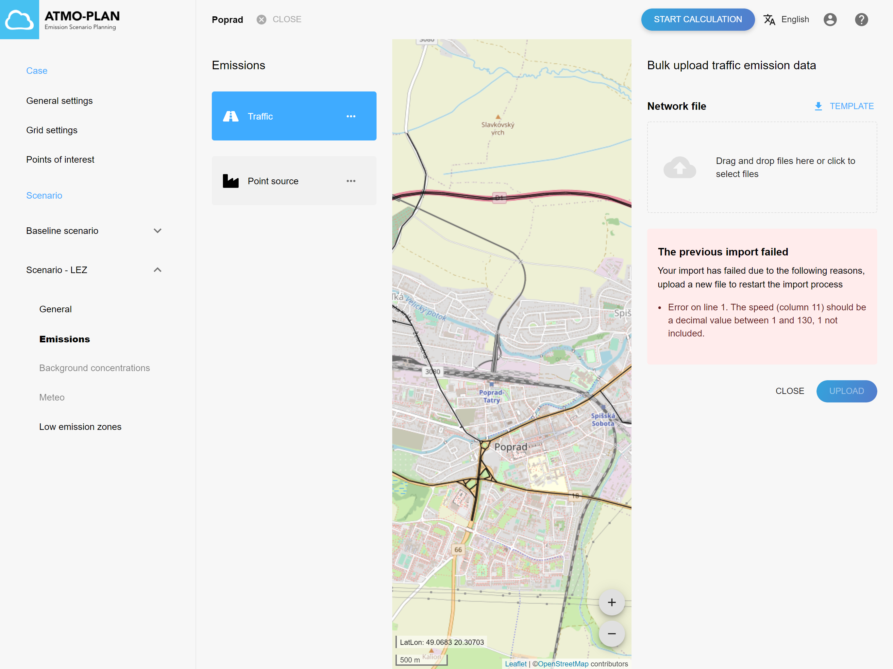
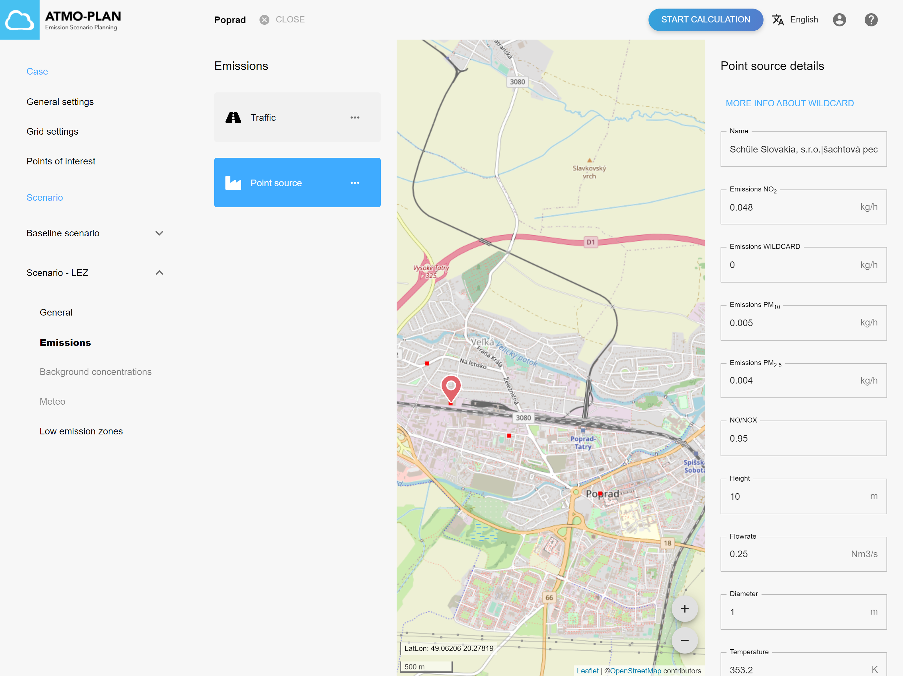
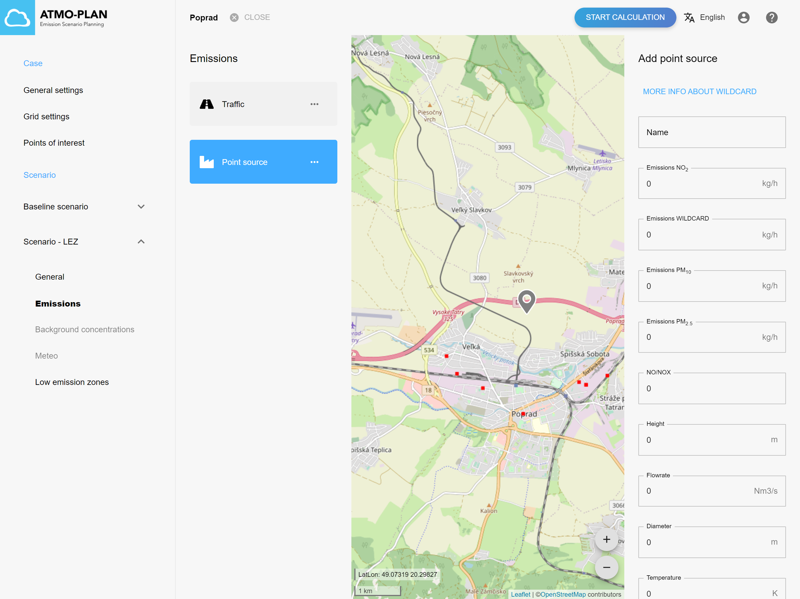
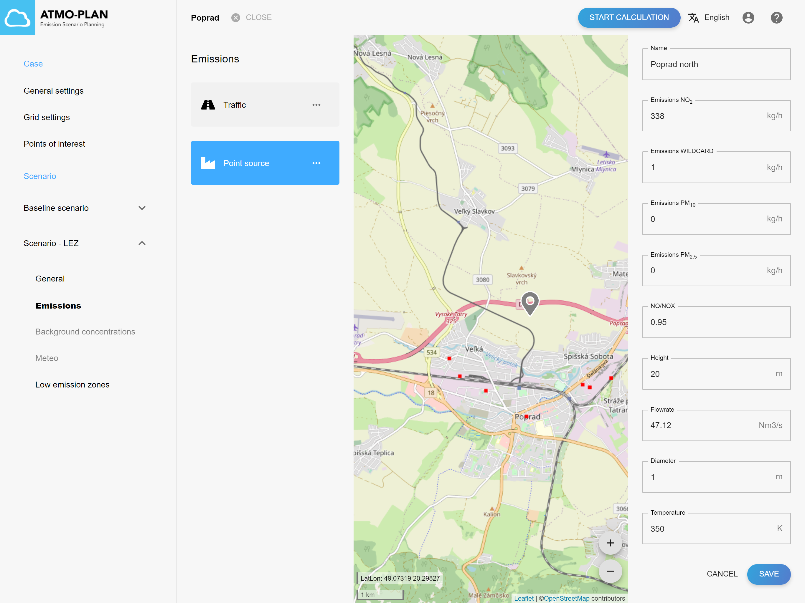
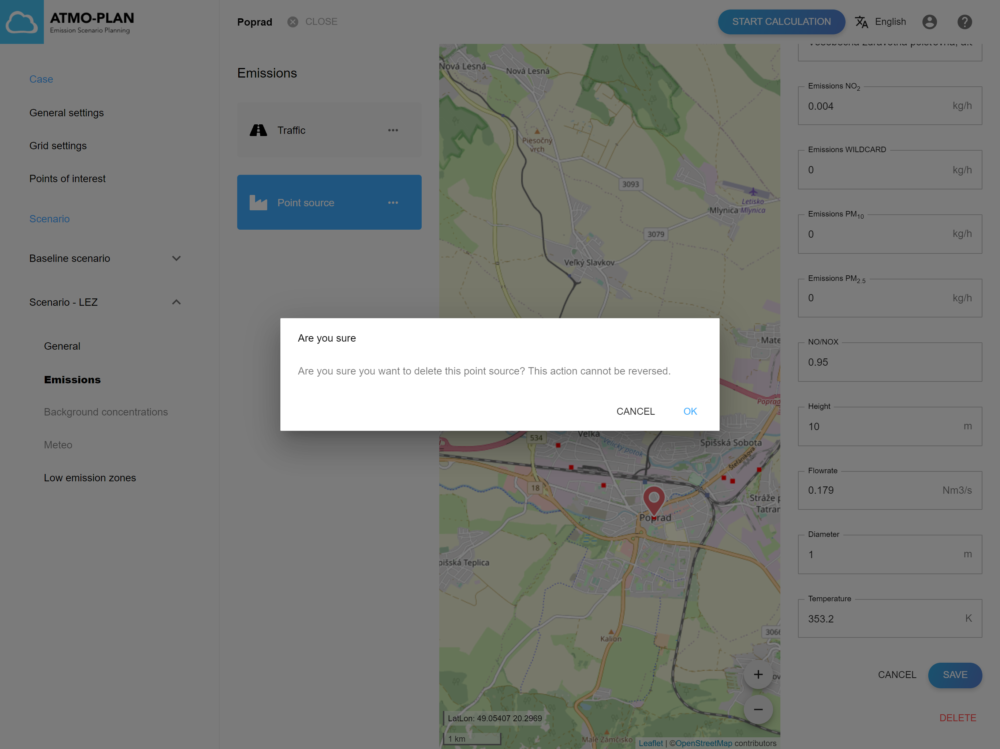

## Kontrola emisií scenára

:::tip Dostupné v každej verzii
:::

Prejdite na stránku s podrobnosťami projektu, otvorte scenár a kliknite na „Emisie“. Zoznam všetkých emisií pre scenár je zobrazený vľavo.

Existujú dva typy emisií:

- Emisie z dopravy
- Emisie z bodových zdrojov

**Emisie z dopravy** pre scenár pozostávajú zo zoznamu ciest s početnosťou dopravy pre rôzne kategórie typov vozidiel. Podporované kategórie typov vozidiel závisia od verzie. Na Slovensku a v Maďarsku sú kategórie typov vozidiel pevne dané: BUS, AUTO, LDV, HDV.

Či sú intenzity dopravy uvedené ako intenzity cez špičku (spolu s profilom škálovania) alebo ročné súčty, závisí aj od verzie. Na Slovensku a v Maďarsku ide o ročné úhrny.

**Emisie z bodových zdrojov** pre scenár pozostávajú zo zoznamu (priemyselných) bodových zdrojov s príslušnými emisiami.

### Kontrola emisií z dopravy

Prejdite na stránku s podrobnosťami projektu, otvorte scenár a kliknite na „Emisie“. Zoznam všetkých emisií pre scenár je zobrazený vľavo. Potom kliknite na „Doprava“. Všetky cesty sú na mape zobrazené ako čierne čiary.

Po kliknutí na cestu sa vpravo zobrazia vlastnosti cesty. Vlastnosti pozostávajú z početnosti dopravy, rýchlostného limitu, výšky a typu cesty. Typ cesty môže byť diaľnica, regionálna alebo mestská.

Pred výberom inej cesty na mape kliknite na Zavrieť.

### Kontrola emisií bodového zdroja

Prejdite na stránku s podrobnosťami projektu, otvorte scenár a kliknite na „Emisie“. Zoznam všetkých emisií pre scenár je zobrazený vľavo. Potom kliknite na „Bodové zdroje“. Všetky bodové zdroje sú na mape zobrazené ako červené body.

Po kliknutí na bodový zdroj sa vpravo zobrazia vlastnosti bodového zdroja. Vlastnosti pozostávajú z názvu, emisií, pomeru NO k NOX, výšky, prietoku, priemeru a teploty bodového zdroja.

Pred výberom iného bodového zdroja na mape kliknite na Zavrieť.

## Vytváranie emisií pre scenár

:::pozor Zatiaľ nedostupné
:::

## Aktualizácia emisií z dopravy pre scenár

:::tip Dostupné na Slovensku, v Maďarsku
:::

Najprv popíšeme, ako aktualizovať emisie z dopravy. Potom sa pozrieme na emisie bodových zdrojov.

:::pozor
V niektorých verziach (Slovensko, Maďarsko) nie je povolené aktualizovať emisie v základnom scenári.
:::

:::pozor
Emisie nie je možné aktualizovať počas výpočtu výsledkov alebo po (úspešnom) dokončení výpočtu.
:::

Existujú rôzne možnosti:

- Aktualizácia vlastností existujúcej cesty
- Vytvorenie cesty kreslením na mape
- Nahranie súboru obsahujúceho viacero ciest
- Odstránenie cesty

### Aktualizácia vlastností existujúcej cesty

Prejdite na stránku s podrobnosťami projektu, otvorte scenár a kliknite na „Emisie“. Zoznam všetkých emisií pre scenár je zobrazený vľavo. Potom kliknite na „Doprava“. Všetky cesty sú na mape zobrazené ako čierne čiary.

Po kliknutí na cestu sa vpravo zobrazia vlastnosti cesty. Vlastnosti pozostávajú z početnosti dopravy, rýchlostného limitu, výšky a typu cesty. Typ cesty môže byť H (diaľnica), R (regionálna) alebo U (mestská).

Vlastnosti je možné aktualizovať úpravou polí a kliknutím na Uložiť. Vlastnosti sa riadia niekoľkými pravidlami:

- Početnosť dopravy by mala byť kladná alebo nulová
- Celková početnosť dopravy nemôže byť nula
- Rýchlostný limit by mal byť celé číslo medzi 1 a 130
- Výška by mala byť hodnota medzi 0 a 150

### Vytvorenie cesty kreslením na mape

Prejdite na stránku s podrobnosťami projektu, otvorte scenár a kliknite na „Emisie“. Zoznam všetkých emisií pre scenár je zobrazený vľavo. Potom kliknite na „Doprava“. Všetky cesty sú na mape zobrazené ako čierne čiary.

Kliknite na ikonu v ľavom hornom rohu mapy a kliknutím na začiatok a koniec cesty nakreslite cestu na mapu. Každá cesta je reprezentovaná čiarou. Po nakreslení cesty sa vpravo zobrazia vlastnosti cesty. Vyplňte vlastnosti cesty a kliknutím na Uložiť vytvorte novú cestu. Vlastnosti sa riadia niektorými pravidlami, ktoré sú popísané v predchádzajúcej časti.

### Nahrávanie súboru obsahujúceho viacero ciest

Prejdite na stránku s podrobnosťami projektu, otvorte scenár a kliknite na „Emisie“. Zoznam všetkých emisií pre scenár je zobrazený vľavo. Potom kliknite na „Doprava“. Všetky cesty sú na mape zobrazené ako čierne čiary.

Kliknite na 'Hromadné nahrávanie' v menu pre dopravné emisie. Vpravo je zobrazený panel, kde je možné nahrať súbor s cestnou sieťou. V hornej časti si môžete stiahnuť šablónu, ktorú možno použiť na definovanie vlastného súbor s cestnou sieťou. Formát súboru s cestnou sieťou je podrobnejšie popísaný v prílohe. Súbor s cestnou sieťou definuje geometrickú polohu jednotlivých ciest prostredníctvom súradníc zemepisnej šírky a dĺžky a obsahuje početnosť dopravy pre rôzne kategórie. Pre každú cestu je uvedený typ cesty, rýchlostný limit a výška.

Nahrajte svoj súbor presunutím súboru do komponentu nahrávania. Prípadne môžete kliknúť na komponent nahrávania; otvorí sa prieskumník súborov, ktorý vám umožní vybrať súbor vo vašom súborovom systéme. Názov zvoleného súboru je zobrazený pod komponentom nahrávania. Kliknutím na „nahrať“ spustíte import súboru.

When importing files, their content is parsed, validated and put into a back-end database. For larger files, this may take some time. While the import is busy, a message is shown on the page.

When the file was valid, the new roads are added to the map.

When the file is invalid, the user is notified with a brief message of where the import went wrong. You can then correct your file and upload it again, as described above.

### Deleting a road

Go to the case detail page, open a scenario and click on 'Emissions'. A list of all emissions for the scenario is shown at the left. Then click on a traffic emission. All roads are shown on the map as black line strings.

When clicking on a road, the properties of the road are shown on the right. Click on the Delete button to delete the selected road. A confirmation dialog is shown containing an ok and cancel button.

## Updating point source emissions

:::tip Available in Slovakia, Hungary
:::

:::caution
In some deployments (Slovakia, Hungary), it is not allowed to update emissions in the baseline scenario.
:::

:::caution
The emissions cannot be updated while the results are being calculated or when the calculation is (successfully) finished.
:::

There are different options:

- Updating the properties of an existing point source
- Creating a point source by drawing on the map
- Uploading a file containing multiple point sources
- Deleting a point source

### Updating the properties of an existing point source

Go to the case detail page, open a scenario and click on 'Emissions'. A list of all emissions for the scenario is shown at the left. Then click on a point source emission. All point sources are shown on the map as red squares.

When clicking on a point source, the properties of the point source are shown on the right. The properties consist of the name, emissions, NO/NOX ratio, height, flow rate, diameter and temperature.

The properties can be updated by editing the fields and clicking on Save. The properties follow some rules:

- The emissions should be positive or zero
- The NO/NOX ratio should be a decimal value between 0 and 1
- The height should be a decimal value greater than or equal to 0
- The flow rate should be a decimal value greater than or equal to 0
- The diameter should be a decimal value greater than or equal to 0
- The temperature should be a decimal value greater than or equal to 273.15

### Creating a point source by drawing on the map

Go to the case detail page, open a scenario and click on 'Emissions'. A list of all emissions for the scenario is shown at the left. Then click on a point source emission. All point sources are shown on the map as red squares.

Click on the icon in the top left corner of the map and click on the map to draw your point source. After drawing the point source, the properties of the point source appear at the right. Fill in the different properties and click on Save to create the new point source. The properties follow some rules that are describe in the previous section.

### Uploading a file containing multiple point sources

Go to the case detail page, open a scenario and click on 'Emissions'. A list of all emissions for the scenario is shown at the left. Then click on a point source emission. All point sources are shown on the map as red squares.

Click on 'Bulk upload' in the menu of the point source emission. At the right, a panel is shown where the point source file can be uploaded. At the top a template can be downloaded that can be used to define your own point source file. The format of the point source file is described in more detail in an appendix. The point source file defines the geometrical location of the individual point sources via lat/lon coordinates and contains the emissions for different pollutants. For each point source, the name, NO/NOX ratio, height, flow rate, diameter and temperature are given.

Upload your point source file by dragging and dropping the file in the upload component. Alternatively, you can click on the upload component; this opens a file explorer, which allows you to choose a file on your file system. The name of the chosen file is shown below the upload component. Click on 'upload' to start importing the file.

When importing files, their content is parsed, validated and put into a back-end database. For larger files, this may take some time. While the import is busy, a message is shown on the page.

When the file was valid, the new point sources are added to the map.

When the file is invalid, the user is notified with a brief message of where the import went wrong. You can then correct your file and upload it again, as described above.

### Deleting a point source

Go to the case detail page, open a scenario and click on 'Emissions'. A list of all emissions for the scenario is shown at the left. Then click on a point source emission. All point sources are shown on the map as red squares.

When clicking on a point source, the properties of the point source are shown on the right. Click on the Delete button to delete the selected point source. A confirmation dialog is shown containing an ok and cancel button.

 
