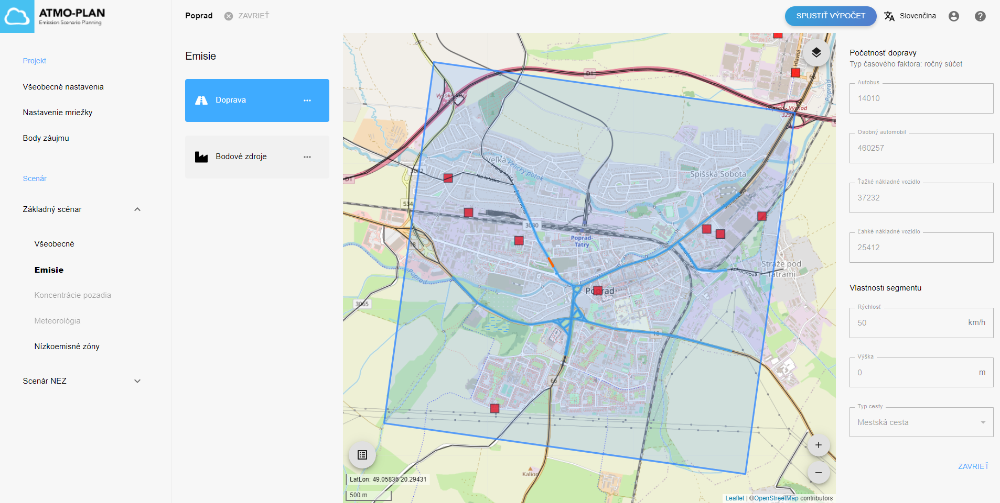

## Kontrola emisií v scenári

Prejdite na stránku s podrobnosťami projektu, otvorte scenár a kliknite na „Emisie“. Zoznam všetkých emisií pre scenár je zobrazený vľavo.

Existujú dva typy emisií:

- Emisie z dopravy
- Emisie z bodových zdrojov

**Emisie z dopravy** pre scenár pozostávajú zo zoznamu ciest s početnosťou dopravy pre rôzne kategórie typov vozidiel. Podporované kategórie typov vozidiel závisia od verzie. Kategórie typov vozidiel sú pevne dané: BUS, AUTO, LDV (ľahké nákladné vozidlá), HDV (ťažké nákladné vozidlá).

Či je početnosť dopravy uvedená ako intenzita cez špičku (spolu s profilom škálovania) alebo ročný súčet, závisí aj od verzie. Na Slovensku ide o ročné súčty.

**Emisie z bodových zdrojov** pre scenár pozostávajú zo zoznamu (priemyselných) bodových zdrojov s príslušnými emisiami.

### Kontrola emisií z dopravy

Prejdite na stránku s podrobnosťami projektu, otvorte scenár a kliknite na „Emisie“. Zoznam všetkých emisií pre scenár je zobrazený vľavo. Potom kliknite na „Doprava“. Všetky cesty sú na mape zobrazené ako modré čiary.

Po kliknutí na cestu sa vpravo zobrazia vlastnosti cesty. Vlastnosti pozostávajú z početnosti dopravy, rýchlostného limitu, výšky a typu cesty. Typ cesty môže byť diaľnica, regionálna alebo mestská.

Pred výberom inej cesty na mape kliknite na „Zavrieť“.

### Kontrola emisií bodového zdroja

Prejdite na stránku s podrobnosťami projektu, otvorte scenár a kliknite na „Emisie“. Zoznam všetkých emisií pre scenár je zobrazený vľavo. Potom kliknite na „Bodové zdroje“. Všetky bodové zdroje sú na mape zobrazené ako modré štvorce.

Po kliknutí na bodový zdroj sa vpravo zobrazia vlastnosti bodového zdroja. Vlastnosti pozostávajú z názvu, emisií, pomeru NO k NOX, výšky, prietoku, priemeru a teploty bodového zdroja.

Pred výberom iného bodového zdroja na mape kliknite na „Zavrieť“.

## Vytváranie emisií pre scenár

:::caution Upozornenie Táto možnosť nie je v aktuálnej verzií ATMO-Plan dostupná
:::

## Aktualizácia emisií z dopravy pre scenár

Najprv popíšeme, ako aktualizovať emisie z dopravy. Potom sa pozrieme na emisie bodových zdrojov.

:::caution Upozornenie
V základnom scenári nie je povolené aktualizovať emisie.
:::

:::caution Upozornenie
Emisie nie je možné aktualizovať počas výpočtu výsledkov alebo po (úspešnom) dokončení výpočtu.
:::

Existujú rôzne možnosti:

- Aktualizácia vlastností existujúcej cesty
- Vytvorenie cesty kreslením na mape
- Nahranie súboru obsahujúceho viacero ciest
- Odstránenie cesty

### Aktualizácia vlastností existujúcej cesty

Prejdite na stránku s podrobnosťami projektu, otvorte scenár a kliknite na „Emisie“. Zoznam všetkých emisií pre scenár je zobrazený vľavo. Potom kliknite na „Doprava“. Všetky cesty sú na mape zobrazené ako modré čiary.

Po kliknutí na cestu sa vpravo zobrazia vlastnosti cesty. Vlastnosti pozostávajú z početnosti dopravy, rýchlostného limitu, výšky a typu cesty. Typ cesty môže byť H (diaľnica), R (regionálna) alebo U (mestská).

Vlastnosti je možné aktualizovať úpravou polí a kliknutím na „Uložiť“. Riadia sa niekoľkými pravidlami:

- Početnosť dopravy by mala byť kladná alebo nulová
- Celková početnosť dopravy nemôže byť nula
- Rýchlostný limit by mal byť celé číslo medzi 1 a 130
- Výška by mala byť hodnota medzi 0 a 150

### Vytvorenie cesty kreslením na mape

Prejdite na stránku s podrobnosťami projektu, otvorte scenár a kliknite na „Emisie“. Zoznam všetkých emisií pre scenár je zobrazený vľavo. Potom kliknite na „Doprava“. Všetky cesty sú na mape zobrazené ako modré čiary.

Kliknite na ikonu v ľavom hornom rohu mapy a kliknutím na začiatok a koniec cesty nakreslite cestu na mapu. Každá cesta je reprezentovaná čiarou. Po nakreslení cesty sa vpravo zobrazia vlastnosti cesty. Vyplňte vlastnosti cesty a kliknutím na „Uložiť“ vytvorte novú cestu. Vlastnosti sa riadia niektorými pravidlami, ktoré sú popísané v predchádzajúcej časti.

### Nahrávanie súboru obsahujúceho viacero ciest

Prejdite na stránku s podrobnosťami projektu, otvorte scenár a kliknite na „Emisie“. Zoznam všetkých emisií pre scenár je zobrazený vľavo. Potom kliknite na „Doprava“. Všetky cesty sú na mape zobrazené ako čierne čiary.

Kliknite na „Hromadné nahrávanie“ v menu pre „Doprava“. Vpravo sa zobrazí panel, kde je možné nahrať súbor s cestnou sieťou. V hornej časti si môžete stiahnuť šablónu, ktorú možno použiť na definovanie vlastného súbor s cestnou sieťou. Formát súboru s cestnou sieťou je podrobnejšie popísaný v prílohe. Súbor s cestnou sieťou definuje geometrickú polohu jednotlivých ciest prostredníctvom súradníc zemepisnej šírky a dĺžky a obsahuje početnosť dopravy pre rôzne kategórie. Pre každú cestu je uvedený typ cesty, rýchlostný limit a výška.

Nahrajte svoj súbor presunutím súboru do komponentu nahrávania. Prípadne môžete kliknúť na komponent nahrávania; otvorí sa prieskumník súborov, ktorý vám umožní vybrať súbor vo vašom súborovom systéme. Názov zvoleného súboru je zobrazený pod komponentom nahrávania. Kliknutím na „Nahrať“ spustíte import súboru.

Pri importovaní súborov sa ich obsah analyzuje, overí a vloží do  back-end databázy. V prípade väčších súborov to môže chvíľu trvať. Keď  import prebieha, na stránke sa zobrazí správa.

Keď je súbor platný, nové cesty sa pridajú na mapu.

Keď je súbor neplatný, užívateľ je upozornený krátkou správou s chybou importu. Potom môže svoj súbor opraviť a znova nahrať, ako je popísané vyššie.

### Odstránenie cesty

Prejdite na stránku s podrobnosťami projektu, otvorte scenár a kliknite na „Emisie“. Zoznam všetkých emisií pre scenár je zobrazený vľavo. Potom kliknite na „Doprava“. Všetky cesty sú na mape zobrazené ako modré čiary.

Po kliknutí na cestu sa vpravo zobrazia vlastnosti cesty. Kliknutím na tlačidlo „Odstrániť“ odstránite vybratú cestu. Zobrazí sa dialógové okno s potvrdením, ktoré obsahuje tlačidlo „OK“ a „Zrušiť“.

## Aktualizácia emisií z bodových zdrojov

:::caution Upozornenie
V základnom scenári nie je povolené aktualizovať emisie.
:::

:::caution Upozornenie
Emisie nie je možné aktualizovať počas výpočtu výsledkov alebo po (úspešnom) dokončení výpočtu.
:::

Existujú rôzne možnosti:

- Aktualizácia vlastností existujúceho bodového zdroja
- Vytvorenie bodového zdroja kreslením na mape
- Nahranie súboru obsahujúceho viacero zdrojových bodov
- Odstránenie bodového zdroja

### Aktualizácia vlastností existujúceho bodového zdroja

Prejdite na stránku s podrobnosťami projektu, otvorte scenár a kliknite na „Emisie“. Zoznam všetkých emisií pre scenár je zobrazený vľavo. Potom kliknite na „Bodové zdroje“. Všetky bodové zdroje sú na mape zobrazené ako modré štvorce.

Po kliknutí na bodový zdroj sa vpravo zobrazia vlastnosti bodového zdroja. Vlastnosti pozostávajú z názvu, emisií, pomeru NO k NOX, výšky, prietoku, priemeru a teploty.

Vlastnosti je možné aktualizovať úpravou polí a kliknutím na „Uložiť“. Vlastnosti sa riadia niekoľkými pravidlami:

- Emisie by mali byť kladné alebo nulové
- Pomer NO k NOX by mal byť desatinná hodnota medzi 0 a 1
- Výška by mala byť  hodnota väčšia alebo rovná 0
- Prietok by mal byť desatinná hodnota väčšia alebo rovná 0
- Priemer by mal byť desatinná hodnota väčšia alebo rovná 0
- Teplota by mala byť desatinná hodnota väčšia alebo rovná 273,15

### Vytvorenie bodového zdroja kreslením na mape

Prejdite na stránku s podrobnosťami projektu, otvorte scenár a kliknite na „Emisie“. Zoznam všetkých emisií pre scenár je zobrazený vľavo. Potom kliknite na „Bodové zdroje“. Všetky bodové zdroje sú na mape zobrazené ako červené štvorce.

Kliknite na ikonu v ľavom hornom rohu mapy a kliknutím na mapu nakreslite bodový zdroj. Po nakreslení bodového zdroja sa vpravo zobrazia vlastnosti bodového zdroja. Vyplňte rôzne vlastnosti a kliknutím na Uložiť vytvorte nový bodový zdroj. Vlastnosti sa riadia niektorými pravidlami, ktoré sú popísané v predchádzajúcej časti.

### Nahrávanie súboru obsahujúceho viacero zdrojových bodov

Prejdite na stránku s podrobnosťami projektu, otvorte scenár a kliknite na „Emisie“. Zoznam všetkých emisií pre scenár je zobrazený vľavo. Potom kliknite na „Bodové zdroje“. Všetky bodové zdroje sú na mape zobrazené ako modré štvorce.

Kliknite na „Hromadné nahrávanie“ v menu pre „Bodové zdroje“. Vpravo sa zobrazí panel, do ktorého je možné nahrať súbor s bodovými zdrojmi. V hornej časti je možné stiahnuť šablónu, ktorú možno použiť na definovanie vlastného súboru s bodovými zdrojmi. Formát súboru s bodovými zdrojmi je podrobnejšie popísaný v prílohe. Súbor s bodovými zdrojmi definuje geometrickú polohu jednotlivých bodových zdrojov prostredníctvom súradníc zemepisnej šírky a dĺžky a obsahuje emisie pre rôzne znečisťujúce látky. Pre každý bodový zdroj je uvedený názov, pomer NO k NOX, výška, prietok, priemer a teplota.

Nahrajte svoj súbor s bodovými zdrojmi presunutím súboru do komponentu nahrávania. Prípadne môžete kliknúť na komponent nahrávania; otvorí sa prieskumník súborov, ktorý vám umožní vybrať súbor vo vašom súborovom systéme. Názov zvoleného súboru je zobrazený pod komponentom nahrávania. Kliknutím na „Nahrať“ spustíte import súboru.

Pri importovaní súborov sa ich obsah analyzuje, overí a vloží do back-end databázy. V prípade väčších súborov to môže chvíľu trvať. Keď  import prebieha, na stránke sa zobrazí správa.

Keď je súbor platný, nové bodové zdroje sa pridajú na mapu.

Keď je súbor neplatný, užívateľ je upozornený krátkou správou s chybou importu. Potom môže svoj súbor opraviť a znova nahrať, ako je popísané vyššie.

### Odstránenie bodového zdroja

Prejdite na stránku s podrobnosťami projektu, otvorte scenár a kliknite na „Emisie“. Zoznam všetkých emisií pre scenár je zobrazený vľavo. Potom kliknite na „Bodové zdroje“. Všetky bodové zdroje sú na mape zobrazené ako modré štvorce.

Po kliknutí na bodový zdroj sa vpravo zobrazia vlastnosti bodového zdroja. Kliknutím na tlačidlo „Odstrániť“ vymažete vybraný bodový zdroj. Zobrazí sa dialógové okno s potvrdením, ktoré obsahuje tlačidlo  „OK“ a „Zrušiť“.

 
