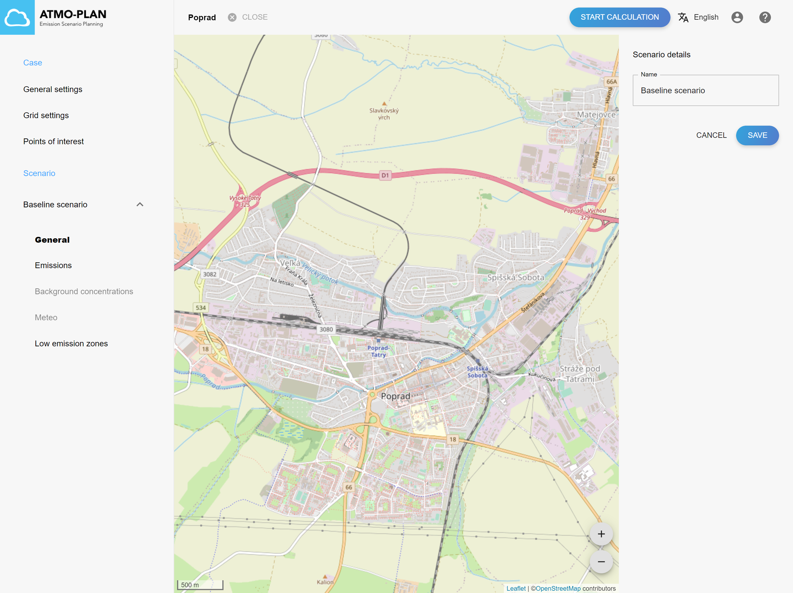

## Kontrola všeobecných nastavení scenára

:::tip Dostupné v každej verzii
:::

Prejdite na stránku s podrobnosťami projektu, otvorte scenár a kliknite na „Všeobecné“. Názov scenára si môžete pozrieť tu.

## Aktualizácia všeobecných nastavení scenára 

:::tip Dostupné v každej verzii
:::

Prejdite na stránku s podrobnosťami projektu, otvorte scenár a kliknite na „Všeobecné“. Tu je možné upraviť názov scenára.

:::Pozor
Všeobecné nastavenia nie je možné aktualizovať počas výpočtu alebo po (úspešnom) dokončení výpočtu. Všeobecné nastavenia môžu byť len zobrazené.
:::
