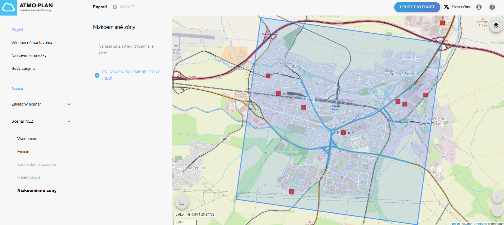
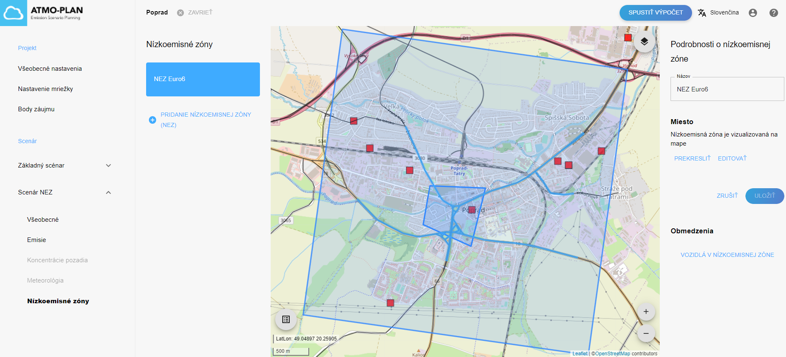
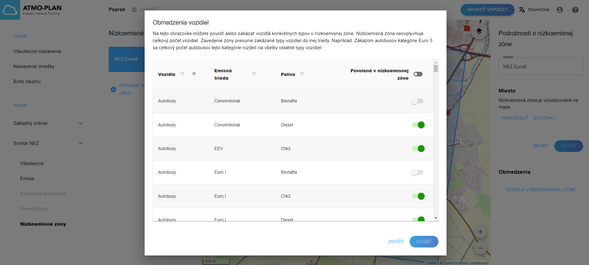
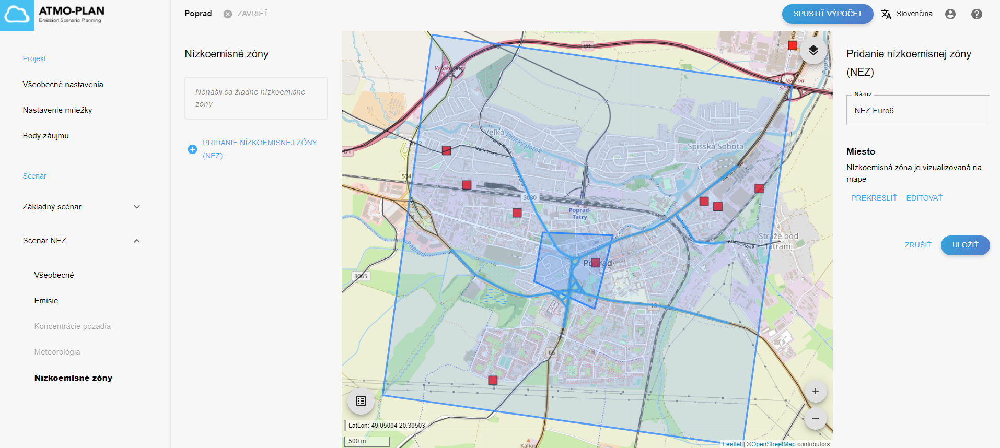
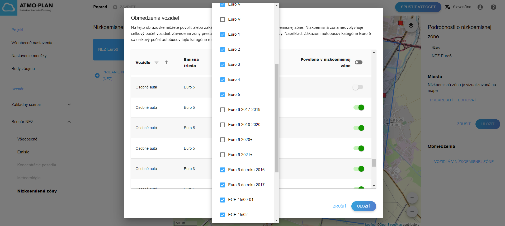
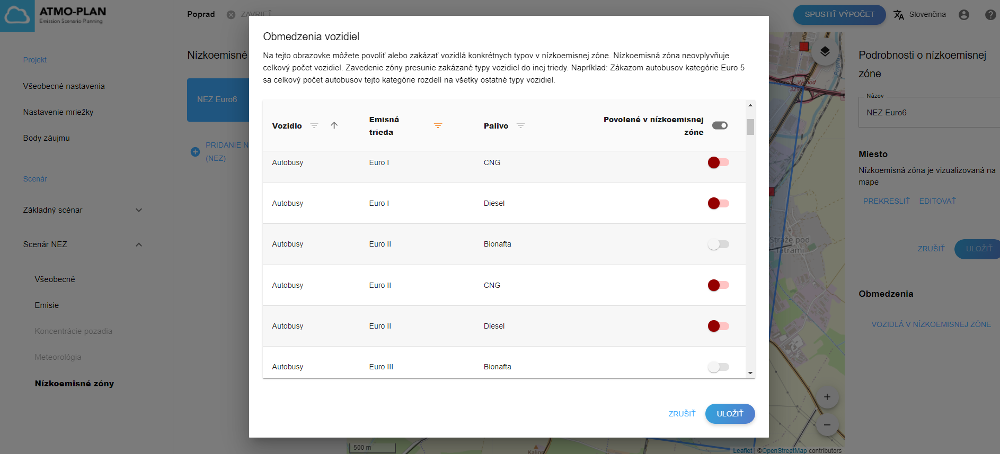
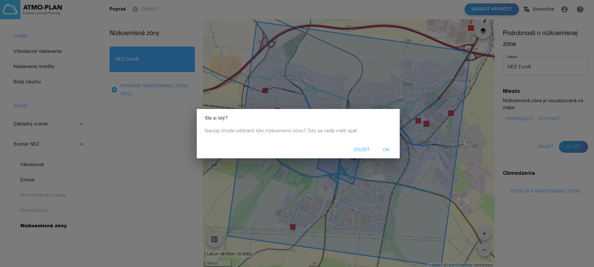

## Kontrola nízkoemisných zón v scenári 

Nástroj ATMO-Plan umožňuje definovanie nízkoemisných zón (NEZ). NEZ je oblasť, kde je zakázaný vjazd vozidlám produkujúcim najväčšie znečistenie.

Prejdite na stránku s podrobnosťami projektu, otvorte scenár a kliknite na „Nízkoemisné zóny“. Zoznam všetkých NEZ pre scenár je zobrazený vľavo.

Potom kliknite na NEZ. Poloha NEZ je na mape znázornená ako modrý polygón.

Vpravo je zobrazený názov NEZ.

Po kliknutí na „Vozidlá v nízkoemisnej zóne“ sa zobrazí zoznam všetkých typov vozidiel. Pre každý typ vozidla je v poslednom stĺpci uvedené, či je v NEZ povolený alebo nie:

- keď je prepínač zelený, typ vozidla je povolený v NEZ 
- keď je prepínač červený, typ vozidla nie je povolený v NEZ
- keď je prepínač sivý, typ vozidla sa nenachádza vo vozovom parku pre daný scenár

Každý stĺpec v tabuľke je možné zoradiť kliknutím na šípky v záhlaví stĺpca. Opätovným kliknutím sa stĺpec zoradí v opačnom poradí. Keď je stĺpec zoradený, šípka sa zobrazuje tmavosivou farbou, inak je skrytá.

Každý stĺpec je možné zoradiť kliknutím na filter v hlavičke stĺpca. Keď je stĺpec filtrovaný, filter je zobrazený oranžovou farbou, inak je zobrazený sivou farbou.

## Vytvorenie nízkoemisnej zóny

:::caution Upozornenie
V základnom scenári nie je povolené vytvárať NEZ.
:::

:::caution Upozornenie
Nízkoemisnú zónu nemožno vytvoriť počas výpočtu alebo po (úspešnom) dokončení výpočtu. Pred vytvorením NEZ by scenár mal mať platnú flotilu. Tlačidlo „Pridanie nízkoemisnej zóny“ je v tom prípade skryté.
:::

Prejdite na stránku s podrobnosťami projektu, otvorte scenár a kliknite na „Nízkoemisné zóny“. Zoznam všetkých NEZ pre scenár je zobrazený vľavo. Kliknutím na „Pridanie nízkoemisnej zóny“ vytvoríte novú NEZ.

Nízkoemisné zóny možno definovať až po definovaní vozového parku pre scenár. V opačnom prípade bude funkcia „Pridanie nízkoemisnej zóny“ deaktivovaná.

Po kliknutí na „Pridanie nízkoemisnej zóny“ môže užívateľ zakresliť NEZ na mapu. Kliknite na mapu a nakreslite rohy polygónu. Priblíženie/oddialenie dosiahnete pomocou ikon v pravom dolnom rohu mapy alebo pomocou kolieska myši. Polygón uzatvoríte kliknutím na prvý roh. Umiestnenie polygónu je možné zmeniť kliknutím na „Prekresliť“ alebo „Editovať“ na pravo. Po kliknutí na „Prekresliť“ nakreslený polygón zmizne a môžete začať kresliť. Keď kliknete na „Editovať“, môžete zmeniť tvar polygónu presúvaním rohov pomocou myši.

Vpravo je možné zadať názov NEZ. Po kliknutí na „Uložiť“ sa NEZ pridá do zoznamu zón s nízkymi emisiami vľavo.

Na dokončenie definície NEZ je potrebné definovať vozový park pre NEZ. Vo vozovom parku je zadefinované, ktoré kategórie vozidiel sú v zóne povolené a ktoré kategórie vozidiel sú zakázané. Toto sa vykonáva v konfiguračnom nástroji NEZ, ktorý sa otvorí po kliknutí na „Vozidlá v nízkoemisnej zóne“.

Konfiguračný nástroj NEZ možno použiť na vykonanie rýchleho skríningu účinku zavedenia NEZ na koncentrácie. Nástroj je možné použiť napríklad na zákaz emisných tried vozidiel pred EURO 5 vo vybranej zóne, pričom sa celkový počet vozidiel daného typu (autobus, auto, HDV...) vo vozovom parku nemení, ani počty prebehov. Pri zakázaní určitej emisnej triedy sa tieto vozidlá rozdelia do zostávajúcich emisných tried rovnakého typu, pričom sa početnosť dopravy vo všetkých uliciach zachová konštantná. Napríklad pri zákaze všetkých osobných áut emisných tried pred EURO 5 budú osobné autá pred EURO 5 nahradené EURO 5 a EURO 6, pričom pomer medzi nimi sa bude rovnať pomeru medzi EURO 5 a EURO 6 vo vozovom parku mimo NEZ.

Jednoduchý konfiguračný nástroj zobrazuje tabuľku obsahujúcu všetky typy vozidiel vo vozovom parku daného scenára. Pre každý typ vozidla je uvedená kategória typu vozidla, emisná trieda a typ paliva.

:::caution Upozornenie
Je dôležité poznamenať, že typy vozidiel a im prislúchajúce kategórie, ktoré sa môžu vyskytnúť v súbore zloženia vozového parku, sú preddefinované pre každú verziu a závisia od zvoleného regiónu. Užívateľ môže pracovať iba s existujúcimi typmi vozidiel. V prípade požiadavky na rozšírenie typov a príslušných kategórií vozidiel je potrebné kontaktovať VITO.
:::

Pri otvorení konfiguračného nástroja posledný stĺpec zobrazuje, ktoré kategórie vozidiel sa nachádzajú vo vozovom parku daného scenára (zelený prepínač), a ktoré nie (sivý prepínač). Užívateľ môže zakázať kategórie vozidiel v NEZ prepnutím prepínača zo zelenej na červenú.

Užívateľ môže tiež zakázať kategórie vozidiel pomocou filtrov v stĺpcoch a následným kliknutím na prepínač v záhlaví posledného stĺpca. Na nasledujúcich obrázkoch je zobrazená tabuľka s filtrom na kategórie vozidiel, ktorých emisná trieda líši od emisnej triedy „Euro 6“. Kliknutím na prepínač v záhlaví posledného stĺpca sú všetky tieto kategórie vozidiel okamžite zakázané.

Keď sú potrebné kategórie vozidiel zakázané, kliknite na „Uložiť“. V tom momente je vozový park pre NEZ vypočítaný, uložený a novovytvorená NEZ je tak kompletná.

:::caution Upozornenie
Pri zákaze kategórií vozidiel v NEZ existujú určité obmedzenia. Pri zákaze kategórie vozidla je dôležité si uvedomiť, že celkový počet vozidiel vo vozovom parku sa nezmení. Zakázané vozidlá sú distribuované do zostávajúcich kategórií vozidiel rovnakého typu. Napríklad pri zákaze osobných áut emisnej triedy Euro 1 sa počet osobných áut v emisnej triede Euro 1 rozloží na všetky ostatné emisné triedy pre osobné autá. To tiež znamená, že nemôžete zakázať vo vozovom parku všetky kategórie  pre vozidlá konkrétneho typu. Musí zostať aspoň jedna; inak sa zobrazí chybové hlásenie.
:::

## Aktualizácia nízkoemisnej zóny

:::caution Upozornenie
V základnom scenári nie je povolené vytvárať/aktualizovať NEZ.
:::

:::caution Upozornenie
Nízkoemisnú zónu nie je možné aktualizovať počas výpočtu alebo po (úspešnom) dokončení výpočtu. Pred vytvorením NEZ by  mal mať scenár platný vozový park. Vlastnosti NEZ môžu byť vtedy len zobrazené.
:::

Prejdite na stránku s podrobnosťami projektu, otvorte scenár a kliknite na „Nízkoemisné zóny“. Zoznam všetkých NEZ pre scenár je zobrazený vľavo. Potom kliknite na NEZ. Názov NEZ je možné aktualizovať vpravo a obmedzenia vozidiel možno aktualizovať podľa postupu vysvetlenom v predchádzajúcej časti.

## Odstránenie nízkoemisnej zóny

:::caution Upozornenie
V základnom scenári nie je povolené vytvárať/aktualizovať NEZ.
:::

:::caution Upozornenie
Nízkoemisnú zónu nie je možné odstrániť počas výpočtu alebo po (úspešnom) dokončení výpočtu. Tlačidlo „Odstrániť“ je vtedy skryté.
:::

Prejdite na stránku s podrobnosťami projektu, otvorte scenár a kliknite na „Nízkoemisné zóny“. Zoznam všetkých NEZ pre scenár je zobrazený vľavo. NEZ je možné odstrániť umiestnením kurzora myši na NEZ v zozname vľavo a kliknutím na ikonu výmazu. Zobrazí sa dialógové okno s potvrdením, ktoré obsahuje tlačidlá „OK“ a „Zrušiť“.

