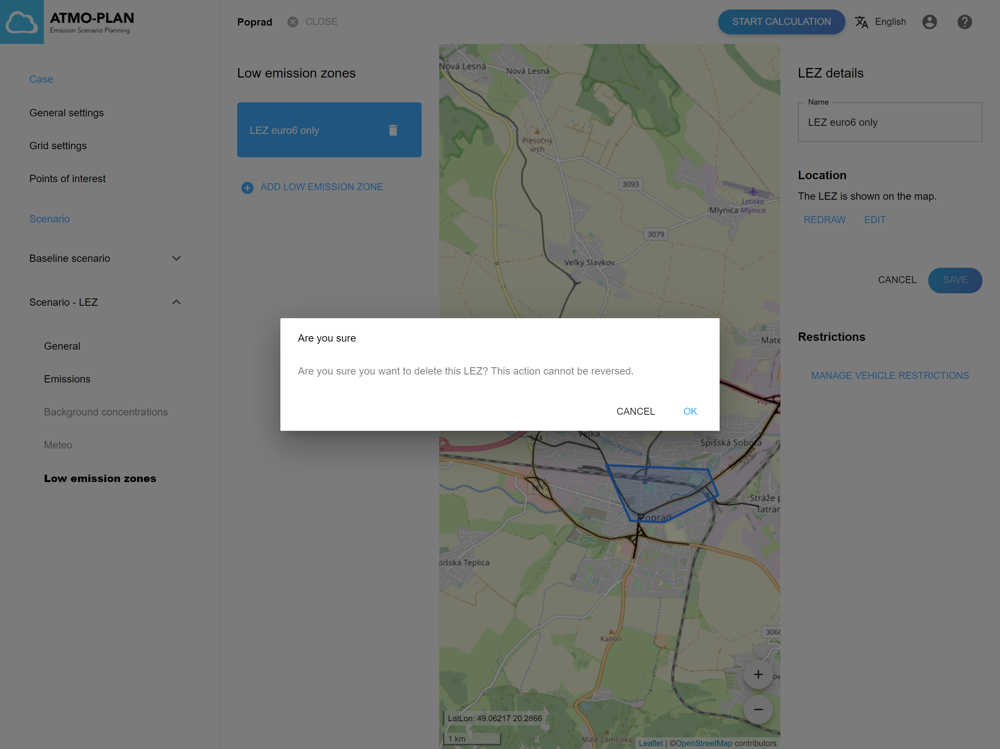

## Kontrola nízkoemisných zón v scenári 

:::tip Dostupné na Slovensku a v Maďarsku
:::

Nástroj ATMO-Plan umožňuje definovanie nízkoemisných zón (NEZ). NEZ je oblasť, kde je zakázaný vjazd vozidlám produkujúcim najväčšie znečistenie.

Prejdite na stránku s podrobnosťami projektu, otvorte scenár a kliknite na „Zóny s nízkymi emisiami“. Zoznam všetkých NEZ pre scenár je zobrazený vľavo.

Potom kliknite na NEZ. Poloha NEZ je na mape znázornená ako modrý polygón.

Vpravo je zobrazený názov NEZ.

Po kliknutí na „Správa obmedzení vozidiel“ sa zobrazí zoznam všetkých typov vozidiel. Pre každý typ vozidla je v poslednom stĺpci uvedené, či je v NEZ povolený alebo nie:

- keď je semafor zelený, typ vozidla je povolený v NEZ 
- keď je semafor červený, typ vozidla nie je povolený v NEZ
- keď je semafor sivý, typ vozidla sa nenachádza vo flotile pre daný scenár

Každý stĺpec v tabuľke je možné zoradiť kliknutím na šípky v záhlaví stĺpca. Opätovným kliknutím sa stĺpec zoradí v opačnom poradí. Keď je stĺpec zoradený, šípka sa zobrazuje tmavosivou, inak je skrytá.

Každý stĺpec je možné zoradiť kliknutím na lievik v hlavičke stĺpca. Keď je stĺpec filtrovaný, lievik je zobrazený oranžovou farbou, inak je zobrazený sivou farbou.

## Vytvorenie nízkoemisnej zóny

:::tip Dostupné na Slovensku a v Maďarsku
:::

:::Pozor
V niektorých verziach (Slovensko, Maďarsko) nie je povolené vytvárať NEZ v základnom scenári.
:::

:::Pozor
Nízkoemisnú zónu nemožno vytvoriť počas výpočtu alebo po (úspešnom) dokončení výpočtu. Pred vytvorením NEZ by scenár mal mať platnú flotilu. Tlačidlo Pridať je v tom prípade skryté.
:::

Prejdite na stránku s podrobnosťami o prípade, otvorte scenár a kliknite na „Zóny s nízkymi emisiami“. Zoznam všetkých NEZ pre scenár je zobrazený vľavo. Kliknutím na „Pridanie nízkoemisnej zóny“ vytvoríte novú NEZ.

Nízkoemisné zóny možno definovať až po definovaní flotily pre scenár. V opačnom prípade bude funkcia „Pridanie nízkoemisnej zóny“ deaktivovaná.

Po kliknutí na „Pridanie nízkoemisnej zóny“ môže užívateľ zakresliť NEZ na mapu. Kliknite na mapu a nakreslite rohy polygónu. Priblíženie/oddialenie dosiahnete pomocou ikon v pravom dolnom rohu mapy alebo pomocou kolieska myši. Polygón uzatvoríte kliknutím na prvý roh. Umiestnenie polygónu je možné zmeniť kliknutím na 'Prekresliť' alebo 'Editovať' na pravo. Po kliknutí na 'Prekresliť' nakreslený polygón zmizne a môžete začať kresliť. Keď kliknete na 'Editovať', môžete zmeniť tvar polygónu presúvaním rohov pomocou myši.

Vpravo je možné zadať názov NEZ. Po kliknutí na „Uložiť“ sa NEZ pridá do zoznamu zón s nízkymi emisiami vľavo.

Na dokončenie definície NEZ je potrebné definovať flotilu pre NEZ. Vo flotile je zadefinované, ktoré typy vozidiel sú v zóne povolené a ktoré typy vozidiel sú zakázané. Toto sa vykonáva v konfiguračnom nástroji NEZ, ktorý sa otvorí po kliknutí na „Správa obmedzení vozidiel“.

Konfiguračný nástroj NEZ možno použiť na vykonanie rýchleho skríningu účinku zavedenia NEZ na koncentrácie. Nástroj je možné použiť na zákaz typov vozidiel (napr. pred EURO 5) vo vybranej zóne, pričom sa nemení celkový počet vozidiel kategórie (autobus, auto, HDV...) vo flotile, ani počty prebehov. Pri zakázaní určitého typu vozidiel sa tieto vozidlá rozdelia do zostávajúcich typov rovnakej kategórie, pričom sa intenzita dopravy vo všetkých uliciach zachová konštantná. Napríklad pri zákaze všetkých áut kategórií pred EURO 5 budú autá pred EURO 5 nahradené EURO 5 a EURO 6, pričom pomer medzi nimi sa bude rovnať pomeru medzi EURO 5 a EURO 6 vo flotile mimo NEZ.

Jednoduchý konfiguračný nástroj zobrazuje tabuľku obsahujúcu všetky typy vozidiel vo flotile daného scenára. Pre každý typ vozidla je uvedená kategória typu vozidla, emisná trieda a typ paliva.

:::Pozor
Je dôležité poznamenať, že kategórie vozidiel, ktoré sa môžu vyskytnúť v súbore zloženia flotily, sú preddefinované pre každú verziu a závisia od zvoleného regiónu. Užívateľ môže pracovať iba s existujúcimi typmi vozidiel. Po nasadení verzie nie je možné pridať žiadne nové typy vozidiel, v prípade požiadavky na rozšírenie typov je potrebné kontaktovať VITO.
:::

Pri otvorení konfiguračného nástroja zobrazuje posledný stĺpec, ktoré typy vozidiel sa nachádzajú vo vozovom parku scenárov (zelený semafor) a ktoré nie (sivý semafor). Užívateľ môže zakázať typy vozidiel v NEZ prepnutím semafora zo zelenej na červenú.

Užívateľ môže tiež zakázať skupiny typov vozidiel pomocou filtrov v stĺpcoch a následným kliknutím na semafor v záhlaví posledného stĺpca. Na nasledujúcich obrázkoch je zobrazená tabuľka s filtrom na typy vozidiel, ktorých kategória paliva sa líši od kategórie „Euro 6“. Kliknutím na semafor v záhlaví posledného stĺpca sú všetky tieto typy vozidiel okamžite zakázané.

Keď sú potrebné typy vozidiel zakázané, kliknite na Uložiť. V tom momente je flotila pre NEZ vypočítaná, uložená a novovytvorená NEZ je tak kompletná.

:::Pozor
Pri zákaze typov vozidiel v NEZ existujú určité obmedzenia. Pri zákaze typu vozidla je dôležité si uvedomiť, že celkový počet vozidiel vo flotile sa nezmení. Zakázané vozidlá budú namiesto toho distribuované do zostávajúcich typov vozidiel rovnakej kategórie. Napríklad pri zákaze áut kategórie Euro 1 sa počet áut Euro 1 rozloží na všetky ostatné typy vozidiel. To tiež znamená, že nemôžete zakázať vo flotile všetky typy vozidiel zodpovedajúce určitej kategórii vozidla. Musí zostať aspoň jeden; inak sa zobrazí chybové hlásenie.
:::

## Aktualizácia nízkoemisnej zóny

:::tip Dostupné na Slovensku a v Maďarsku
:::

:::Pozor
V niektorých nasadeniach (Slovensko, Maďarsko) nie je povolené vytvárať/aktualizovať NEZ v základnom scenári.
:::
:::Pozor
Nízkoemisnú zónu nie je možné aktualizovať počas výpočtu alebo po (úspešnom) dokončení výpočtu. Pred vytvorením NEZ by  mal mať scenár platnú flotilu. Vlastnosti NEZ môžu byť vtedy len zobrazené.
:::

Prejdite na stránku s podrobnosťami projektu, otvorte scenár a kliknite na „Zóny s nízkymi emisiami“. Zoznam všetkých NEZ pre scenár je zobrazený vľavo. Potom kliknite na NEZ. Názov NEZ je možné aktualizovať vpravo a obmedzenia vozidiel možno aktualizovať podľa postupu vysvetlenom v predchádzajúcej časti.

## Vymazanie nízkoemisnej zóny

:::tip Dostupné na Slovensku a v Maďarsku
:::

:::Pozor
V niektorých verziach (Slovensko, Maďarsko) nie je povolené vytvoriť/vymazať NEZ v základnom scenári.
:::
:::Pozor
Nízkoemisnú zónu nie je možné vymazať počas výpočtu alebo po (úspešnom) dokončení výpočtu. Tlačidlo Odstrániť je vtedy skryté.
:::

Prejdite na stránku s podrobnosťami projektu, otvorte scenár a kliknite na „Zóny s nízkymi emisiami“. Zoznam všetkých NEZ pre scenár je zobrazený vľavo. NEZ je možné odstrániť umiestnením kurzora myši na NEZ v zozname vľavo a kliknutím na ikonu výmazu. Zobrazí sa dialógové okno s potvrdením, ktoré obsahuje tlačidlá OK a Zrušiť.

