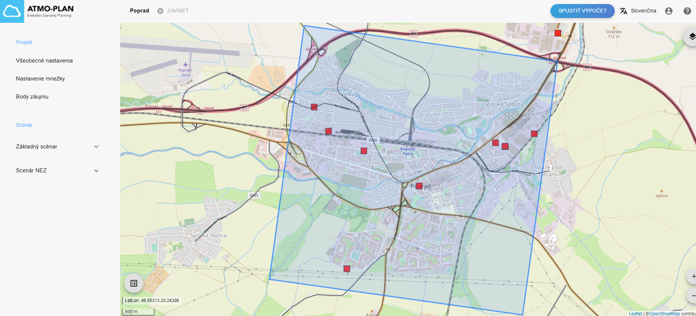
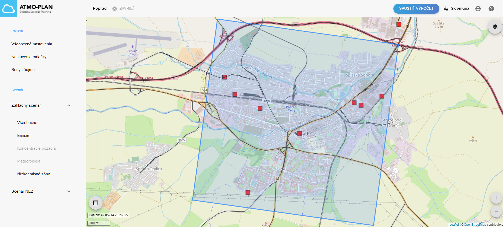

## Kontrola scenára

Prejdite na stránku s podrobnosťami projektu. Vľavo je zobrazený zoznam všetkých scenárov. Tento zoznam vždy obsahuje aspoň jeden scenár, ktorý je základným scenárom projektu. Tento scenár sa vytvorí automaticky pri vytvorení projektu. Základný scenár sa vždy zobrazuje ako prvý scenár.

Kliknutím na názov scenára alebo na šípku napravo od názvu otvoríte menu pre daný scenár. Menu obsahuje odkazy na všeobecné nastavenia, emisie, koncentrácie pozadia, meteorológiu a nízkoemisné zóny scenára.

 

