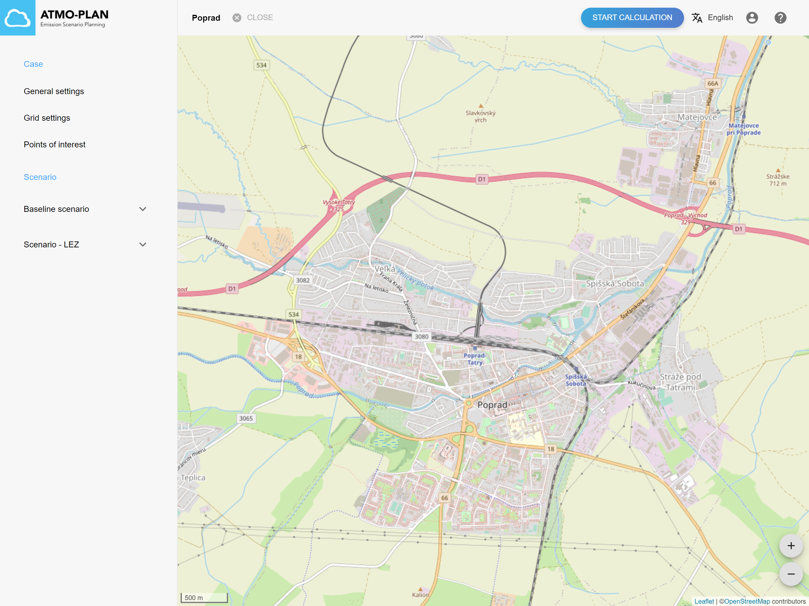
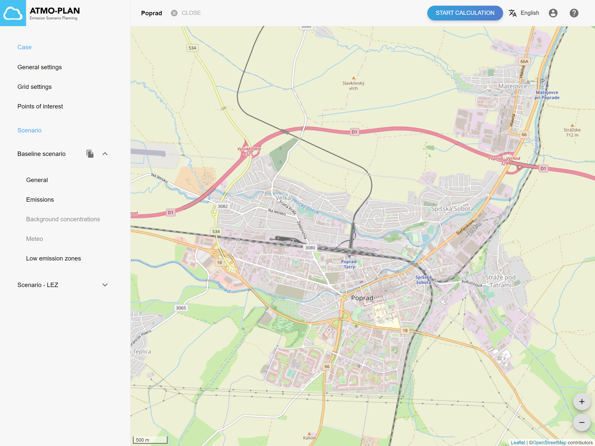

## Inspecting a scenario

:::tip Available in each deployment
:::

Go to the case detail page. At the left, a list of all scenarios is shown. This list always contains at least one scenario, which is the baseline scenario of the case. This scenario is created automatically when the case was created. The baseline scenario is always shown as first scenario.

Click on a scenario name or on the arrow to the right of the name to open the menu for that scenario. The menu contains links to the general settings, emissions, background concentrations, meteo and Low Emission Zones of the scenario.

 

