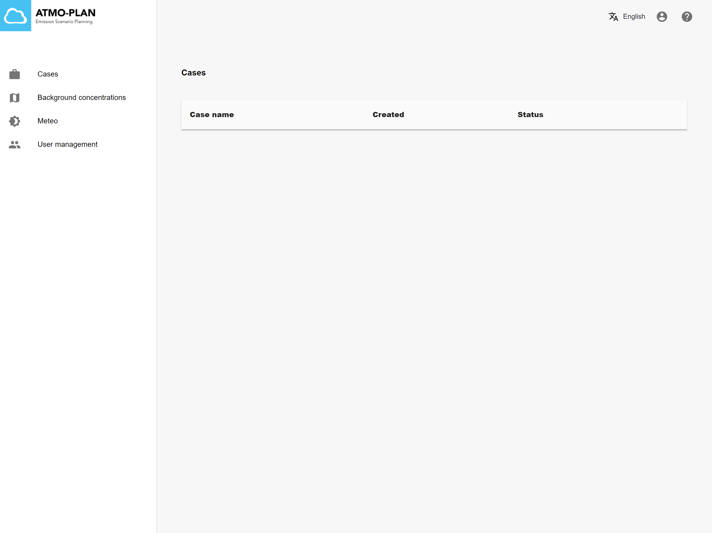
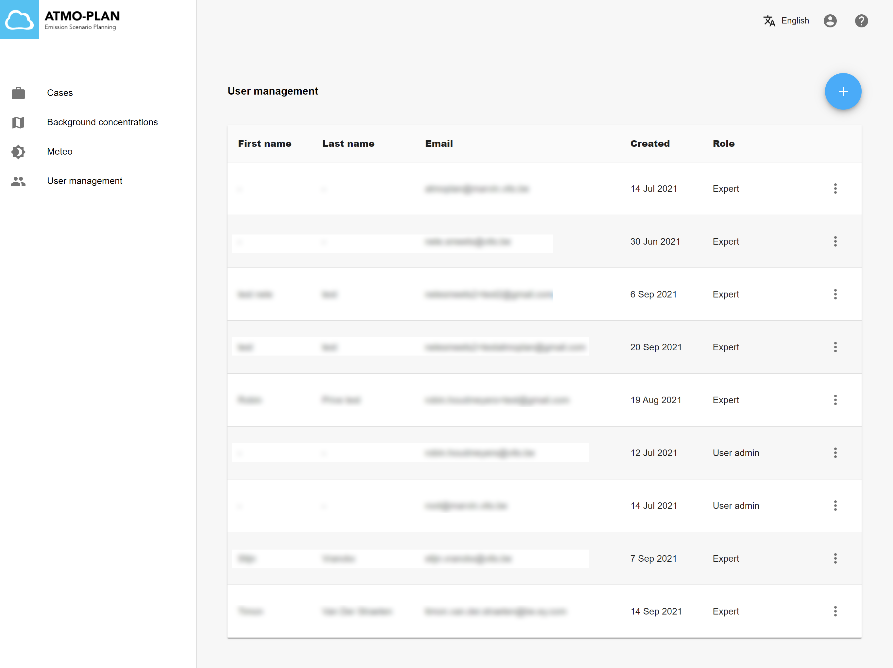
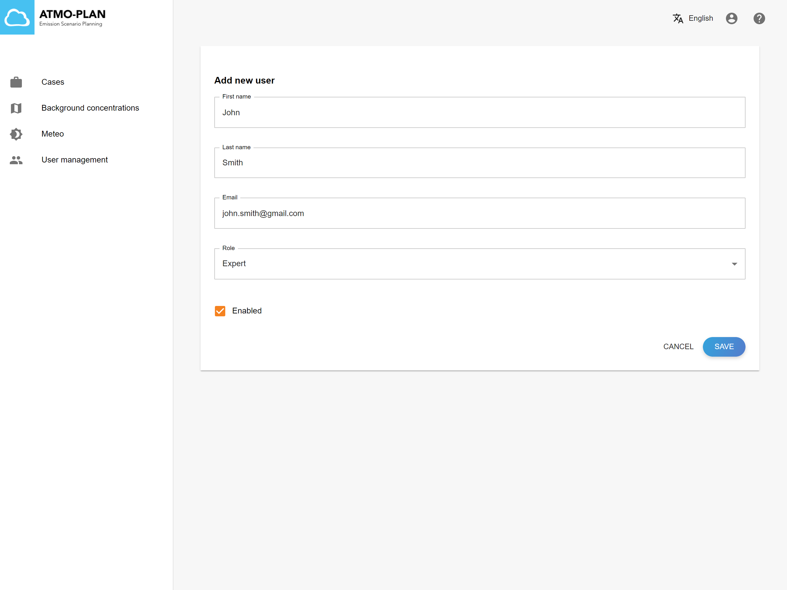

Ak má užívateľ práva správcu, na hlavnej stránke sa zobrazí štvrtá položka menu: „Správa užívateľov“.

Po kliknutí na túto položku menu sa zobrazí tabuľka so všetkými aktuálnymi užívateľmi.

Správca užívateľov môže užívateľov upravovať alebo mazať prostredníctvom položky menu vpravo.

Nových užívateľov možno pridať pomocou tlačidla „+“. Správca užívateľov zadá meno, priezvisko, e-mail a rolu nového užívateľa. V súčasnosti sú podporované dve roly: expert a správca užívateľov. Po kliknutí na „Uložiť“ sa odošle e-mail na uvedenú e-mailovú adresu. Po prijatí tohto e-mailu sa nový užívateľ môže prihlásiť do nástroja ATMO-Plan pomocou odkazu v e-maile. Nový užívateľ si môže vytvoriť heslo kliknutím na „Zabudli ste heslo?“ na prihlasovacej stránke.

